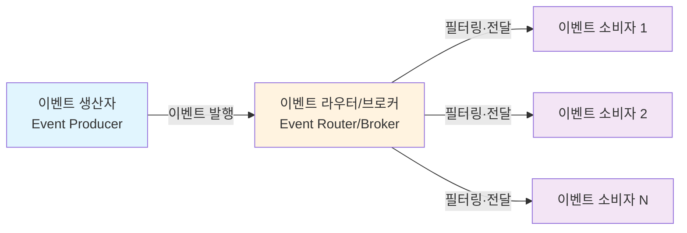
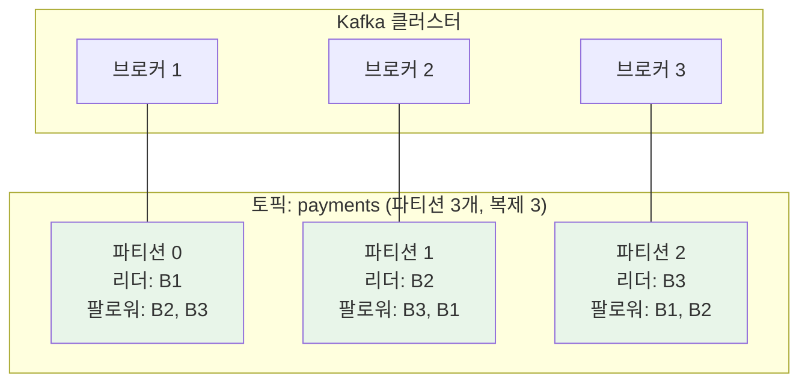
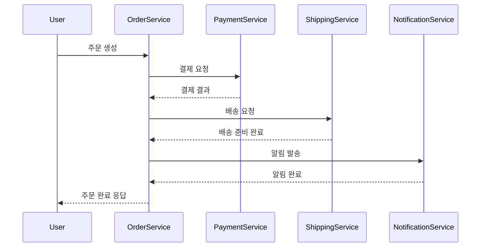
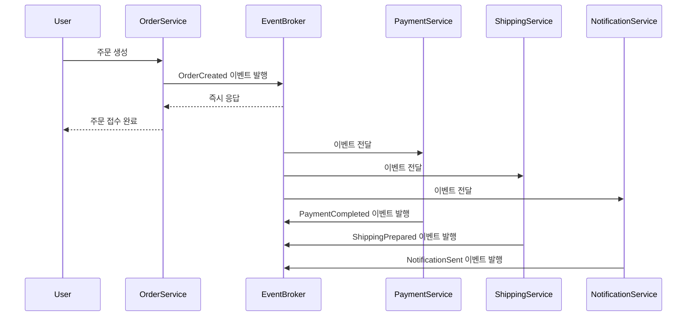

# Chapter 1. 왜 이벤트 스트리밍인가

## 학습 목표

이 장을 읽고 나면 다음을 설명할 수 있어야 한다.

- 이벤트 기반 아키텍처(EDA)가 무엇이며, 왜 현대 시스템에서 필요한지
- 배치 처리와 스트림 처리의 근본적 차이와 각각 적합한 상황
- 메시지 큐와 이벤트 스트리밍 플랫폼의 구조적 차이
- 이벤트 기반 아키텍처가 시스템 결합도를 어떻게 완화하는지
- 비즈니스 관점에서 이벤트 스트리밍 도입을 판단하는 기준

---

## 1.1 이벤트 기반 아키텍처란 무엇인가

### 이벤트의 정의

이벤트 기반 아키텍처를 이해하려면 먼저 **이벤트**가 무엇인지부터 명확히 해야 한다. 이벤트란 **시스템 상태의 변화**(State Change)를 뜻한다.

예를 들어 다음과 같은 것들이 이벤트가 된다.

- "주문이 생성됨"
- "결제가 완료됨"
- "사용자가 상품을 장바구니에 추가함"
- "센서 온도가 30도를 초과함"

이벤트는 일반적으로 JSON이나 Avro 형식의 페이로드에 키, 값, 타임스탬프, 선택적 메타데이터 헤더를 담아 표현한다.

### EDA의 핵심 구성요소

이벤트 기반 아키텍처는 세 가지 핵심 구성요소로 이루어진다.

**이벤트 생산자**(Event Producer): 상태 변화를 감지하고 이벤트를 발행하는 주체다. 생산자는 누가 이 이벤트를 수신하고 어떻게 처리할지 알지 못한다.

**이벤트 라우터/브로커**(Event Router/Broker): 이벤트를 받아 필터링, 버퍼링, 전달을 담당하는 중앙 채널이다. AWS 환경에서는 EventBridge, SNS, SQS, Kinesis 등을 조합해 이 역할을 구현한다.

**이벤트 소비자**(Event Consumer): 이벤트를 구독해 비즈니스 로직을 수행하는 주체다.

### EDA의 핵심 특징

EDA에서는 동기식 요청-응답(Request/Response) 호출 대신 비동기 이벤트를 통해 컴포넌트가 느슨하게 결합된다. 이 구조는 다음과 같은 특징을 가진다.

- **결합 분리**(Decoupling): 생산자와 소비자가 서로를 직접 호출하지 않는다.
- **독립적 확장·장애 격리**: 각 구성요소가 독립적으로 확장되고, 하나가 장애를 겪어도 다른 구성요소에 미치는 영향이 최소화된다.
- **준실시간 시스템으로의 전환**: 조직이 배치 기반 처리에서 벗어나 준실시간 시스템을 설계하는 토대가 된다.

Confluent는 이벤트 스트리밍을, 실시간으로 이벤트를 캡처·저장·처리·라우팅하는 실천으로 정의하며 이를 조직의 신경망에 비유한다.

> **용어 정리**: 이 책에서는 '메시지(Message)'와 '이벤트(Event)'를 구분한다. 메시지는 수신자가 지정된 명령이나 작업 지시의 성격이 강하고, 이벤트는 이미 일어난 사실의 통보라는 성격을 갖는다.

---

## 1.2 배치 처리 vs 스트림 처리

### 근본적 차이: 유한 데이터 vs 무한 데이터

배치 처리와 스트리밍 처리의 가장 근본적인 차이는 **입력 데이터의 형태**에 있다.

| 차원 | 배치 처리 | 스트리밍 처리 |
|---|---|---|
| 데이터 형태 | 유한(Bounded): 정해진 데이터 집합 | 무한(Unbounded): 끊임없이 이어지는 이벤트 시퀀스 |
| 처리 타이밍 | 데이터를 모은 뒤 정해진 시점에 일괄 처리 | 이벤트 발생 즉시 연속 처리 |
| 지연 시간 | 분~시간 단위 | 밀리초~초 단위 |
| 처리 모델 | 주기적으로 실행되고 작업 완료 후 종료 | 항상 실행 상태를 유지하며 이벤트 단위로 결과 방출 |
| 상태 관리 | 대부분 무상태(Stateless) | 상태 저장(Stateful), 내구성 있는 체크포인팅 필요 |
| 장애 복구 | 작업 전체를 재시도 | 마지막 체크포인트에서 재개 |
| 일관성 | 강한 일관성, 재현 가능 | 최종 일관성(Eventual Consistency), 순서에 민감 |
| 디버깅 | 사후 분석, 결정적(재현 가능) | 실시간 진행 중 분석, 타이밍에 의존적 |
| 대표 도구 | Spark, dbt, SQL, 오케스트레이터 | Kafka, Flink, 실시간 컨슈머 |

**배치 처리**(Batch Processing): 일정 기간(시간·일·월 단위) 동안 누적된 유한한 데이터를 특정 시점에 한 번에 처리하는 방식이다. 데이터 수집 시점과 처리·통찰 획득 시점 사이에 지연이 불가피하게 발생한다.

**스트림 처리**(Stream Processing): 끝없이 이어지는 무한 데이터를 발생 즉시 밀리초에서 초 단위로 처리하는 방식이다. "데이터를 먼저 저장한 뒤 조회하는 모델"에서 "조회 로직이 상주하고 데이터가 그 옆을 흘러가는 모델"로의 전환이라고 볼 수 있다.

이 개념은 데이터 시스템 설계를 다루는 여러 문헌에서 공통적으로 강조된다. 대표적으로 마틴 클레프만(Martin Kleppmann)의 저서 *Designing Data-Intensive Applications*는 스트리밍 시스템의 철학을 별도 장에서 깊이 있게 다룬다.

### 비즈니스 관점: 언제 스트리밍이 필요한가

스트리밍 처리가 필요한 상황은 **지연 시간이 비즈니스 가치에 직접 영향을 미치는 경우**다.

**스트리밍이 적합한 사용 사례**

- 사기 탐지(이상 금융거래 탐지)
- 실시간 알림
- 라이브 대시보드
- 이벤트 기반 애플리케이션
- IoT 모니터링
- 실시간 추천

**배치가 적합한 사용 사례**

- 야간 리포트
- 청구·급여 정산
- 규정 준수 보고
- 오프라인 머신러닝 학습
- 과거 데이터 분석

두 방식 중 무엇을 선택할지는 다음 질문으로 판단할 수 있다.

> "데이터가 1시간 늦어지면 비즈니스에 어떤 손실이 발생하는가?"
> "이 이벤트에 즉각 반응하는 것이 제품 가치를 높이는가?"

### 하이브리드 아키텍처: 배치와 스트리밍의 결합

현대 데이터 플랫폼은 배치와 스트리밍을 함께 쓰는 경우가 많다.

- **람다 아키텍처**(Lambda Architecture): 저지연을 담당하는 스트리밍 경로와 정확성을 담당하는 배치 경로를 병행한다.
- **카파 아키텍처**(Kappa Architecture): 스트리밍 하나로 통일하고, 재처리가 필요하면 스트림을 다시 재생(Replay)해 해결한다.
- **오케스트레이터 활용**: 하나의 플랫폼에서 두 패턴을 함께 운영한다.

---

## 1.3 메시지 큐 vs 이벤트 스트리밍 플랫폼

### Pub/Sub 모델 vs 로그 기반 아키텍처

전통적인 메시지 큐와 이벤트 스트리밍 플랫폼의 차이는 **데이터 보존 방식**과 **소비 모델**에 있다.

**Pub/Sub 모델**은 생산자가 이벤트를 발행하면 브로커가 구독자에게 전달하는, 알림 중심의 모델이다.

- 메시지는 전달 후 삭제되거나 짧게만 유지된다.
- 구독자가 오프라인 상태면 메시지를 놓칠 수 있다(예: Redis Pub/Sub).
- 결합이 분리된 즉각적 반응 처리에 적합하다.

**로그 기반 스트리밍**은 이벤트를 내구성 있는 순서화된 로그에 추가하고, 컨슈머가 자신의 오프셋을 관리하며 읽어가는 방식이다.

- 메시지를 길게(일~주~영구) 보존한다.
- 컨슈머가 임의의 오프셋으로 되돌아가 재생(Replay)할 수 있다.
- 상태 저장 처리, 이벤트 소싱, CQRS에 적합하다.

### RabbitMQ vs Apache Kafka

| 차원 | RabbitMQ | Apache Kafka |
|---|---|---|
| 모델 | 메시지 브로커(큐 기반) | 분산 스트리밍 플랫폼(로그 기반) |
| 메시지 전달 | Push 기반(ACK 후 삭제) | Pull 기반(오프셋 관리, 보존 후 삭제) |
| 메시지 보존 | 소비 후 삭제 | 설정 가능(시간·용량 기준, 일~영구) |
| 라우팅 | Exchange(direct/topic/fanout/headers) | 토픽과 파티션 기반 |
| 순서 보장 | 큐 단위 FIFO | 파티션 단위 순서 보장 |
| 처리량 | 중간 수준(초당 수만 건) | 매우 높음(초당 수백만 건) |
| 지연 시간 | 매우 낮음(1ms 미만) | 낮음(수 ms) |
| 메시지 재생 | 제한적(Streams 플러그인 필요) | 우수(임의 오프셋 탐색 가능) |
| 주 사용 사례 | 태스크 큐, 워크플로우 | 스트리밍, 분석, 데이터 파이프라인 |

> **주의**: 이 표의 처리량·지연 시간 수치는 측정 환경과 설정에 따라 크게 달라질 수 있다. 실제 도입을 검토할 때는 반드시 자신의 워크로드로 직접 벤치마크해 볼 것을 권장한다.

### Kafka의 로그 구조

Kafka 토픽의 각 파티션은 append-only(추가 전용) 로그 파일의 연속으로 구현된다.

- 각 메시지는 64비트 오프셋으로 식별한다.
- 로그 파일은 오프셋을 기준으로 세그먼트 단위로 나뉜다(예: `00000000000000000000.log`).
- 쓰기는 마지막 세그먼트에 순차적으로 추가되며, 설정된 크기에 도달하면 새 세그먼트로 넘어간다.
- 읽기는 오프셋을 지정하면 해당 세그먼트를 이진 탐색으로 찾아 데이터를 반환한다.
- 삭제는 시간이나 용량 기준의 보존(Retention) 정책에 따라 세그먼트 단위로 이뤄진다.
- 내구성은 CRC32 검사, 로그 복구 절차, flush 설정으로 보장한다.

---

## 1.4 핵심 아키텍처 개념

### 브로커·토픽·파티션·복제

**브로커**(Broker): Kafka 클러스터를 구성하는 서버다. 파티션을 저장하고 읽기·쓰기 요청을 처리한다.

**토픽**(Topic): 이벤트의 카테고리다(예: `payments`). 여러 생산자와 여러 컨슈머가 하나의 토픽을 함께 사용할 수 있다.

**파티션**(Partition): 토픽을 여러 브로커에 나눠 분산하는 병렬 처리 단위다. 같은 키를 가진 이벤트는 항상 같은 파티션으로 라우팅되어 순서가 보장된다.

**복제**(Replication): 각 파티션은 여러 브로커에 복제된다(보통 복제 계수 3을 사용). 리더-팔로워 구조로 장애를 허용한다.

### 컨슈머 그룹

**컨슈머 그룹**(Consumer Group): 동일한 `group.id`를 가진 컨슈머들의 집합이다. 토픽의 파티션이 그룹 내 컨슈머들에 나뉘어 병렬로 처리된다.

- 하나의 파티션은 한 그룹 안에서 오직 하나의 컨슈머만 처리한다.
- 컨슈머를 추가하면 파티션이 재분배되어 수평 확장이 가능하다.

### 전달 보장

Kafka는 세 가지 수준의 전달 보장(Delivery Semantics)을 제공한다.

| 시맨틱 | 설명 | 데이터 손실 | 중복 | 성능 | 전형적 사용 사례 |
|---|---|---|---|---|---|
| At-most-once | 전송 후 재시도 없음, 처리 전에 오프셋 커밋 | 가능 | 없음 | 가장 빠름 | 메트릭·로그 등 손실을 허용할 수 있는 경우 |
| At-least-once | 응답을 기다려 재시도, 처리 후에 오프셋 커밋 | 없음 | 가능 | 빠름 | 대부분의 프로덕션 환경(중복 제거 로직 필요) |
| Exactly-once | 멱등성 프로듀서 + 트랜잭션 + read_committed | 없음 | 없음 | 3~5% 정도의 오버헤드 | 금융 거래, 청구 등 정확성이 중요한 경우 |

**Exactly-once를 구현하기 위한 요건**

- **멱등성 프로듀서**(Idempotent Producer): `enable.idempotence=true`로 설정하면 프로듀서 ID와 시퀀스 번호를 이용해 브로커가 중복 메시지를 감지하고 폐기한다.
- **트랜잭션**(Transactions): 여러 파티션·토픽에 걸친 쓰기와 오프셋 커밋을 하나의 원자적 단위로 처리한다. 내부적으로 `__transaction_state` 토픽을 사용한다.
- **read_committed 컨슈머**: 중단(abort)된 트랜잭션의 기록을 걸러낸다.

> **주의**: Kafka의 exactly-once 보장은 Kafka 토픽 간 파이프라인에 한정된다. 외부 HTTP 호출이나 데이터베이스 쓰기까지 포함하려면 애플리케이션 레벨에서 별도의 멱등성 처리가 필요하다.

---

## 1.5 EDA의 주요 이점

### 결합도 감소

생산자와 소비자가 서로를 알지 못하므로 독립적인 배포·확장·장애 대응이 가능하다. 서비스 간 의존성이 줄어들면서 시스템을 진화시키기도 쉬워진다.

### 확장성

이벤트 버퍼링과 병렬 컨슈머를 조합하면 초당 수백만 건의 이벤트도 처리할 수 있다. Kafka는 파티션을 늘리고 그만큼 컨슈머 인스턴스를 추가하는 방식으로 선형적인 확장이 가능하다.

### 복원력

이벤트 지속성, 재시도, 데드레터 큐(Dead Letter Queue, DLQ)를 조합하면 장애가 발생해도 데이터 손실을 방지할 수 있다. 스트리밍 플랫폼의 복제 구조 덕분에 브로커 장애 시에도 자동으로 failover가 이루어진다.

### 실시간성

이벤트가 발생한 뒤 밀리초에서 초 단위로 반응할 수 있다. 사기 탐지나 실시간 추천처럼 지연 시간이 곧 비즈니스 가치로 직결되는 상황에서는 필수적인 특성이다.

---

## 1.6 비즈니스 맥락에서의 EDA 전환 판단 기준

### 도입이 강력히 권장되는 경우

1. **단일 원천 데이터의 다중 소비**: 하나의 이벤트(예: 주문 완료)를 결제, 배송, 알림, 추천, 정산 등 여러 독립적인 도메인에서 각기 다른 목적으로 동시에 소비해야 할 때
2. **준실시간**(Near Real-Time) 대응이 필요한 경우: 이상 금융거래 탐지(FDS), 동적 가격 책정, IoT 센서 모니터링처럼 발생 즉시 반응해야 가치가 생기는 경우
3. **도메인 간 독립적 확장**: 팀별 배포 주기와 트래픽 패턴이 서로 달라, 마이크로서비스 간 직접적인 종속 관계를 끊어야 할 때

### 도입 시 주의하거나 재검토가 필요한 경우

1. **단순 CRUD와 강한 트랜잭션 일관성이 필요한 경우**(ACID): 모든 쓰기 작업이 즉각적인 원자적 일관성을 보장해야 하며, 최종 일관성을 받아들이기 어려운 경우
2. **시스템 복잡도 대비 오버헤드가 큰 경우**: 시스템 규모가 작고 팀의 운영 역량이 충분하지 않은 상태에서 성급하게 브로커 인프라를 도입하는 경우

---

## 1.7 심화: 마틴 파울러의 '이벤트 기반' 네 가지 분류

마틴 파울러(Martin Fowler)는 "이벤트 기반"이라는 용어가 실제로는 서로 다른 맥락에서 쓰이고 있다고 지적하며, 이를 네 가지로 구분한다.

1. **이벤트 알림**(Event Notification): 시스템이 상태 변화가 있었다는 사실만 짧게 알리고, 상세 정보가 필요하면 수신자가 원본 시스템에 다시 질의(Query)하도록 하는 방식이다. 결합도가 일부 남아 있다.
2. **이벤트 상태 전송**(Event-Carried State Transfer): 이벤트 페이로드에 변경된 상태의 전체 스냅샷을 담아 전송해, 수신자가 원본 시스템에 다시 질의하지 않고도 자신의 데이터를 갱신할 수 있게 하는 방식이다.
3. **이벤트 소싱**(Event Sourcing): 시스템의 현재 상태를 직접 저장하는 대신, 모든 상태 변경 이벤트를 순서대로 영구 보존해 원장(Ledger)으로 삼는 패턴이다.
4. **CQRS**(Command Query Responsibility Segregation): 쓰기 모델(명령)과 읽기 모델(조회)을 분리하고, 둘 사이의 동기화를 이벤트로 수행하는 패턴이다.

---

## 1.8 실습 시나리오: 주문 처리 시스템 비교

### 시나리오: 온라인 쇼핑몰 주문 처리

다음과 같은 요구사항이 있다고 가정하자.

- 사용자가 주문을 완료하면 결제, 배송, 알림, 추천, 정산 시스템이 각각 독립적으로 처리해야 한다.
- 결제가 실패하면 재시도 로직이 필요하다.
- 배송 시스템은 주문 완료 후 30분 이내에 배송 준비를 시작해야 한다.

### 전통적인 요청-응답 모델

**문제점**

- 시간적 결합: 모든 서비스가 동시에 가용해야 한다.
- 연쇄 실패: 서비스 하나의 장애가 전체 시스템으로 퍼진다.
- 확장의 어려움: 서비스마다 부하 패턴이 다른데도 독립적으로 확장할 수 없다.

### 이벤트 기반 아키텍처 모델

**이점**

- OrderService는 다른 서비스의 가용성과 무관하게 즉시 응답할 수 있다.
- 각 서비스가 독립적으로 확장하고 독립적으로 장애를 겪는다.
- 추천 시스템처럼 새로운 소비자를 추가할 때 생산자를 변경할 필요가 없다.

---

## 1.9 주의사항: 은탄환은 없다

이벤트 기반 아키텍처는 만능이 아니다. 다음과 같은 트레이드오프가 존재한다.

- **최종 일관성**(Eventual Consistency): 강한 일관성(ACID)을 보장하지 않는다. 모든 쓰기가 즉각적인 원자적 일관성을 보장해야 하는 경우에는 적합하지 않다.
- **분산 디버깅의 복잡도**: 비동기 이벤트 흐름은 추적하기 어렵다. 이벤트 계보(Lineage) 추적과 모니터링 체계가 반드시 뒷받침되어야 한다.
- **지연 시간의 변동성**: 모놀리식 애플리케이션은 하나의 메모리 공간 안에서 처리가 이뤄져 지연이 낮고 예측 가능한 반면, 이벤트 기반 애플리케이션은 네트워크를 거쳐 통신하므로 지연 변동성이 커진다.
- **인프라 운영 부담**: 브로커 인프라를 운영·모니터링하고 장애에 대응할 역량이 필요하다.

---

## 1.10 이 장에서 다루지 않은 내용

- **이벤트 소싱·CQRS 패턴**: 이 장에서는 개념만 간략히 소개했으며, 3부에서 자세히 다룬다.
- **실제 도입 사례**: Uber, Netflix, Stripe 등 대규모 서비스의 Kafka 도입 사례는 4부 실무 적용 장에서 다룬다.
- **메시지 큐와 스트리밍 플랫폼의 심화 비교**: 2장에서 자세히 다룬다.
