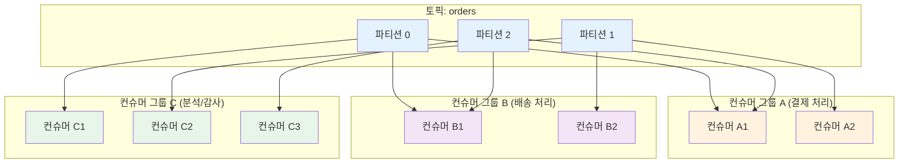
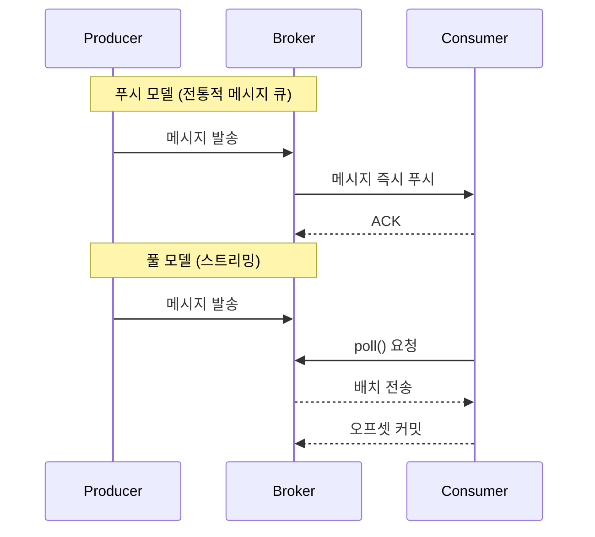
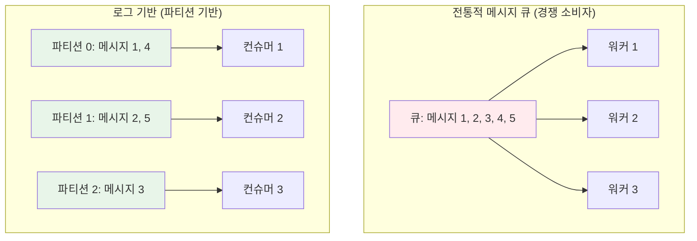
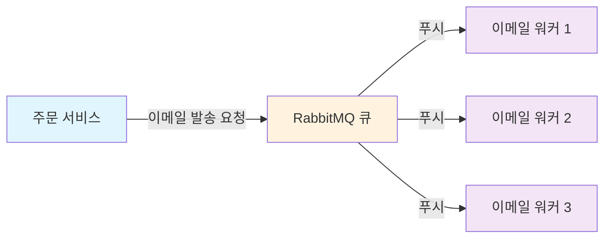
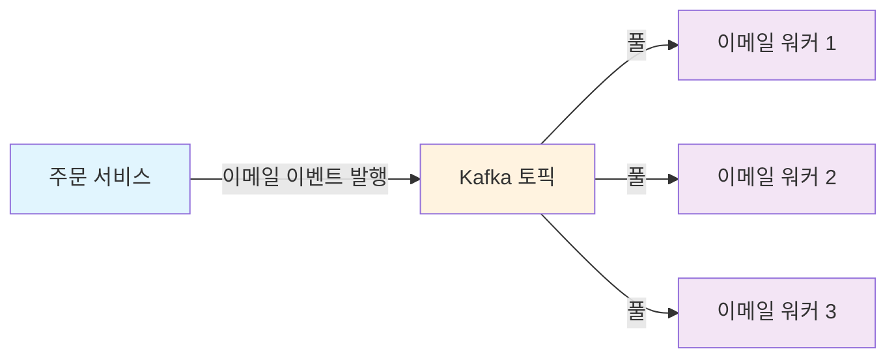

# Chapter 2. 메시지 큐 vs 이벤트 스트리밍 플랫폼

## 학습 목표

이 장을 읽고 나면 다음을 설명할 수 있어야 한다.

- 전통적 메시지 큐와 이벤트 스트리밍 플랫폼의 근본적인 설계 차이
- 로그 기반 아키텍처의 핵심 개념과 재처리(Replay) 가능성
- 푸시(Push) 모델과 풀(Pull) 모델의 장단점, 그리고 배압(Backpressure) 처리 방식
- 메시지 순서 보장과 동시성 모델의 차이
- 메시지 큐와 스트리밍 플랫폼 각각에 적합한 워크로드와 선택 기준

---

## 2.1 두 가지 메시징 모델: 큐잉과 발행-구독

전통적인 메시징에는 **큐잉**(Queuing)과 **발행-구독**(Publish-Subscribe)이라는 두 가지 모델이 있다.

**큐잉 모델**에서는 여러 컨슈머가 하나의 큐를 두고 메시지를 읽어가며, 각 메시지는 그중 단 하나에게만 전달된다. 작업을 여러 워커에 분산할 때 유용하다.

**발행-구독 모델**에서는 메시지가 모든 컨슈머에게 브로드캐스트된다. 동일한 이벤트를 여러 시스템이 각자 독립적으로 처리해야 할 때 유용하다.

Kafka는 이 두 모델을 하나로 통합한 **컨슈머 그룹**(Consumer Group)이라는 추상화를 제공한다. 컨슈머는 자신이 속한 컨슈머 그룹의 이름을 지정하며, 토픽에 발행된 각 메시지는 이를 구독 중인 각 컨슈머 그룹 내에서 정확히 하나의 컨슈머 인스턴스에만 전달된다. 즉 같은 그룹 안에서는 큐잉처럼 동작하고, 서로 다른 그룹 사이에서는 발행-구독처럼 동작하는 구조다.

> **핵심**: 같은 토픽의 메시지를 여러 컨슈머 그룹이 독립적으로 소비할 수 있다. 각 그룹 안에서는 파티션이 하나의 컨슈머에만 배정되어 병렬로 처리된다.

---

## 2.2 로그 기반 아키텍처의 본질

### 로그(Log)의 정의

로그란 시간 순서대로 정렬된(Ordered) 기록이다.

Kafka 공동 창시자인 제이 크렙스(Jay Kreps)는 로그를 소프트웨어에서 가장 단순한 저장 추상화로 설명한다. 로그는 새 항목이 항상 끝에만 추가되고, 한번 기록된 항목은 순서가 바뀌지 않으며, 각 항목에는 기록된 순서에 따라 고유한 번호가 매겨지는 구조다. 이 개념은 데이터베이스, NoSQL 스토어, 복제, 합의 알고리즘(Paxos), 분산 처리 시스템, 버전 관리 시스템 등 사실상 모든 데이터 시스템의 밑바탕에 깔려 있으며, 이를 이해하는 것이 소프트웨어 시스템을 깊이 이해하는 출발점이라는 것이 크렙스의 핵심 주장이다.

### 전통적 큐 vs 로그 기반 스트리밍

| 특성 | 전통적 메시지 큐 | 로그 기반 스트리밍 플랫폼 |
|---|---|---|
| 데이터 관점 | 일시적인 작업·명령(Transient Task) | 영구적인 사실의 기록(Permanent Record of Facts) |
| 소비 후 처리 | 즉시 삭제 | 보존 정책(Retention Policy)에 따라 유지 |
| 재처리(Replay) | 불가능(DLQ로 일부만 가능) | 언제든 과거 시점부터 다시 소비 가능(오프셋 제어) |
| 상태 관리 | 브로커가 컨슈머별 전달·확인 상태를 관리 | 컨슈머가 자신의 오프셋을 스스로 관리 |
| 적합 용도 | 태스크 큐, 워크플로우, 분산 작업 스케줄링 | 실시간 데이터 파이프라인, 이벤트 소싱, 대용량 로그·메트릭 수집 |

Kafka는 원래 대기업 내부의 모든 실시간 데이터 피드를 한곳에서 처리하는 통합 플랫폼을 목표로 설계됐다. 이 목표를 이루려면 서로 상충하는 세 가지 요구를 동시에 만족시켜야 했다. 실시간 로그 집계처럼 이벤트가 대량으로 쏟아지는 상황을 감당할 만큼 처리량이 높아야 했고, 오프라인 시스템이 주기적으로 데이터를 적재할 때 생기는 대규모 백로그도 무리 없이 처리해야 했으며, 동시에 전통적인 메시징에서 요구하는 저지연 전달도 놓칠 수 없었다. 이 세 요구를 모두 만족시키려다 보니, Kafka의 설계는 전통적인 메시징 시스템보다는 오히려 데이터베이스 내부의 로그 구조에 더 가까워졌다.

Confluent는 Kafka의 토픽을 "내구성 있게 저장된 이벤트의 정렬된 로그"라고 정의하며, 파일시스템의 폴더에 해당하는 Kafka의 가장 기본적인 조직 단위로 설명한다. 프로듀서는 토픽에 이벤트를 쓰고 컨슈머는 토픽에서 이벤트를 읽는다. 하나의 토픽은 병렬 처리를 위해 여러 파티션으로 나뉘고, 장애에 대응하기 위해 여러 브로커에 복제된다.

토픽은 항상 다중 프로듀서·다중 구독자 구조를 갖는다. 토픽 자체에 SQL처럼 쿼리를 던질 수는 없지만, 그 안의 이벤트는 필요한 만큼 몇 번이고 반복해서 읽을 수 있다. 또한 토픽은 추가 전용(Append-only) 구조여서, 새 이벤트는 항상 토픽의 끝에 덧붙여진다.

### 재처리 가능성

로그 기반 아키텍처의 가장 강력한 특징은 **재처리 가능성**(Replayability)이다. 컨슈머는 단순히 오프셋(Offset)이라는 포인터만 옮기면, 과거의 원하는 시점부터 데이터를 몇 번이든 다시 처리할 수 있다.

이 기능은 다음과 같은 상황에서 결정적인 가치를 가진다.

- **버그 수정 후 과거 데이터 재집계**: 처리 로직의 버그를 고친 뒤, 과거 이벤트를 다시 처리해 정확한 결과를 다시 계산할 수 있다.
- **신규 마이크로서비스 추가**: 새 서비스가 시스템에 합류할 때, 과거 이력을 처음부터 재생해 현재 상태를 스스로 복원할 수 있다.
- **테스트와 디버깅**: 프로덕션에서 발생한 이벤트를 테스트 환경으로 옮겨 동일하게 재현하며 문제를 분석할 수 있다.

---

## 2.3 스마트 브로커 vs 덤 브로커

### 전통적 메시지 큐: 스마트 브로커·덤 컨슈머

전통적 메시지 큐는 **스마트 브로커·덤 컨슈머** 모델을 따른다.

- **브로커의 책임**: 어떤 컨슈머가 어떤 메시지를 읽었는지(확인 응답 상태), 어떤 메시지를 재전송해야 하는지를 브로커가 직접 추적한다.
- **단점**: 컨슈머 수가 늘거나 대기 중인 메시지가 쌓일수록 브로커가 관리해야 할 메타데이터가 늘어나, 성능이 급격히 떨어질 수 있다.

### 이벤트 스트리밍 플랫폼: 덤 브로커·스마트 컨슈머

이벤트 스트리밍 플랫폼은 **덤 브로커·스마트 컨슈머** 모델을 따른다.

- **브로커의 책임**: 메시지를 순서대로 디스크에 기록하고, 요청이 오면 바이트 스트림을 빠르게 전달하는 일에만 집중한다. 컨슈머의 읽기 상태를 복잡하게 추적하지 않는다.
- **컨슈머의 책임**: 자신이 어디까지 읽었는지를 나타내는 정수값인 **오프셋**(Offset)을 스스로 관리한다.
- **장점**: 컨슈머가 수백 개로 늘어나거나 컨슈머별 소비 속도가 크게 달라져도, 브로커가 짊어져야 할 상태 관리 부담은 거의 일정하게 유지된다.

---

## 2.4 푸시(Push) vs 풀(Pull) 모델

### 푸시 모델: 전통적 메시지 큐의 표준

전통적 메시지 큐는 주로 **푸시**(Push) 모델을 사용한다.

- **동작 방식**: 브로커가 연결된 컨슈머에게 메시지를 밀어 넣는다.
- **장점**: 지연 시간이 매우 짧다.
- **단점**: 생산량이 급증해 컨슈머의 처리 용량을 넘어서면 컨슈머 쪽에서 메모리 오버플로우가 발생할 수 있다. 이를 막으려면 프리페치(Prefetch) 한도나 크레딧 기반 흐름 제어 같은 별도 메커니즘이 필요하다.

### 풀 모델: 스트리밍 플랫폼의 표준

이벤트 스트리밍 플랫폼은 주로 **풀**(Pull) 모델을 사용한다.

- **동작 방식**: 컨슈머가 자신의 처리 속도에 맞춰 브로커에 데이터를 요청한다(`poll()`).
- **장점**: 컨슈머 스스로 속도를 조절하는 자연스러운 배압(Backpressure) 처리가 가능하다. 컨슈머 처리가 지연되어도 과부하로 다운되지 않고 자기 속도대로 읽어간다. 클라이언트가 배치(Batching) 처리를 주도할 수 있어 처리량을 극대화하기도 쉽다.
- **단점**: 새 데이터가 없을 때 불필요하게 계속 요청을 보내는 것(Busy-waiting)을 막기 위해, 데이터가 생기거나 타임아웃될 때까지 대기하는 롱 폴링(Long-polling) 방식을 사용한다.

---

## 2.5 메시지 순서 보장과 동시성 모델

### 전통적 메시지 큐: 경쟁 소비자 패턴

전통적 메시지 큐는 **경쟁 소비자 패턴**(Competing Consumers)을 사용한다.

- 하나의 큐를 두고 여러 컨슈머 워커가 메시지를 병렬로 가져간다.
- 워커마다 처리 속도가 다르거나 특정 메시지 처리가 실패해 재시도되면, 메시지가 처리되는 순서가 뒤바뀔 수 있다.
- 즉, 병렬 처리와 순서 보장은 서로 충돌하는 목표다.

### 로그 기반 스트리밍: 파티션 기반 동시성

로그 기반 스트리밍 플랫폼은 **파티션 기반 동시성**을 사용한다.

- 토픽을 여러 개의 물리적 단위인 **파티션**(Partition)으로 나눈다.
- 메시지는 키(Key)의 해시값에 따라 특정 파티션에 배정되며, 하나의 파티션 안에서는 순서(FIFO)가 완벽하게 보장된다.
- 컨슈머 그룹 안에서 하나의 파티션은 오직 하나의 컨슈머 스레드에만 배정되므로, 순서를 깨뜨리지 않으면서 파티션 단위로 안전하게 수평 확장할 수 있다.

경쟁 소비자 패턴에서는 워커별 처리 속도 차이로 인해 메시지 1, 2, 3이 각각 다른 순서로 완료될 수 있다. 반면 파티션 기반 모델에서는 각 파티션이 자신에게 할당된 메시지만 정해진 순서대로 처리하므로, 컨슈머 3명이 병렬로 동작해도 파티션별 순서는 그대로 유지된다.

---

## 2.6 스토리지 메커니즘과 성능 확장성

### 전통적 메시지 큐의 스토리지 한계

전통적 메시지 큐는 메시지를 **메모리 중심**(인메모리 인덱스, B-Tree 등)으로 관리하도록 설계됐다.

- 컨슈머가 다운되어 큐에 메시지가 수백만~수천만 건 쌓이면, 메모리 고갈을 막기 위해 디스크로 페이징(Page-out)하기 시작한다.
- 이 과정에서 디스크 랜덤 I/O, 가비지 컬렉션, 인덱스 관리 비용이 급증해 시스템 전체 처리량이 크게 떨어질 수 있다.

### 스트리밍 플랫폼의 스토리지 설계

스트리밍 플랫폼은 처음부터 모든 데이터를 디스크의 추가 전용 로그 파일에 순차적으로 기록한다.

- 운영체제의 **페이지 캐시**(Page Cache)와 **제로카피**(Zero-Copy, `sendfile` 시스템 콜)를 적극 활용해, 커널 공간에서 네트워크 소켓으로 데이터를 곧바로 전송한다.
- 데이터가 100건이 쌓여 있든 1억 건이 쌓여 있든 로그의 끝에 추가하고 오프셋으로 직접 접근하기 때문에, 데이터 누적량과 무관하게 일정한 쓰기·읽기 성능을 유지한다.

> **비유**: 전통적 메시지 큐는 은행 대기표에 가깝다. 번호표를 뽑고 창구에서 처리가 끝나면 표는 버려진다. 반면 스트리밍 플랫폼은 회계 장부에 가깝다. 한 번 적힌 장부는 지워지지 않으며, 감사관은 언제든 처음부터 다시 넘겨볼 수 있다.

---

## 2.7 라우팅 유연성 vs 단순 파티셔닝

### 전통적 메시지 큐: 풍부하고 복잡한 라우팅

RabbitMQ 같은 전통적 메시지 큐는 **풍부하고 복잡한 라우팅**을 제공한다.

- AMQP 프로토콜의 Exchange(Direct, Topic, Fanout, Headers)와 바인딩 규칙을 이용하면, 메시지 헤더나 라우팅 키를 검사해 여러 큐로 정교하게 분기·필터링할 수 있다.
- 비즈니스 라우팅 로직을 브로커 단에서 처리하기 쉽다.

### 스트리밍 플랫폼: 단순한 토픽·파티션 매핑

스트리밍 플랫폼은 **단순한 토픽·파티션 매핑**을 제공한다.

- 브로커는 해시나 라운드로빈 같은 단순 파티셔닝만 수행하며, 복잡한 라우팅 로직을 브로커 내부에 두지 않는다.
- 복잡한 필터링, 데이터 변환, 동적 분기는 Kafka Streams, Flink, ksqlDB 같은 상위 스트림 처리 엔진에 맡긴다.

---

## 2.8 종합 비교

| 비교 항목 | 전통적 메시지 큐 (RabbitMQ, ActiveMQ, SQS) | 이벤트 스트리밍 플랫폼 (Kafka, Redpanda, Pulsar) |
|---|---|---|
| 핵심 데이터 추상화 | 큐(임시 대기열) | 분산 커밋 로그 |
| 데이터 생명주기 | 소비 및 확인 완료 후 즉시 삭제 | 소비 여부와 무관하게 설정된 기간·용량 동안 보존 |
| 데이터 재처리 | 불가능(별도 데드레터 큐로 일부만 가능) | 언제든 원하는 과거 시점부터 다시 소비 가능(오프셋 제어) |
| 상태 관리 주체 | 스마트 브로커(브로커가 컨슈머별 전달·확인 상태를 관리) | 스마트 컨슈머(컨슈머가 자신의 오프셋을 관리) |
| 통신 모델 | 주로 푸시(브로커 → 컨슈머) | 주로 풀(컨슈머 → 브로커) |
| 동시성과 순서 보장 | 경쟁 소비자 패턴: 병렬 처리 시 순서가 뒤바뀔 수 있음 | 파티션당 컨슈머 하나 배정: 파티션 내 순서를 엄격히 보장 |
| 메시지 누적 시 성능 | 메시지가 쌓이면 디스크 페이징으로 성능이 급격히 떨어질 위험 | 대용량 데이터가 쌓여도 일정한 순차 I/O 성능 유지 |
| 라우팅 기능 | Exchange·바인딩 규칙 기반의 정교한 브로커 라우팅 | 단순 파티셔닝 위주(복잡한 처리는 스트림 프로세서가 담당) |
| 주요 적합 워크로드 | 비동기 백그라운드 작업, 복잡한 RPC, 태스크 큐 | 실시간 데이터 파이프라인, 이벤트 소싱, 대용량 로그·메트릭 수집 |

---

## 2.9 최신 업계 동향: 경계의 융합

### RabbitMQ Streams

RabbitMQ 진영도 3.9 버전부터 **Streams**라는 컴포넌트를 정식으로 추가해, Kafka처럼 영구 보존과 추가 전용(Append-only) 로그, 대용량 고성능 처리를 지원하기 시작했다. 이로써 RabbitMQ는 하나의 플랫폼 안에서 전통적인 큐 모델과 스트리밍 로그 모델을 함께 제공한다. 이는 "메시지 큐냐 스트리밍이냐"가 이분법의 문제가 아니라, 워크로드에 따라 적절한 도구를 선택하거나 함께 쓰는 시대가 되었음을 보여준다.

### Apache Pulsar의 접근 방식

Apache Pulsar는 컴퓨트와 스토리지를 분리한 아키텍처를 바탕으로, 전통적인 메시지 큐 모델(Shared·Exclusive·Failover 구독 모드)과 Kafka식 스트리밍 로그 모델을 하나의 플랫폼에서 함께 제공한다는 점을 핵심 강점으로 내세운다. 워크로드에 따라 구독 모드를 선택할 수 있는 구조다.

> **핵심 메시지**: "메시지 큐 vs 스트리밍"은 우열의 문제가 아니라 용도의 문제다. 개별 작업을 정교하게 라우팅하고 완료 즉시 제거해야 하는 시스템(예: 이메일 발송 큐, 분산 작업 스케줄링)에는 전통적 메시지 큐가 더 가볍고 적합하다. 반면 실시간 데이터 파이프라인, 이벤트 소싱, 대용량 로그 수집에는 스트리밍 플랫폼이 적합하다.

---

## 2.10 실습 시나리오: 이메일 발송 시스템 설계

### 시나리오: 온라인 쇼핑몰 이메일 발송

다음과 같은 요구사항이 있다고 가정하자.

- 사용자가 주문을 완료하면 확인 이메일을 발송해야 한다.
- 이메일 발송은 백그라운드 비동기 작업으로 처리한다.
- 발송이 실패하면 재시도 로직이 필요하다.
- 발송이 끝난 메시지는 더 이상 필요 없다.

### 전통적 메시지 큐 모델 (RabbitMQ)

**적합한 이유**

- 작업이 끝나면 메시지가 삭제되어 메모리를 효율적으로 사용한다.
- 우선순위 큐, 지연 큐 같은 복잡한 라우팅을 지원한다.
- 푸시 모델이라 발송 지연이 짧다.

### 이벤트 스트리밍 모델 (Kafka) — 이 시나리오엔 부적합

**부적합한 이유**

- 이메일을 발송한 뒤에도 로그에 영구히 남아 저장 비용이 낭비된다.
- 재처리 기능이 애초에 필요하지 않다(과거 이메일을 다시 보낼 일이 없다).
- 우선순위나 지연 처리 같은 복잡한 라우팅을 지원하기 어렵다.

> **결론**: 이 시나리오에서는 전통적 메시지 큐가 더 적합하다.

---

## 2.11 이 장에서 다루지 않은 내용

- **Kafka 아키텍처 심화**: 브로커·토픽·파티션·복제·컨슈머 그룹의 상세 구조는 3장에서 다룬다.
- **전달 보장**(Delivery Semantics): at-least-once, exactly-once 등 전달 보장 수준은 3장에서 정식으로 다룬다.
- **Apache Pulsar 아키텍처**: Pulsar의 관점에서 본 "큐 vs 스트리밍" 비교는 6장에서 다룬다.
