# Chapter 3. 핵심 아키텍처 개념

이 장에서는 이벤트 스트리밍 플랫폼을 구성하는 가장 기본적인 요소를 살펴본다. 브로커와 토픽에서 시작해 파티션, 세그먼트, 복제, 컨슈머 그룹, 전달 보장으로 범위를 넓혀 간다. 예제는 Kafka를 기준으로 설명하지만, 여기서 익히는 분산 로그의 기본 원리는 다른 이벤트 스트리밍 플랫폼을 이해할 때도 그대로 활용할 수 있다.

## 학습 목표

이 장을 읽고 나면 다음을 설명할 수 있어야 한다.

- 브로커, 토픽, 파티션, 세그먼트의 역할과 관계
- 파티션이 병렬성과 확장성의 기본 단위인 이유
- 리더·팔로워 복제와 ISR의 동작 방식
- 컨슈머 그룹과 오프셋, 리밸런싱의 관계
- at-most-once, at-least-once, exactly-once 전달 보장의 차이
- 멱등성 프로듀서와 Kafka 트랜잭션이 exactly-once 처리에 기여하는 방식

---

## 3.1 전체 구조 한눈에 보기

Kafka 클러스터는 여러 브로커로 구성된다. 프로듀서가 이벤트를 토픽에 기록하면, 토픽은 하나 이상의 파티션으로 나뉘어 저장된다. 각 파티션은 독립적인 로그이며, 필요에 따라 여러 브로커에 복제된다.

컨슈머는 토픽을 한 덩어리로 읽지 않고 파티션 단위로 읽는다. 같은 컨슈머 그룹에 속한 컨슈머들은 파티션을 나누어 처리하고, 서로 다른 컨슈머 그룹은 같은 이벤트를 각자의 위치에서 독립적으로 읽는다.

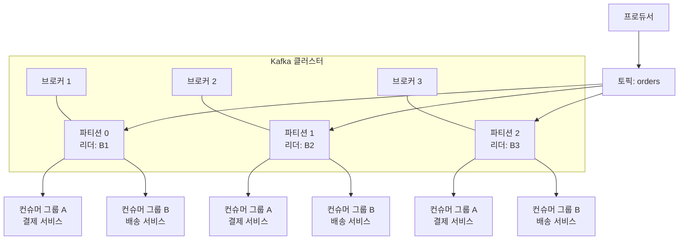

이 구조는 다음 순서로 이해하면 쉽다.

1. **브로커**는 데이터를 저장하고 요청을 처리하는 서버다.
2. **토픽**은 이벤트를 분류하는 논리적 이름이다.
3. **파티션**은 토픽을 나눈 독립 로그이자 병렬 처리 단위다.
4. **복제본**은 파티션 장애에 대비한 사본이다.
5. **컨슈머 그룹**은 파티션을 나누어 처리하는 소비자 집합이다.
6. **오프셋**은 컨슈머가 어디까지 읽었는지를 나타내는 위치다.

---

## 3.2 브로커

### 브로커의 역할

브로커는 Kafka 클러스터를 구성하는 서버다. 파티션 데이터를 디스크에 저장하고, 프로듀서와 컨슈머의 요청을 처리한다.

브로커가 수행하는 주요 역할은 다음과 같다.

- 파티션 로그와 세그먼트 파일 저장
- 프로듀서의 이벤트 기록 요청 처리
- 컨슈머의 이벤트 조회 요청 처리
- 파티션 복제와 리더·팔로워 관리
- 컨슈머 그룹과 오프셋 관련 요청 처리
- 트랜잭션 및 메타데이터 관련 요청 처리

각 브로커는 클러스터 전체 데이터를 모두 저장하지 않는다. 여러 파티션 중 일부만 담당한다. 따라서 브로커를 추가하면 저장 공간과 요청 처리 능력을 클러스터 전체에 분산할 수 있다.

### 브로커의 요청 처리

클라이언트 요청은 네트워크 연결을 통해 브로커로 들어온다. 브로커는 요청 유형에 따라 데이터를 기록하거나 읽고, 필요하면 다른 브로커와 통신한다.

브로커 내부의 기본적인 요청 처리 구성은 다음과 같다.

| 구성 요소 | 기본 개수 | 역할 |
|---|---:|---|
| Acceptor | 리스너당 1개 | 새 TCP 연결 수락 |
| Network Processor | `num.network.threads` 기준 | 요청 읽기와 응답 쓰기 |
| Request Handler | `num.io.threads` 기준 | Kafka API 실행과 로컬 작업 처리 |
| 응답 경로 | 별도 풀 없음 | 네트워크 프로세서가 응답을 소켓에 기록 |

프로듀서 멱등성이나 트랜잭션을 사용하면 일반적인 요청 처리 외에도 시퀀스 번호 확인, 트랜잭션 조정, 펜싱 등의 작업이 추가된다.

> 이 표에서 설명하는 스레드 구성은 브로커 내부 구현에 해당하며, Kafka 버전과 설정에 따라 세부 사항이 달라질 수 있다.

### KRaft 환경의 브로커

Kafka 4.0부터 ZooKeeper가 완전히 제거되고, 메타데이터 관리는 KRaft 기반 컨트롤러 쿼럼이 담당한다.

KRaft 환경에서는 브로커와 컨트롤러의 역할을 구분해서 이해해야 한다.

- **컨트롤러 쿼럼**: 클러스터 메타데이터의 변경을 관리하고, Raft 방식으로 메타데이터를 복제한다.
- **`__cluster_metadata` 로그**: 토픽, 파티션, 설정, 브로커 등록 등 클러스터 메타데이터를 기록한다.
- **브로커**: 컨트롤러로부터 메타데이터 스냅샷이나 변경 사항을 받아 로컬 캐시에 유지하고, 클라이언트 요청을 처리한다.

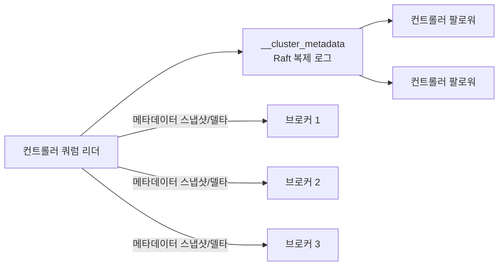

KRaft의 핵심 효과는 메타데이터 관리에 필요했던 외부 시스템 의존성을 줄이고, Kafka 자체의 합의 메커니즘으로 클러스터 상태를 관리한다는 데 있다.

---

## 3.3 토픽

### 토픽의 정의

토픽은 이벤트의 논리적 카테고리다. 프로듀서는 토픽에 이벤트를 기록하고, 컨슈머는 토픽을 구독한다. 예를 들어 다음과 같은 토픽을 만들 수 있다.

- `orders.created`
- `payments.completed`
- `inventory.stock-changed`

Kafka의 토픽은 단순한 메시지 목록이 아니다. 토픽은 하나 이상의 파티션으로 이루어진 논리적 스트림이며, 각 파티션은 순서화된 불변 로그다.

### 토픽과 파티션

토픽을 여러 파티션으로 나누면 다음과 같은 이점이 있다.

- 여러 브로커에 데이터를 분산할 수 있다.
- 여러 컨슈머가 동시에 읽을 수 있다.
- 파티션별로 복제본을 구성할 수 있다.
- 특정 키를 같은 파티션에 배치해 키 단위 순서를 유지할 수 있다.

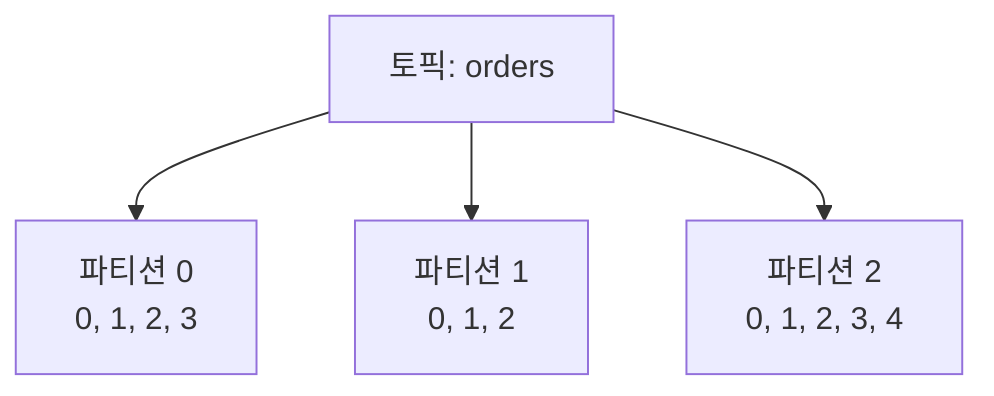

토픽 하나가 단일 머신에만 저장된다면, 그 토픽의 최대 크기와 처리량은 해당 머신의 저장 용량과 성능으로 제한된다. 파티션은 이 제약을 줄이기 위해 하나의 논리적 스트림을 여러 독립 로그로 나누는 방식이다.

### 토픽 이름

토픽 이름은 운영자가 의미를 파악할 수 있도록 설계해야 한다. 소문자와 도메인·엔티티·이벤트 타입을 포함하는 이름을 권장한다.

```text
payments.invoice.created
users.profile.updated
clickstream.web
```

다음과 같은 이름은 피하는 편이 좋다.

```text
events
data
test
orders2
```

토픽 이름만 보고도 데이터의 성격과 소유 도메인을 이해할 수 있어야 한다. 다만 조직 전체의 명명 규칙은 프로젝트에서 먼저 합의해야 한다.

> **주의**: 토픽 이름에서 점(`.`)과 밑줄(`_`)을 혼용하면 모니터링 시스템의 메트릭 이름과 충돌할 수 있다. 하나의 규칙을 정하고 일관되게 적용한다.

---

## 3.4 파티션과 세그먼트

### 파티션은 독립적인 로그다

파티션은 토픽을 물리적으로 분할한 단위이며, 각각 독립적인 추가 전용(Append-only) 로그로 동작한다. 이벤트는 파티션 끝에 추가되고, 각 이벤트에는 파티션 안에서 증가하는 오프셋이 부여된다.

예를 들어 `orders` 토픽이 세 개의 파티션으로 구성되어 있다면, 각 파티션은 별도의 오프셋 공간을 가진다.

```text
orders-0: offset 0, 1, 2, 3, ...
orders-1: offset 0, 1, 2, 3, ...
orders-2: offset 0, 1, 2, 3, ...
```

따라서 Kafka에서 이벤트의 위치는 단순한 숫자 하나가 아니라 일반적으로 다음의 조합으로 표현된다.

```text
(topic, partition, offset)
```

예를 들어 다음 위치는 `orders` 토픽의 파티션 1에서 오프셋 42에 해당하는 이벤트를 의미한다.

```text
(orders, 1, 42)
```

### 파티션의 순서 보장

Kafka가 보장하는 순서는 **토픽 전체의 전역 순서가 아니라 파티션 내부 순서**다. 하나의 파티션 안에서는 이벤트가 기록된 순서대로 저장되고 읽힌다.

```text
파티션 0: A → B → C
파티션 1: X → Y → Z
```

위 두 파티션의 이벤트를 하나로 합쳐 다음과 같은 전역 순서가 항상 성립한다고 볼 수는 없다.

```text
A → X → B → Y → C → Z
```

따라서 특정 엔티티의 순서가 중요하다면 같은 키의 이벤트가 같은 파티션에 기록되도록 설계해야 한다. 주문 상태 변경의 순서가 중요하다면 `order_id`를 키로 사용하는 식이다.

### 파티션과 병렬성

파티션은 Kafka에서 병렬성의 기본 단위다. 컨슈머 그룹 안에서 하나의 파티션은 한 컨슈머에 배정된다. 따라서 파티션 수는 하나의 컨슈머 그룹이 사용할 수 있는 최대 병렬성에 직접적인 영향을 준다.

| 파티션 수 | 컨슈머 수 | 결과 |
|---:|---:|---|
| 3 | 1 | 한 컨슈머가 세 파티션 처리 |
| 3 | 3 | 각 컨슈머가 한 파티션씩 처리 |
| 3 | 5 | 두 컨슈머는 파티션을 할당받지 못함 |

파티션 수가 너무 적으면 컨슈머를 추가해도 처리량이 충분히 늘지 않는다. 반대로 파티션을 지나치게 많이 만들면 파일, 메타데이터, 복제, 리밸런싱 관리 비용이 커질 수 있다.

### 세그먼트 파일

파티션 로그는 하나의 무한히 커지는 파일로 저장되지 않는다. Kafka는 파티션을 여러 세그먼트 파일로 나누어 관리한다. 세그먼트는 일정 크기나 시간이 지나면 롤오버된다.

대표적인 세그먼트 구성은 다음과 같다.

| 파일 | 역할 |
|---|---|
| `.log` | 직렬화된 레코드가 순서대로 저장되는 로그 파일 |
| `.index` | 오프셋과 로그 파일의 물리적 위치를 연결하는 희소 인덱스 |
| `.timeindex` | 타임스탬프와 오프셋을 연결하는 인덱스 |

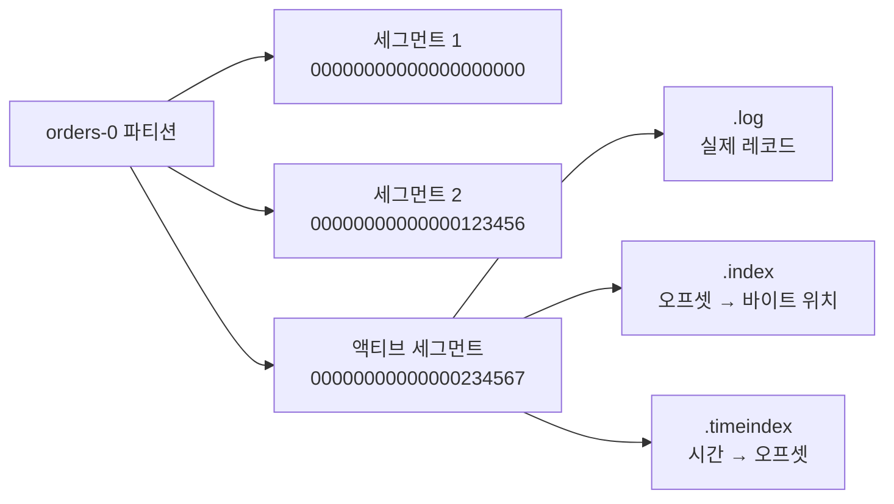

현재 쓰기가 이루어지는 세그먼트를 **액티브 세그먼트**라고 한다. 액티브 세그먼트가 설정된 크기나 시간에 도달하면 닫히고, 새로운 세그먼트가 액티브 세그먼트가 된다.

모든 오프셋을 인덱스에 기록하면 인덱스 자체가 커질 수 있다. Kafka는 일정한 바이트 간격마다 인덱스 항목을 기록하는 희소 인덱스를 사용해 메모리와 디스크 사용량을 줄인다.

---

## 3.5 오프셋과 워터마크

### 오프셋

오프셋은 파티션 안에서 이벤트의 위치를 나타내는 64비트 단조 증가 정수다.

다음과 같이 이벤트가 저장되어 있다고 하자.

```text
파티션 0

offset 0: 주문 A 생성
offset 1: 주문 B 생성
offset 2: 주문 C 생성
offset 3: 주문 A 결제 완료
```

컨슈머가 오프셋 0과 1을 처리했다면, 다음에 읽을 위치는 오프셋 2가 된다. 오프셋은 이벤트의 전역 ID가 아니라 **특정 파티션 안에서의 위치**다.

### Log End Offset와 High Watermark

분산 복제 환경에서는 로그의 끝을 두 가지 관점에서 구분해야 한다.

- **Log End Offset(LEO)**: 특정 브로커의 로컬 로그에서 다음 쓰기가 이루어질 위치
- **High Watermark(HW)**: 모든 ISR에 성공적으로 복제되어 컨슈머가 읽을 수 있는 범위의 끝

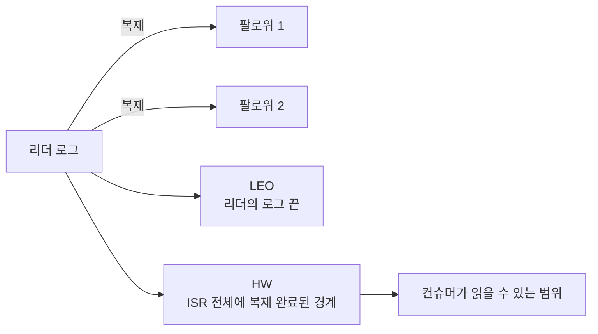

리더에 먼저 기록되었지만 팔로워에 아직 복제되지 않은 이벤트가 있다고 하자. 그 이벤트는 리더의 LEO에는 포함될 수 있지만, High Watermark 아래에는 아직 포함되지 않을 수 있다. 컨슈머는 일반적으로 High Watermark까지의 커밋된 데이터만 읽는다. 이 방식은 리더 장애가 발생했을 때 아직 안전하게 복제되지 않은 데이터가 컨슈머에 노출되는 문제를 줄인다.

---

## 3.6 복제와 ISR

Kafka는 파티션을 여러 브로커에 복제해 장애에 대비한다. 각 파티션은 다음과 같은 복제본으로 구성된다.

- **리더**: 파티션의 클라이언트 읽기·쓰기 요청을 처리한다.
- **팔로워**: 리더의 로그를 가져와 자신의 로컬 로그에 복제한다.

리더가 장애를 일으키면 팔로워 중 하나가 새 리더로 선출될 수 있다. 각 브로커는 어떤 파티션에서는 리더가 되고 다른 파티션에서는 팔로워가 되어, 클러스터 전체의 부하가 분산된다.

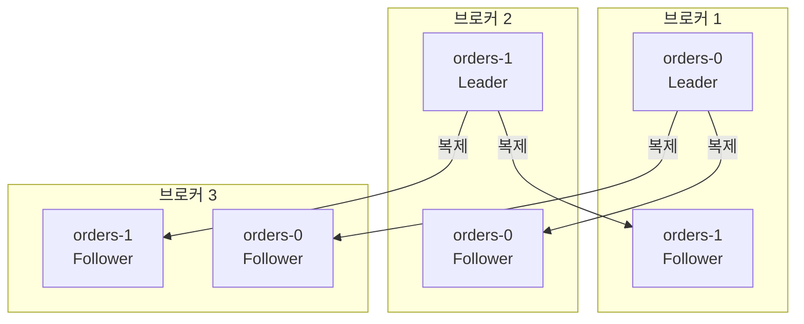

### 복제 계수

**복제 계수**(Replication Factor)는 리더를 포함한 전체 복제본 수다. 복제 계수가 3이면 하나의 파티션이 세 개의 브로커에 저장될 수 있다.

복제 계수를 높이면 장애 허용 능력은 커지지만 저장 공간과 네트워크 복제 비용도 늘어난다. 따라서 복제 계수는 데이터 중요도, 허용 가능한 장애 범위, 비용을 함께 고려해 결정해야 한다.

### ISR

**ISR**(In-Sync Replicas)은 리더와 충분히 동기화된 복제본들의 집합이다. 팔로워가 일정 시간 동안 리더의 데이터를 따라잡지 못하면 ISR에서 제외될 수 있다.

리더 장애가 발생했을 때는 일반적으로 ISR에 포함된 복제본 중에서 새 리더가 선택된다. ISR에 없는 복제본은 최신 데이터가 없을 수 있기 때문에 기본적으로 리더 후보에서 제외된다.

```text
전체 복제본:  Leader, Follower 1, Follower 2
현재 ISR:    Leader, Follower 1
지연 복제본: Follower 2
```

이 상태에서 리더가 장애를 일으키면 `Follower 1`이 새 리더가 될 수 있다. `Follower 2`를 리더로 선택하면 아직 복제되지 않은 이벤트가 사라질 위험이 있기 때문이다.

---

## 3.7 `acks`와 내구성

프로듀서가 이벤트를 전송했을 때 언제 성공으로 간주할지는 `acks` 설정으로 결정한다.

| 설정 | 성공 응답 시점 | 위험 |
|---|---|---|
| `acks=0` | 브로커 응답을 기다리지 않음 | 데이터 유실 위험이 가장 큼 |
| `acks=1` | 리더가 로컬 로그에 기록한 뒤 응답 | 팔로워 복제 전 리더 장애 시 유실 가능 |
| `acks=all` 또는 `-1` | 현재 ISR의 복제본들이 기록을 마친 뒤 응답 | 높은 내구성, ISR 축소 시 쓰기 실패 가능 |

`acks=all`은 모든 복제본을 무조건 기다린다는 뜻이 아니다. **현재 ISR에 속한 복제본**의 응답을 기다린다는 뜻이다. 따라서 `acks=all`과 `min.insync.replicas`를 함께 고려해야 한다.

예를 들어 다음 설정을 사용한다고 하자.

```text
replication.factor=3
min.insync.replicas=2
acks=all
```

ISR이 세 개라면 세 복제본의 상태를 기준으로 쓰기가 처리된다. 한 브로커가 장애를 일으켜 ISR이 두 개로 줄어들어도 최소 ISR 수인 2를 만족하므로 쓰기를 계속할 수 있다. ISR이 하나만 남으면 `min.insync.replicas=2` 조건을 만족하지 못해 쓰기가 실패한다. 이는 데이터 유실 가능성을 줄이는 대신 가용성을 일부 포기하는 설정이다.

### Unclean Leader Election

ISR에 포함되지 않은 복제본을 새 리더로 선출하는 것을 **Unclean Leader Election**이라고 한다. 이 방식은 최신 데이터가 없는 복제본을 리더로 승격할 수 있으므로 데이터 유실 가능성이 있다.

- 비활성화: 데이터 일관성을 우선하고, 적절한 ISR이 복구될 때까지 기다린다.
- 활성화: 가용성을 우선하고, 일부 데이터 유실을 허용할 수 있다.

따라서 금융 거래나 감사 로그처럼 유실이 허용되지 않는 데이터에서는 이 설정을 신중하게 검토해야 한다.

---

## 3.8 컨슈머 그룹

### 컨슈머 그룹의 역할

컨슈머 그룹은 동일한 `group.id`를 공유하는 컨슈머 인스턴스들의 논리적 집합이다. 하나의 컨슈머 그룹 안에서는 파티션이 컨슈머들에게 분배된다.

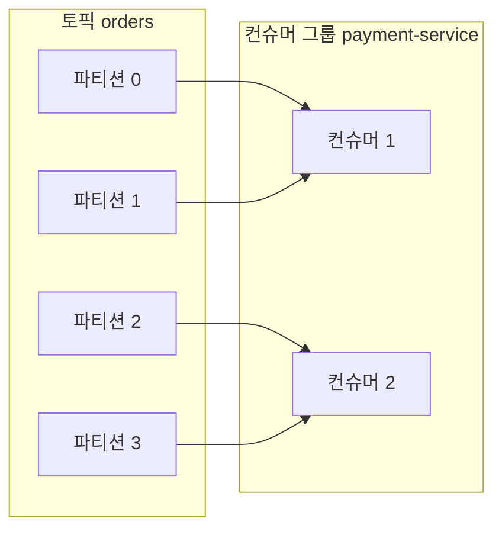

같은 그룹 안에서 하나의 파티션은 동시에 하나의 컨슈머에만 할당된다. 이 규칙은 같은 파티션의 이벤트가 여러 컨슈머에 의해 중복 처리되는 것을 방지하고, 파티션 내부 순서를 유지하는 데 도움이 된다.

반면 서로 다른 컨슈머 그룹은 같은 토픽을 독립적으로 읽는다.

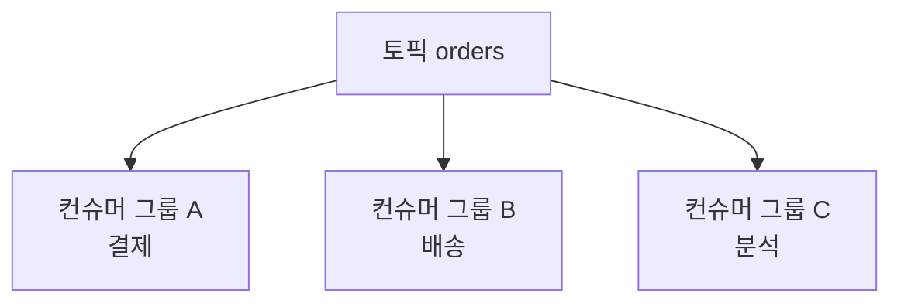

이 구조는 큐잉과 발행-구독을 함께 제공한다.

- 같은 그룹 안: 큐처럼 작업을 분배한다.
- 서로 다른 그룹 사이: 발행-구독처럼 이벤트를 독립적으로 전달한다.

### 파티션 수와 컨슈머 수

컨슈머 그룹의 병렬성은 파티션 수에 제한된다.

```text
파티션 4개, 컨슈머 2개:
- 컨슈머 1: 파티션 0, 1
- 컨슈머 2: 파티션 2, 3

파티션 4개, 컨슈머 6개:
- 컨슈머 4개: 파티션 할당
- 컨슈머 2개: 유휴 상태
```

컨슈머를 추가한다고 항상 처리량이 늘어나는 것은 아니다. 파티션 수보다 컨슈머가 많으면 일부 컨슈머는 할당받을 파티션이 없기 때문이다.

### 오프셋

컨슈머 그룹은 파티션별로 다음에 읽을 위치인 오프셋을 관리한다. 이 오프셋은 Kafka의 내부 토픽인 `__consumer_offsets`에 저장된다.

```text
group.id: payment-service

orders-0 → 다음 오프셋 120
orders-1 → 다음 오프셋 98
orders-2 → 다음 오프셋 143
```

오프셋은 이벤트 자체와 분리되어 있다. 이벤트가 토픽에 남아 있는 동안, 여러 컨슈머 그룹은 서로 다른 오프셋 위치에서 같은 이벤트를 읽을 수 있다.

---

## 3.9 리밸런싱

### 리밸런싱이 발생하는 시점

컨슈머 그룹의 구성이나 토픽의 파티션 구성이 바뀌면 파티션을 다시 분배해야 한다. 이를 **리밸런싱**(Rebalancing)이라고 한다.

다음과 같은 상황에서 리밸런싱이 발생할 수 있다.

- 새로운 컨슈머가 그룹에 참여할 때
- 컨슈머가 정상적으로 이탈할 때
- 컨슈머가 장애로 사라질 때
- 토픽의 파티션 수가 변경될 때

그룹 코디네이터 역할을 하는 브로커는 그룹 구성원에게 파티션을 재할당한다.

### Eager 리밸런싱

전통적인 Eager 방식에서는 리밸런싱이 시작되면 모든 컨슈머가 기존 파티션을 내려놓는다. 그 후 파티션을 처음부터 다시 할당한다.

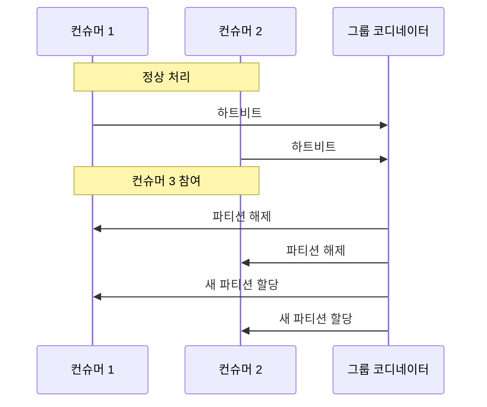

파티션 수가 많거나 그룹이 큰 경우에는 이 과정에서 소비가 일시 중단될 수 있다.

### Cooperative 리밸런싱

Cooperative 방식은 이동이 필요한 파티션만 점진적으로 재할당한다. 영향을 받지 않는 컨슈머는 가능한 한 계속 처리를 이어간다. Kafka의 KIP-429는 이 점진적 협력 리밸런싱 프로토콜을 정의한다.

| 방식 | 파티션 처리 | 장점 | 주의점 |
|---|---|---|---|
| Eager | 모든 파티션을 해제 후 재할당 | 구조가 단순함 | 전체 소비가 중단될 수 있음 |
| Cooperative | 필요한 파티션만 단계적으로 이동 | 중단 시간 감소 | 프로토콜과 설정을 함께 확인해야 함 |

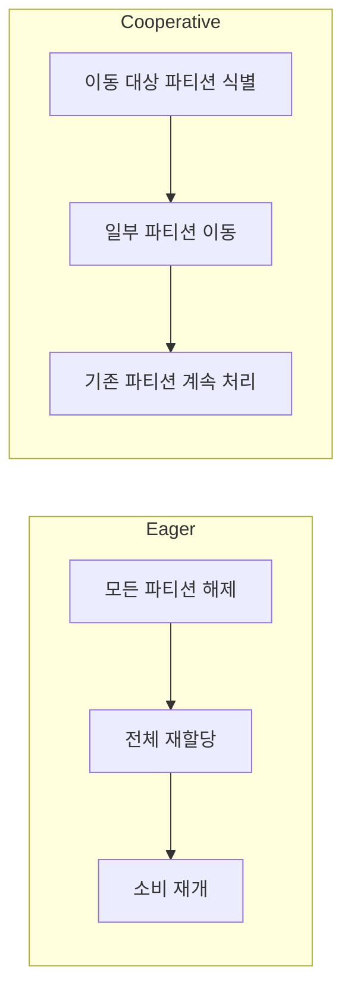

리밸런싱은 단순한 내부 이벤트가 아니다. 리밸런싱 동안 소비가 지연될 수 있고, 처리 중인 작업과 오프셋 커밋 시점이 맞물릴 수 있다. 따라서 운영 환경에서는 리밸런싱 횟수, 소요 시간, 컨슈머 지연을 함께 모니터링해야 한다.

### Static Membership

`group.instance.id`를 활용하는 Static Membership은 컨슈머가 재시작할 때 불필요한 리밸런싱을 줄이는 데 사용된다. 다만 실제 효과는 컨슈머 실행 방식과 장애 감지 설정에 따라 달라질 수 있으므로, 적용 전에 운영 환경에서 재시작·배포 시나리오를 충분히 검증해야 한다.

---

## 3.10 전달 보장

분산 시스템에서 "메시지를 한 번 전달한다"는 표현은 여러 의미를 가질 수 있다. 네트워크 오류나 프로세스 장애가 발생하면, 메시지를 다시 전송할지, 처리 전에 오프셋을 저장할지에 따라 결과가 달라진다.

Kafka에서 주로 구분하는 전달 보장은 다음 세 가지다.

| 전달 보장 | 동작 방식 | 유실 | 중복 | 적합한 예 |
|---|---|---:|---:|---|
| At-most-once | 처리 전에 오프셋 커밋, 실패 시 재처리하지 않음 | 가능 | 없음 | 일부 메트릭·로그 |
| At-least-once | 처리 후 오프셋 커밋, 실패 시 다시 처리 | 없음 | 가능 | 일반적인 업무 처리 |
| Exactly-once | 중복이나 유실이 없는 것과 같은 처리 결과를 목표로 함 | 없음 | 없음 | Kafka 내부의 원자적 파이프라인 |

### At-most-once

At-most-once는 이벤트를 최대 한 번 처리한다. 일반적으로 컨슈머가 비즈니스 로직을 실행하기 전에 오프셋을 커밋한다.

```text
1. 오프셋 커밋
2. 비즈니스 로직 처리
3. 처리 중 장애 발생
```

이 경우 컨슈머가 다시 시작해도 이미 오프셋이 이동했기 때문에 해당 이벤트를 다시 읽지 않을 수 있다. 따라서 중복은 줄지만, 처리 도중 장애가 발생하면 데이터가 유실될 수 있다.

### At-least-once

At-least-once는 이벤트를 최소 한 번 처리한다. 일반적으로 비즈니스 로직을 수행한 후 오프셋을 커밋한다.

```text
1. 이벤트 읽기
2. 비즈니스 로직 처리
3. 오프셋 커밋
```

처리와 오프셋 커밋 사이에 장애가 발생하면, 다음 실행에서 같은 이벤트를 다시 읽는다.

```text
1. 이벤트 읽기
2. 결제 처리 성공
3. 오프셋 커밋 직전 장애
4. 재시작 후 같은 이벤트 재수신
```

이 방식은 유실을 줄이는 대신 중복 처리 가능성이 있다. 따라서 컨슈머 로직은 멱등적으로 설계하거나 중복 제거 전략을 갖춰야 한다.

### Exactly-once

Exactly-once는 장애와 재시도가 있어도 결과적으로 이벤트가 정확히 한 번 처리된 것처럼 보이도록 하는 보장이다. 다만 이 개념을 과장해서는 안 된다.

Kafka의 트랜잭션과 exactly-once 처리는 주로 Kafka 토픽에서 읽고 Kafka 토픽에 쓰는 파이프라인 안에서 의미가 있다. 외부 데이터베이스, HTTP API, 결제 시스템 같은 외부 시스템의 작업까지 자동으로 정확히 한 번 실행해 주는 것은 아니다.

---

## 3.11 멱등성 프로듀서

### 멱등성이 필요한 이유

프로듀서가 브로커에 이벤트를 전송한 뒤 응답을 받지 못했다고 가정하자.

```text
1. 프로듀서가 이벤트 전송
2. 브로커가 이벤트 기록
3. 응답이 네트워크에서 유실
4. 프로듀서가 실패로 판단하고 재전송
```

브로커가 두 번째 전송을 새로운 이벤트로 기록하면 같은 이벤트가 두 번 저장된다.

멱등성 프로듀서는 이 문제를 줄인다. 프로듀서는 자신을 식별하는 Producer ID(PID)와 파티션별 시퀀스 번호를 사용한다. 브로커는 이미 처리한 시퀀스 번호를 확인해 재전송된 중복 기록을 방지한다.

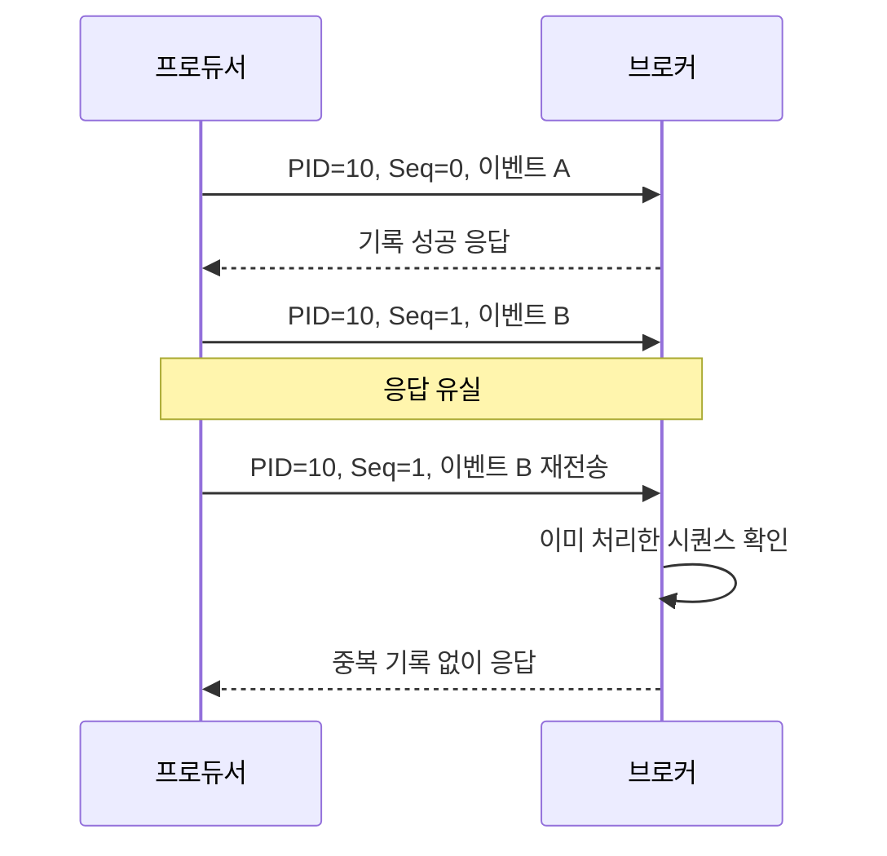

멱등성 프로듀서는 `enable.idempotence=true`로 설정해 활성화한다.

> 멱등성은 프로듀서 재시도로 인한 브로커 내부 중복 기록을 다루는 기능이다. 컨슈머가 외부 API를 두 번 호출하는 문제까지 해결하지는 않는다.

---

## 3.12 Kafka 트랜잭션

### Read-Process-Write 패턴

스트림 처리 애플리케이션은 흔히 다음 흐름을 사용한다.

```text
입력 토픽 읽기
    ↓
이벤트 처리
    ↓
출력 토픽에 결과 기록
    ↓
입력 오프셋 커밋
```

입력 이벤트를 처리하고 출력 이벤트까지 기록했지만 오프셋 커밋 전에 장애가 발생하면, 재시작 후 입력 이벤트를 다시 읽게 된다. 그 결과 출력 토픽에 같은 결과가 중복 기록될 수 있다.

Kafka 트랜잭션은 출력 레코드 기록과 입력 오프셋 커밋을 하나의 원자적 작업으로 묶는 데 사용된다.

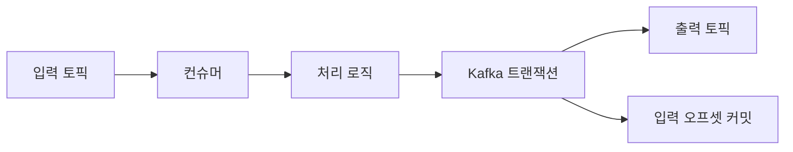

트랜잭션이 성공하면 출력 레코드와 오프셋 커밋이 함께 반영된다. 트랜잭션이 중단되면, 컨슈머는 중단된 트랜잭션의 결과를 읽지 않도록 설정할 수 있다.

### 트랜잭션 코디네이터와 커밋 마커

Kafka 트랜잭션은 트랜잭션 코디네이터와 내부 상태 저장소를 사용한다. `__transaction_state` 내부 토픽을 통해 트랜잭션 상태를 관리하며, 트랜잭션이 성공하거나 중단될 때 로그에 커밋 마커를 기록한다.

### `read_committed`

컨슈머가 트랜잭션이 완료된 레코드만 읽으려면 격리 수준을 `read_committed`로 설정한다.

```properties
isolation.level=read_committed
enable.auto.commit=false
```

반대로 `read_uncommitted`에서는 아직 트랜잭션이 완료되지 않았거나 중단될 수 있는 레코드가 노출될 수 있다.

### Exactly-once의 범위

다음은 Kafka 내부 파이프라인에서 가능한 범위다.

```text
Kafka 입력 토픽
    → 처리 애플리케이션
    → Kafka 출력 토픽
```

다음과 같은 외부 호출은 별도의 설계가 필요하다.

```text
Kafka 입력 토픽
    → 처리 애플리케이션
    → 외부 데이터베이스
    → 외부 결제 API
```

외부 시스템은 Kafka 트랜잭션에 자동으로 참여하지 않기 때문이다. 이런 경우에는 멱등 키, 중복 요청 방지, 보상 트랜잭션, 아웃박스 패턴 등 별도의 방법을 검토해야 한다.

---

## 3.13 전달 보장 설정 예제

다음은 Kafka 클라이언트 설정을 개념적으로 비교한 예제다.

### At-most-once 소비자

```properties
enable.auto.commit=false
```

처리 전에 오프셋을 먼저 커밋하는 코드 흐름을 사용한다.

```java
ConsumerRecords<String, Order> records = consumer.poll(Duration.ofMillis(100));
consumer.commitSync();  // 처리 전에 먼저 커밋

for (ConsumerRecord<String, Order> record : records) {
    process(record.value());
}
```

이 예제에서는 `process()` 실행 중 장애가 발생하면 해당 레코드가 다시 처리되지 않을 수 있다.

### At-least-once 소비자

```properties
enable.auto.commit=false
```

처리 완료 후 오프셋을 커밋한다.

```java
ConsumerRecords<String, Order> records = consumer.poll(Duration.ofMillis(100));

for (ConsumerRecord<String, Order> record : records) {
    processIdempotently(record.value());
    consumer.commitSync();
}
```

처리 후 커밋 전에 장애가 발생하면 같은 이벤트가 다시 전달될 수 있다. 따라서 `processIdempotently()`는 같은 이벤트를 여러 번 호출해도 결과가 한 번 호출한 것과 같도록 구현해야 한다.

### 멱등성 프로듀서

```properties
enable.idempotence=true
acks=all
```

프로듀서 재시도에 따른 브로커 내부 중복을 줄일 수 있다.

### 트랜잭션 프로듀서

```properties
enable.idempotence=true
transactional.id=order-transformer-1
```

애플리케이션에서는 입력 처리, 출력 기록, 오프셋 커밋을 트랜잭션 경계 안에서 함께 처리해야 한다.

> 위 코드는 전달 보장의 개념을 설명하기 위한 단순화된 예제다. 실제 애플리케이션에서는 예외 처리, 파티션별 오프셋, 리밸런싱 중 커밋, 외부 시스템의 멱등성 등을 함께 설계해야 한다.

---

## 3.14 전체 동작 흐름

앞에서 설명한 요소를 하나의 흐름으로 합치면 다음과 같다.

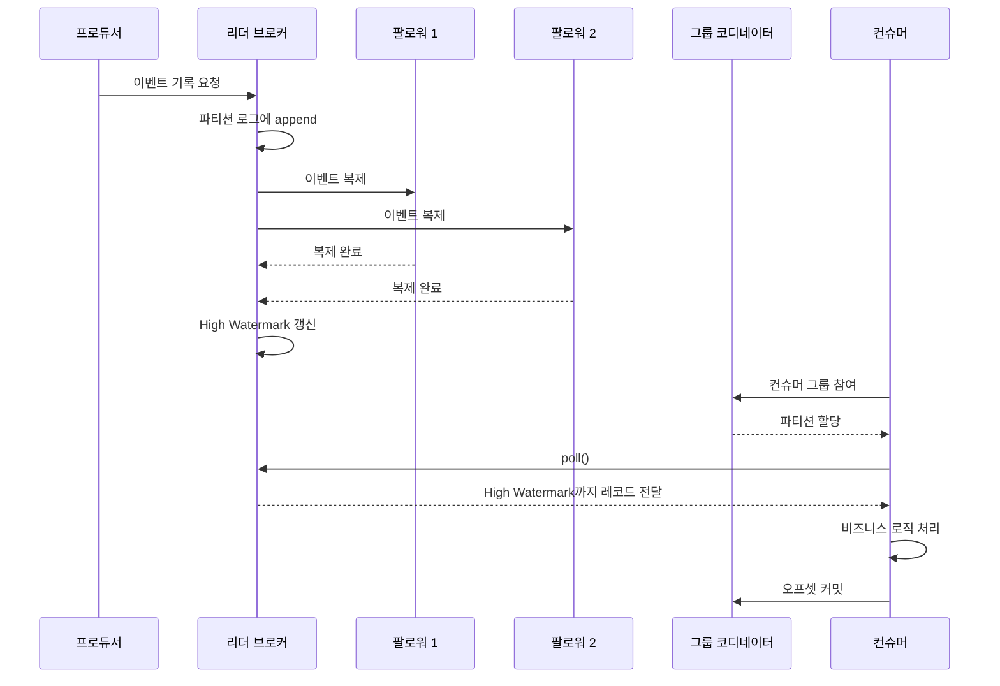

이 흐름에서 눈여겨봐야 할 경계는 다음과 같다.

- 프로듀서가 이벤트를 기록하는 위치: 파티션 리더
- 팔로워 복제가 완료되는 범위: ISR과 High Watermark
- 컨슈머가 읽는 위치: 컨슈머 그룹별 오프셋
- 파티션 할당을 관리하는 주체: 그룹 코디네이터
- 중복·유실 가능성을 결정하는 요소: 오프셋 커밋 시점과 트랜잭션 설정

---

## 3.15 핵심 개념 정리

| 개념 | 한 문장 정의 |
|---|---|
| 브로커 | 파티션 데이터를 저장하고 클라이언트 요청을 처리하는 Kafka 서버 |
| 토픽 | 이벤트를 분류하는 논리적 스트림 이름 |
| 파티션 | 토픽을 나눈 독립적인 순서화 로그이자 병렬 처리 단위 |
| 세그먼트 | 파티션 로그를 크기·시간 기준으로 나눈 물리 파일 단위 |
| 오프셋 | 파티션 안에서 이벤트의 위치를 나타내는 숫자 |
| 리더 | 파티션의 기본 읽기·쓰기 요청을 처리하는 복제본 |
| 팔로워 | 리더 로그를 복제하는 복제본 |
| ISR | 리더와 동기화된 복제본 집합 |
| High Watermark | ISR에 안전하게 복제되어 소비 가능한 경계 |
| 컨슈머 그룹 | 파티션을 나누어 처리하는 컨슈머 집합 |
| 리밸런싱 | 컨슈머 그룹의 파티션 할당을 다시 계산하는 과정 |
| At-most-once | 유실 가능성을 감수하고 중복을 피하는 전달 방식 |
| At-least-once | 중복 가능성을 감수하고 유실을 줄이는 전달 방식 |
| Exactly-once | 원자적 처리로 한 번 처리된 것과 같은 결과를 목표로 하는 방식 |
