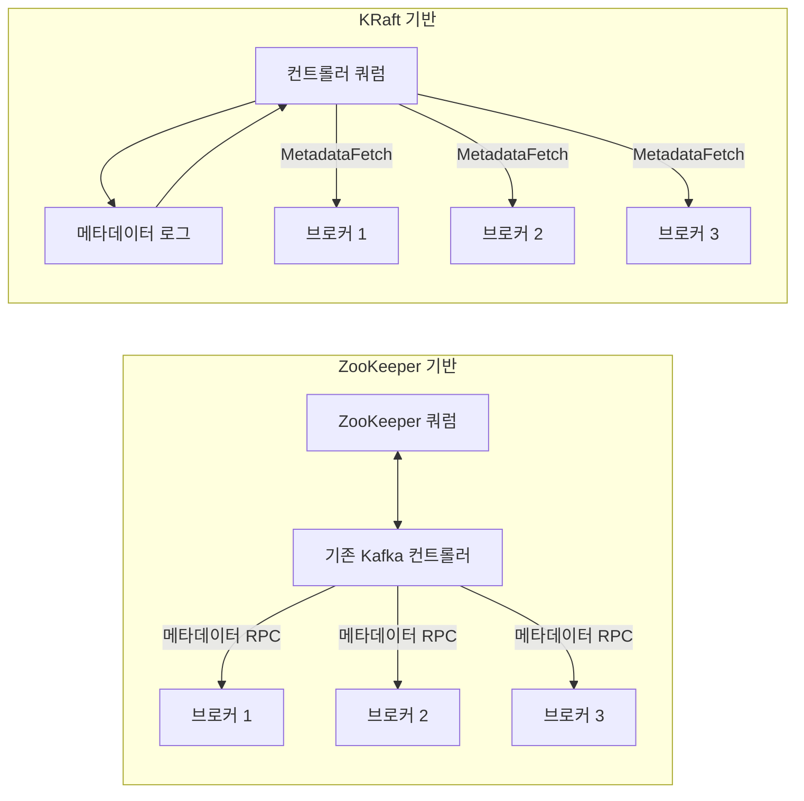
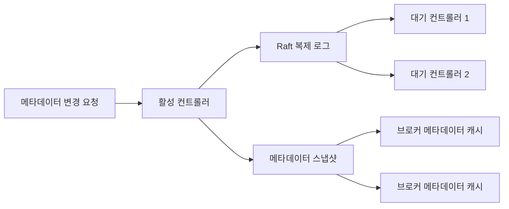
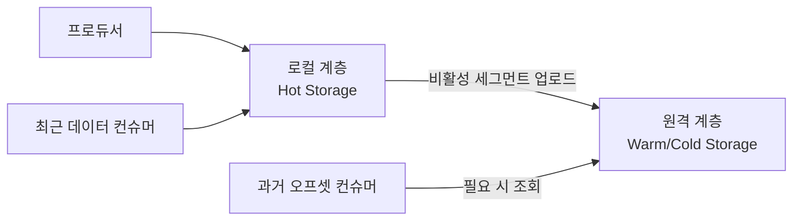
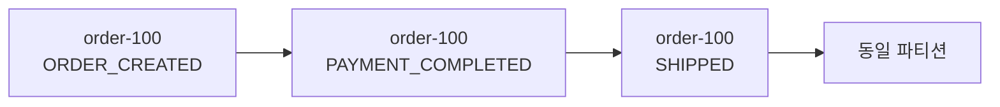
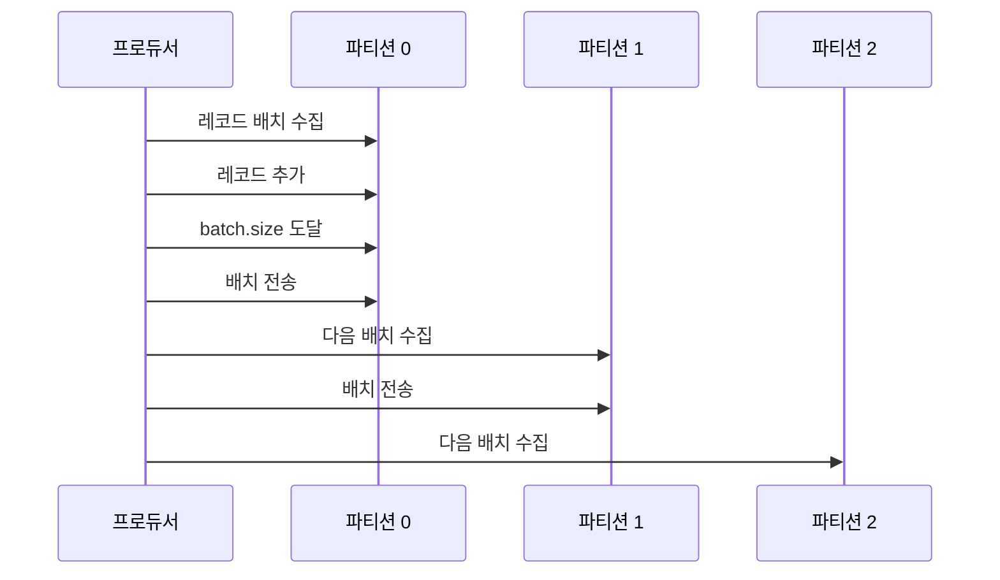
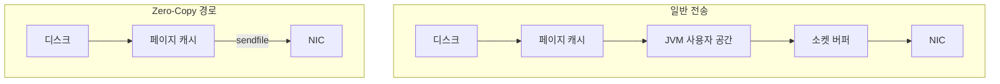
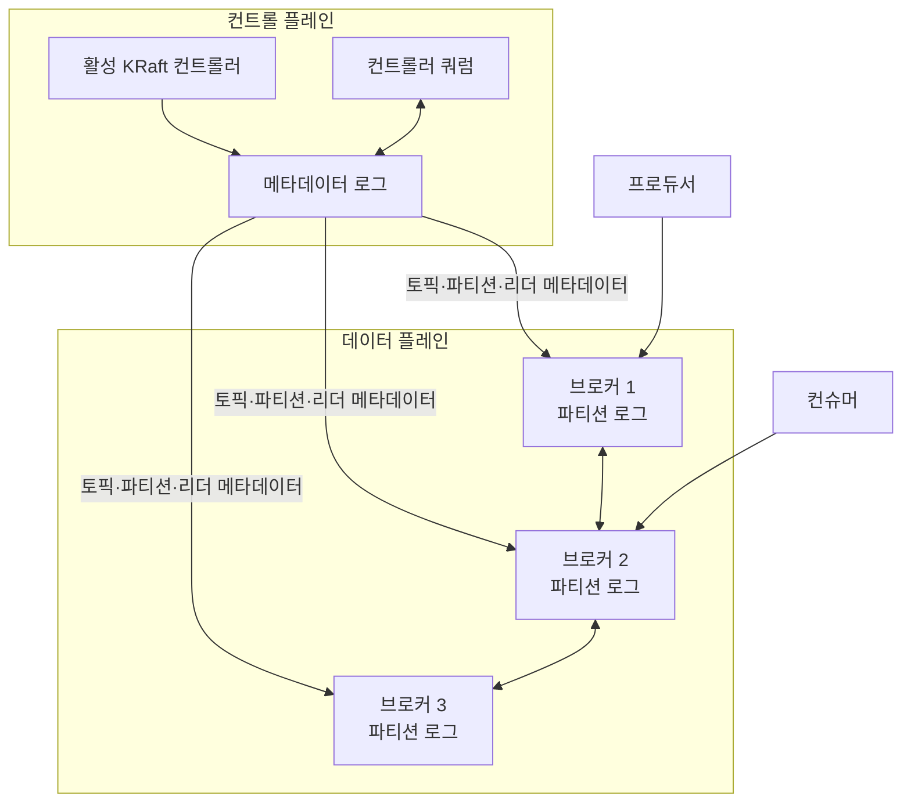

# Chapter 4. Apache Kafka 아키텍처 심화

Kafka를 처음 접한 독자는 흔히 Kafka를 "메시지를 전달하는 서버"로 이해한다. 하지만 Kafka의 핵심은 단순한 메시지 전달에 있지 않다. Kafka는 이벤트를 분산 로그에 기록하고, 그 로그의 메타데이터와 데이터를 복제하며, 컨슈머가 자신의 위치에서 원하는 만큼 읽도록 설계된 시스템이다.

Kafka 4.x에서는 이 구조가 더욱 명확해졌다. 외부 ZooKeeper에 의존하던 메타데이터 관리가 Kafka 내부의 KRaft 쿼럼으로 통합되었고, 계층형 스토리지와 파티셔닝·I/O 최적화가 발전했다. 이 장에서는 Kafka 4.3.x를 기준으로 이러한 변화를 살펴본다.

> **버전 기준**
> 이 장의 기준 버전은 Apache Kafka 4.3.x이며, 4.3.1을 최신 안정 릴리스로 삼아 서술한다. 릴리스와 설정은 빠르게 바뀌므로 실제 운영 전에는 해당 시점의 공식 문서를 다시 확인해야 한다.

## 학습 목표

이 장을 읽고 나면 다음을 설명할 수 있어야 한다.

- Kafka 4.x에서 KRaft가 필요한 이유
- 컨트롤러 쿼럼과 메타데이터 로그의 동작 방식
- Kafka 4.x의 계층형 스토리지 구조
- 키 기반·스티키 파티셔닝의 차이와 핫 파티션 문제
- 페이지 캐시와 Zero-Copy가 Kafka 성능에 미치는 영향
- Kafka 4.x의 Java 요구사항과 JVM 튜닝 시 주의점

---

## 4.1 ZooKeeper에서 KRaft로

### ZooKeeper 기반 Kafka의 구조

Kafka는 오랫동안 ZooKeeper를 사용해 클러스터 메타데이터를 관리했다. 토픽, 파티션, 브로커 등록, 리더 선출 같은 정보가 Kafka 데이터 로그와 별도의 ZooKeeper 시스템에 걸쳐 관리되는 구조였다.

이 구조는 Kafka의 초기 확장에는 기여했지만, 클러스터가 커질수록 몇 가지 부담을 만들었다.

첫째, 메타데이터의 원천이 둘로 나뉘었다. Kafka 컨트롤러와 ZooKeeper가 각각 상태를 유지하면서 두 시스템 사이의 동기화가 필요했다. 둘째, 메타데이터 변경 사항을 컨트롤러가 여러 브로커에 전파해야 했다. 파티션 수와 브로커 수가 늘어날수록 이 전파와 복구에 필요한 시간도 커졌다. 셋째, 운영자는 Kafka뿐 아니라 ZooKeeper 쿼럼도 별도로 배포하고 모니터링해야 했다.

이 문제를 해결하기 위해 제안된 것이 KIP-500이다. KIP-500은 ZooKeeper를 제거하고 Kafka가 자체적으로 메타데이터 쿼럼을 관리하는 방향을 제시했다.

### KRaft의 기본 아이디어

KRaft는 Kafka Raft Metadata Mode의 약어다. 핵심 아이디어는 클러스터 메타데이터를 외부 시스템의 트리 구조에 두지 않고, Kafka 내부의 분산 로그에 기록하는 것이다.



KRaft 환경에서 토픽 생성, 파티션 변경, 브로커 등록, 리더 변경과 같은 클러스터 상태 변화는 메타데이터 로그에 순서대로 기록된다. 대기 중인 컨트롤러는 이 로그를 복제하고 메모리 상태를 최신 상태로 유지한다. 브로커는 컨트롤러에서 메타데이터를 가져와 로컬 캐시에 반영한다.

### Kafka 4.0의 전환

Kafka 3.x에서는 KRaft가 도입되고 ZooKeeper에서 KRaft로의 전환 경로가 제공되었다. Kafka 4.0부터는 ZooKeeper 관련 레거시 코드와 설정이 제거되었으며, Kafka는 KRaft를 전제로 동작한다. 따라서 Kafka 4.x를 새로 구축할 때는 ZooKeeper를 별도로 설치하는 절차가 필요하지 않다.

이 변화는 단순히 구성 요소 하나를 제거한 것이 아니다. Kafka의 컨트롤 플레인, 즉 클러스터 메타데이터를 관리하는 영역을 Kafka 자체의 로그·복제·합의 모델 안으로 가져온 변화다.

---

## 4.2 KRaft 컨트롤러 쿼럼

### 쿼럼과 과반수

KRaft 컨트롤러는 하나의 노드가 모든 메타데이터를 독점하는 방식으로 동작하지 않는다. 여러 컨트롤러가 쿼럼을 구성하고, 그중 하나가 현재 리더 역할을 수행한다.

컨트롤러 쿼럼은 일반적으로 홀수 개의 노드로 구성한다.

| 컨트롤러 수 | 유지에 필요한 과반수 | 허용 가능한 장애 수 |
|---:|---:|---:|
| 1 | 1 | 0 |
| 3 | 2 | 1 |
| 5 | 3 | 2 |

과반수가 살아 있어야 메타데이터 변경을 합의하고 쿼럼의 가용성을 유지할 수 있다. 노드 수를 무작정 늘리는 것이 항상 좋은 것은 아니다. 컨트롤러가 많아지면 합의 과정에서 교환해야 할 메시지와 운영 비용도 커질 수 있다.

### 메타데이터 로그

KRaft는 클러스터 메타데이터를 로그 형태로 관리한다. 토픽 생성이나 파티션 리더 변경처럼 상태를 바꾸는 작업은 메타데이터 로그에 새로운 레코드로 추가된다.

```text
메타데이터 로그

offset 0: 브로커 1 등록
offset 1: orders 토픽 생성
offset 2: orders-0 파티션 생성
offset 3: orders-0 리더를 브로커 1로 지정
offset 4: 브로커 2 등록
```

컨트롤러는 이 로그를 순서대로 적용해 현재 클러스터 상태를 구성한다. 메타데이터 로그가 무한히 커지지 않도록 스냅샷을 만들 수 있다. 스냅샷에는 특정 시점의 메모리 상태가 저장되고, 이후의 변경 사항만 로그에서 다시 적용하면 된다.



### 브로커와 컨트롤러의 역할

KRaft에서는 브로커와 컨트롤러의 역할을 분리해서 이해해야 한다.

**컨트롤러**는 메타데이터 변경을 관리한다.

- 클러스터 메타데이터 로그 관리
- 컨트롤러 리더 선출
- 토픽·파티션 메타데이터 변경
- 브로커 상태 관리
- 파티션 리더 변경 결정

**브로커**는 데이터 플레인을 담당한다.

- 프로듀서의 레코드 기록
- 컨슈머의 레코드 조회
- 파티션 로그 저장
- 파티션 복제
- 클라이언트 요청 처리

하나의 노드가 두 역할을 모두 수행하도록 설정할 수도 있다. 이러한 combined 모드는 개발 환경이나 소규모 환경에 적합하며, 프로덕션에서는 역할을 분리하는 구성을 권장한다. 역할을 분리하면 브로커의 데이터 I/O나 JVM 활동이 컨트롤러의 메타데이터 처리에 미치는 영향을 줄일 수 있다.

### KRaft 노드 설정 예제

다음은 역할을 개념적으로 표현한 설정 예제다.

```properties
# 브로커와 컨트롤러를 함께 실행하는 예
process.roles=broker,controller

# 브로커가 클라이언트 요청을 받을 주소
listeners=PLAINTEXT://:9092,CONTROLLER://:9093

# 컨트롤러 간 통신 리스너
controller.listener.names=CONTROLLER
```

프로덕션 환경에서 브로커와 컨트롤러를 분리한다면 개념적으로 다음과 같이 구성할 수 있다.

```properties
# 브로커 전용 노드
process.roles=broker

# 컨트롤러 전용 노드
process.roles=controller
```

실제 배포에서는 컨트롤러 주소, 노드 식별자, 보안 프로토콜, 저장 디렉터리와 같은 설정을 환경에 맞게 지정해야 한다.

### 동적 컨트롤러 쿼럼

KIP-853을 계기로 정적 컨트롤러 목록을 사용하는 방식에서, 동적으로 컨트롤러를 추가·제거할 수 있는 방식으로 발전하고 있다. 정적 구성에서는 클러스터를 시작할 때 컨트롤러 목록을 미리 지정해야 한다. 동적 방식에서는 쿼럼 구성을 런타임에 변경할 수 있다.

다만 동적 쿼럼 변경의 세부 설정과 운영 절차는 Kafka 배포 버전에 따라 달라질 수 있으므로, 실제 도입 전에는 사용 중인 버전의 공식 운영 문서를 확인해야 한다.

### Kafka 스토리지 포맷

KRaft 기반 Kafka에서는 노드 저장소를 명시적으로 포맷하고 클러스터 ID를 연결해야 한다. `kafka-storage.sh format`을 사용해 클러스터 ID와 메타데이터 로그를 초기화한다.

```bash
kafka-storage.sh format \
  --cluster-id <cluster-id> \
  --config server.properties
```

이 명령은 기존 데이터를 포함한 디렉터리에 주의해서 사용해야 한다. 저장소 포맷은 메타데이터와 로그 디렉터리의 초기화에 영향을 주므로, 운영 클러스터에서 임의로 실행해서는 안 된다.

---

## 4.3 Kafka 4.3.x의 주요 변화

Kafka 4.3.0은 2026년 5월 22일 발표되었고, Kafka 4.3.1은 2026년 6월 25일 버그 수정 릴리스로 발표되었다.

| 버전 | 성격 | 주요 내용 |
|---|---|---|
| 4.0 | 메이저 릴리스 | ZooKeeper 완전 제거, KRaft 기반 전환 |
| 4.2 | 기능 릴리스 | Kafka Queues(Share Groups) 기능의 안정화 |
| 4.3.0 | 기능 릴리스 | KRaft 운영성, 계층형 스토리지, 그룹 코디네이터, Share Groups 등 개선 |
| 4.3.1 | 버그 수정 | 4.3.0 이후 이슈 수정, Kafka Streams RocksDB 네이티브 메모리 누수 수정 |

4.3.0에는 KRaft 컨트롤러의 Fetch 및 Snapshot 요청 크기와 관련된 설정 개선이 포함되었다. 이러한 변경은 느린 네트워크 환경에서 컨트롤러가 메타데이터 스냅샷을 수신하는 데 도움이 된다.

다만 각 KIP의 세부 동작과 운영상 영향은 릴리스 노트와 해당 KIP를 함께 확인해야 한다. 릴리스 번호만 보고 모든 클러스터가 동일한 방식으로 동작한다고 가정해서는 안 된다.

---

## 4.4 계층형 스토리지

### 로컬 디스크만 사용하는 구조

전통적인 Kafka 배포에서는 파티션 로그가 브로커의 로컬 디스크에 저장된다. 로컬 SSD나 NVMe는 빠른 읽기·쓰기를 제공하지만 비용과 용량에 한계가 있다.

데이터를 오래 보존하려면 선택지는 제한적이다.

- 브로커에 더 큰 디스크를 연결한다.
- 브로커 수를 늘려 저장 공간을 확장한다.
- 오래된 데이터를 별도의 데이터 레이크나 오브젝트 스토리지로 복사한다.
- 로컬 토픽의 보존 기간을 줄인다.

별도의 외부 적재 파이프라인을 사용하면 장기 보존은 가능하지만, Kafka 컨슈머가 과거 오프셋을 그대로 다시 읽는 경험과는 분리될 수 있다.

### KIP-405의 계층형 모델

KIP-405는 파티션 로그를 로컬 계층과 원격 계층으로 나누는 방향을 제시한다. 정확한 지원 범위와 활성화 방법은 Kafka 버전에 따라 달라질 수 있으므로, 실제 도입 전에는 사용 중인 버전의 공식 문서를 확인해야 한다.



**로컬 계층**에는 최근 데이터와 현재 쓰기 중인 액티브 세그먼트가 저장된다. 이 계층은 일반적으로 초저지연 읽기·쓰기를 담당한다.

**원격 계층**에는 일정 시간이 지나 비활성화된 세그먼트가 업로드된다. Amazon S3, Google Cloud Storage, Azure Blob, MinIO와 같은 오브젝트 스토리지가 대표적인 예다.

브로커 내부의 원격 로그 관리자는 세그먼트 업로드, 원격 메타데이터 관리, 원격 보존 기간 만료 처리를 담당한다. 컨슈머는 데이터가 로컬에 있는지 원격에 있는지 직접 알 필요가 없도록 설계된다. 과거 오프셋을 요청하면 브로커가 적절한 저장 계층에서 데이터를 가져온다.

### 계층형 스토리지의 효과

계층형 스토리지는 다음과 같은 설계 효과를 제공한다.

- 빠른 최신 데이터는 로컬 디스크에서 처리한다.
- 오래된 데이터는 저렴한 오브젝트 스토리지에 보관한다.
- 컴퓨트와 스토리지의 확장 단위를 분리할 수 있다.
- 별도의 데이터 복사 파이프라인 없이 과거 이벤트 재생을 지원할 수 있다.
- 로컬 디스크에 모든 보존 데이터를 저장해야 하는 부담을 줄인다.

하지만 "무제한 보존"이라는 표현은 주의해서 사용해야 한다. 원격 스토리지도 비용, 요청량, 보존 정책, 네트워크 지연, 장애 도메인을 가진다. 실제 보존 가능 기간은 원격 스토리지 비용과 복구 요구사항을 함께 계산해 결정해야 한다.

### 보존 계층 설계 예

| 데이터 종류 | 로컬 계층 | 원격 계층 | 주요 목적 |
|---|---|---|---|
| 최근 주문 이벤트 | 짧은 기간 | 필요 시 장기 보존 | 실시간 처리 |
| 감사 로그 | 제한된 기간 | 장기 보존 | 감사와 규정 준수 |
| 클릭스트림 | 최근 데이터 | 장기 보관 | 분석과 재처리 |
| 장애 복구용 이벤트 | 운영 요구에 따라 설정 | 장기 보존 가능 | 재생과 복구 |

---

## 4.5 파티셔닝과 파티셔너

### 키 기반 파티셔닝

프로듀서가 키를 지정하면 Kafka 프로듀서는 키를 기준으로 파티션을 선택한다. 기본적인 키 기반 계산은 다음과 같이 이해할 수 있다.

```text
partition = hash(key) % number_of_partitions
```

Kafka 클라이언트의 구체적인 해시 구현과 파티셔너 동작은 버전과 클라이언트에 따라 확인해야 하지만, 설계 관점에서 중요한 규칙은 단순하다.

> 같은 키는 같은 파티션으로 보내고, 같은 파티션 안에서 순서를 유지한다.

예를 들어 주문 이벤트를 다음과 같이 기록한다고 하자.

```text
key=order-100, value=ORDER_CREATED
key=order-100, value=PAYMENT_COMPLETED
key=order-100, value=SHIPPED
```

세 레코드가 같은 파티션으로 배치되면 주문 100에 대한 상태 변화 순서를 유지할 수 있다.



키 기반 파티셔닝은 다음과 같은 엔티티에 적합하다.

- 사용자 ID
- 주문 ID
- 세션 ID
- 계정 ID
- 디바이스 ID

### 핫 파티션

키 기반 파티셔닝은 순서를 보장하는 데 유용하지만, 특정 키에 트래픽이 집중되면 문제가 발생한다. 대형 고객사 하나가 전체 트래픽의 대부분을 발생시키면 해당 키가 매핑된 파티션만 바빠질 수 있다.

```text
파티션 0: 일반 고객 다수
파티션 1: 일반 고객 다수
파티션 2: 대형 고객 A의 이벤트 대부분
파티션 3: 일반 고객 다수
```

이 현상을 핫 파티션 또는 데이터 스큐라고 한다.

복합 키나 Salt(임의의 접미사)를 이용해 특정 키의 이벤트를 여러 파티션에 분산하는 방법이 대안이 될 수 있다.

```text
대형 고객 A#0
대형 고객 A#1
대형 고객 A#2
```

다만 이 방법은 해당 키의 모든 이벤트를 하나의 파티션에서 처리한다는 전제를 깨뜨릴 수 있다. 따라서 순서가 반드시 필요한지, 순서를 키의 전체 범위에서 보장할지 아니면 작은 단위로 보장할지 먼저 정해야 한다.

### 키가 없는 레코드

키가 `null`인 레코드는 키 기반 순서를 사용할 수 없다. Kafka 2.4 이후 키가 없는 레코드에 대해 Sticky Partitioner 계열의 동작이 도입되었다.

#### 레거시 라운드 로빈

레거시 방식에서는 키가 없는 레코드를 파티션에 순환 배치했다. 이 방식은 파티션을 고르게 사용할 수 있지만, 프로듀서 배치가 여러 파티션으로 빠르게 쪼개질 수 있다.

#### Sticky Partitioner

Sticky Partitioner는 하나의 파티션에 레코드를 일정 기간 모은다. 배치가 가득 차거나 `linger.ms`가 만료되면 배치를 전송하고 다음 파티션으로 이동한다. 이렇게 하면 작은 배치가 여러 파티션으로 분산되는 문제를 줄일 수 있다.



Sticky Partitioner의 목적은 이벤트의 전역 순서를 보장하는 것이 아니다. 키가 없는 레코드에서는 애초에 이러한 순서 보장이 없으며, 핵심 목적은 배칭 효율과 처리량을 개선하는 것이다.

이후 UniformStickyPartitioner가 전체 파티션의 부하 균형까지 고려하는 방향으로 발전했다. 실제 기본 파티셔너 클래스와 적용 범위는 사용하는 클라이언트 라이브러리 버전에 따라 다를 수 있으므로 도입 전 확인이 필요하다.

---

## 4.6 브로커 I/O: 순차 쓰기와 페이지 캐시

### Kafka가 디스크를 사용하는 방식

Kafka의 로그는 파티션 끝에 레코드를 추가하는 append-only 구조다. 이러한 순차 쓰기는 임의 위치를 반복해서 갱신하는 방식보다 디스크 I/O를 예측하기 쉽다.

Kafka는 데이터를 JVM 객체로 장기간 보관하기보다는 운영체제의 페이지 캐시를 적극 활용한다. 컨슈머가 데이터를 읽을 때 이미 페이지 캐시에 데이터가 있다면 디스크 접근을 줄일 수 있다. 페이지 캐시는 브로커 프로세스의 Java 힙과 별개인 운영체제 메모리 영역이다.


이 구조가 중요한 이유는 Java 힙에 모든 이벤트를 객체로 저장할 때 발생할 수 있는 객체 오버헤드와 GC 부담을 줄일 수 있기 때문이다. 다만 페이지 캐시 사용량은 메모리와 다른 프로세스의 활동, 디스크 특성에 영향을 받으므로 무조건 크게 잡는다고 성능이 보장되는 것은 아니다.

### Zero-Copy

일반적인 파일 전송에서는 데이터가 여러 버퍼와 메모리 영역을 거칠 수 있다.

```text
디스크
  → OS 페이지 캐시
  → 사용자 공간 버퍼
  → 소켓 버퍼
  → 네트워크 카드
```

Kafka는 가능한 경우 Linux의 `sendfile()`과 같은 Zero-Copy 메커니즘을 사용해 사용자 공간으로 불필요하게 데이터를 복사하는 비용을 줄인다. 개념적으로는 다음과 같다.

```text
디스크
  → OS 페이지 캐시
  → NIC 버퍼
```

Zero-Copy는 데이터가 실제로 아무 곳에도 복사되지 않는다는 뜻이라기보다, 애플리케이션 사용자 공간을 거치는 불필요한 복사를 줄이는 방식으로 이해하는 것이 정확하다.



이 구조는 특히 이미 로그로 기록된 데이터를 컨슈머에게 전송할 때 효과적이다. 반면 이벤트를 역직렬화해 애플리케이션 로직으로 처리해야 하는 경우에는 애플리케이션 자체의 메모리와 CPU 비용이 여전히 발생한다.

---

## 4.7 JVM과 운영체제 튜닝

### Java 버전 요구사항

Kafka 4.0부터 Java 요구사항이 구성요소별로 달라졌다.

| 구성요소 | 최소 Java 버전 |
|---|---:|
| Kafka 브로커 | Java 17 |
| Kafka Connect | Java 17 |
| Kafka Tools | Java 17 |
| Kafka 클라이언트 | Java 11 |
| Kafka Streams 애플리케이션 | Java 11 |

Java 8은 Kafka 4.0에서 제거되었고, 브로커·Connect·Tools에는 Java 17이 요구된다. 이 차이는 브로커와 애플리케이션을 같은 Java 버전으로 실행해야 한다는 뜻이 아니다. 각 구성요소의 공식 요구사항에 맞는 JDK를 사용해야 한다.

### 힙을 무작정 크게 만들지 않는 이유

Kafka 브로커의 메모리는 Java 힙만으로 구성되지 않는다.

- Java 힙
- 메타데이터와 애플리케이션 객체
- 네트워크 버퍼
- 페이지 캐시
- 네이티브 메모리
- 운영체제와 파일 매핑 영역

Java 힙을 지나치게 크게 설정하면 페이지 캐시에 사용할 수 있는 메모리가 줄어들 수 있다. 반대로 힙이 지나치게 작으면 메타데이터와 요청 처리 중 메모리 압박이 생길 수 있다.

따라서 "힙을 크게 할수록 좋다"는 규칙은 Kafka에 적합하지 않다. 워크로드와 브로커의 파티션 수, 요청량, 메모리 크기를 기준으로 측정해야 한다.

### G1GC

Kafka 운영 사례에서 흔히 쓰이는 JVM 설정으로 G1GC를 들 수 있다.

```bash
KAFKA_HEAP_OPTS="
-Xms6g
-Xmx6g
-XX:+UseG1GC
-XX:MaxGCPauseMillis=20
-XX:InitiatingHeapOccupancyPercent=35
-XX:G1HeapRegionSize=16M
"
```

이 설정은 특정 대규모 운영 사례에서 사용된 예시다. 브로커의 메모리 크기와 파티션 수, 메시지 크기, 압축 방식이 다른 환경에 그대로 적용해서는 안 된다. 특히 `-Xms6g -Xmx6g`는 보편적인 정답이 아니라 참고 값이다.

G1GC 외에 JDK 21 이상에서는 Generational ZGC나 Shenandoah와 같은 저지연 수집기를 특수한 환경에서 검토할 수 있다. 다만 최신 공식 문서의 GC 권장값과 지원 범위는 실제 도입 전 반드시 재확인해야 한다.

### 운영체제 메모리와 스왑

Kafka의 페이지 캐시 활용을 고려하면 스왑으로 인해 디스크 I/O가 예기치 않게 지연되지 않도록 운영체제 메모리 정책을 점검해야 한다.

대표적으로 다음과 같은 값을 참고할 수 있다.

```text
vm.swappiness = 1
vm.dirty_background_ratio = 5
vm.dirty_ratio = 10
```

파일 디스크립터와 메모리 매핑 제한도 확인 대상이다.

```text
nofile = 100000 이상
vm.max_map_count = 262144 이상
```

그러나 이 값은 모든 배포 환경에 그대로 적용할 수 있는 절대값이 아니다. 컨테이너 런타임, 클라우드 이미지, 스토리지 드라이버, 커널 버전에 따라 설정 방식과 적정값이 달라질 수 있다.

운영자는 다음 항목을 먼저 측정해야 한다.

- 브로커의 실제 페이지 캐시 적중률
- 디스크 지연시간과 처리량
- JVM GC 일시정지
- 네이티브 메모리 사용량
- 스왑 발생 여부
- 열린 파일 디스크립터 수
- 파티션과 세그먼트 수

> **운영 원칙**
> 튜닝값은 설정 파일에 먼저 적는 것이 아니라, 병목을 측정한 뒤 바꾸는 것이다. 모든 브로커에 동일한 값을 적용하기 전에 개발·스테이징 환경에서 부하 테스트를 수행한다.

---

## 4.8 KRaft와 데이터 플레인의 관계

KRaft는 주로 **컨트롤 플레인**을 관리한다. 이벤트 데이터 자체를 처리하는 데이터 플레인과 메타데이터를 관리하는 컨트롤 플레인은 서로 다른 문제를 해결한다.



예를 들어 프로듀서가 `orders` 토픽에 이벤트를 기록할 때 다음과 같은 흐름이 일어난다.

1. 프로듀서는 토픽과 파티션의 위치를 메타데이터에서 확인한다.
2. 해당 파티션의 리더 브로커에 레코드를 보낸다.
3. 리더는 로컬 로그에 레코드를 추가한다.
4. 팔로워가 레코드를 복제한다.
5. 컨슈머는 파티션의 오프셋을 기준으로 레코드를 읽는다.

이 과정에서 KRaft는 토픽이 어느 브로커에 있고, 어느 브로커가 파티션 리더인지 알려준다. 이벤트 본문을 직접 저장하고 소비하는 역할은 브로커의 데이터 플레인에 있다.

---

## 4.9 실습: KRaft 단일 노드 클러스터 개념 구성

입문자가 KRaft의 흐름을 이해하기 위한 최소 실습은 다음 단계로 구성할 수 있다.

### 1단계: 설정 파일 준비

```properties
process.roles=broker,controller
node.id=1

listeners=PLAINTEXT://:9092,CONTROLLER://:9093
advertised.listeners=PLAINTEXT://localhost:9092

controller.listener.names=CONTROLLER
controller.quorum.voters=1@localhost:9093

log.dirs=/tmp/kafka-logs
```

> 이 예제는 개념 설명용이다. 실제 기본 설정과 배포 방식은 Kafka 버전에 따라 다를 수 있으므로, 실습 전에 해당 버전의 공식 빠른 시작 가이드를 확인하는 것이 좋다.

### 2단계: 저장소 초기화

```bash
CLUSTER_ID="$(kafka-storage.sh random-uuid)"

kafka-storage.sh format \
  --standalone \
  --cluster-id "$CLUSTER_ID" \
  --config server.properties
```

### 3단계: 브로커 실행

```bash
kafka-server-start.sh server.properties
```

### 4단계: 토픽 생성

```bash
kafka-topics.sh \
  --bootstrap-server localhost:9092 \
  --create \
  --topic orders \
  --partitions 3 \
  --replication-factor 1
```

### 5단계: 이벤트 발행

```bash
kafka-console-producer.sh \
  --bootstrap-server localhost:9092 \
  --topic orders \
  --property "parse.key=true" \
  --property "key.separator=:"
```

입력 예:

```text
order-100:ORDER_CREATED
order-100:PAYMENT_COMPLETED
order-101:ORDER_CREATED
```

### 6단계: 이벤트 소비

```bash
kafka-console-consumer.sh \
  --bootstrap-server localhost:9092 \
  --topic orders \
  --from-beginning \
  --property print.key=true
```

이 실습에서 확인할 수 있는 내용은 다음과 같다.

- 토픽은 여러 파티션으로 구성된다.
- 키가 같은 이벤트는 같은 파티션에 배치될 수 있다.
- 컨슈머는 토픽의 현재 데이터뿐 아니라 `--from-beginning` 옵션으로 과거 이벤트도 읽을 수 있다.
- 실제 클러스터에서는 단일 노드가 아니라 여러 브로커와 컨트롤러 쿼럼을 사용한다.

---

## 4.10 설계와 운영 체크리스트

### KRaft

- Kafka 4.x에서는 ZooKeeper가 아니라 KRaft를 기준으로 설계한다.
- 컨트롤러 쿼럼은 과반수 장애 허용 범위를 계산해 구성한다.
- 개발 환경과 프로덕션 환경의 combined·분리 구성을 구분한다.
- 메타데이터 로그와 스냅샷의 저장 위치를 확인한다.
- 컨트롤러와 브로커의 장애를 별도로 모니터링한다.

### 파티셔닝

- 순서가 필요한 엔티티를 먼저 정의한다.
- 해당 엔티티를 파티션 키로 사용할지 결정한다.
- 키 집중으로 인한 핫 파티션을 점검한다.
- 키가 없는 이벤트에 전역 순서가 필요하지 않은지 확인한다.
- 파티션 수와 컨슈머 병렬성의 관계를 계산한다.

### 스토리지

- 로컬 디스크와 원격 스토리지의 보존 역할을 분리한다.
- 원격 데이터 조회 시 지연시간과 비용을 측정한다.
- 보존 기간뿐 아니라 재처리 요구사항을 기준으로 retention을 정한다.
- 디스크 사용량과 세그먼트 업로드 실패를 모니터링한다.

### JVM과 OS

- Java 버전 요구사항을 구성요소별로 확인한다.
- 힙 크기와 페이지 캐시 사이의 균형을 측정한다.
- GC 일시정지와 네이티브 메모리를 함께 관찰한다.
- 스왑, 파일 디스크립터, `vm.max_map_count`를 점검한다.
- 튜닝값은 부하 테스트 후 적용한다.

---

## 4.11 이 장의 핵심 정리

Kafka 4.x의 아키텍처를 이해하는 핵심은 다음 네 문장으로 요약할 수 있다.

1. **KRaft는 Kafka의 메타데이터 관리 기능을 Kafka 내부의 Raft 기반 로그로 통합한다.**
2. **파티션은 데이터 분산과 병렬성의 단위이며, 키 기반 파티셔닝은 엔티티 단위 순서를 유지하는 도구다.**
3. **계층형 스토리지는 최근 데이터는 빠른 로컬 디스크에, 오래된 데이터는 저렴한 원격 스토리지에 배치하는 구조다.**
4. **Kafka의 성능은 분산 구조만이 아니라 순차 로그 쓰기, 페이지 캐시, Zero-Copy, JVM·운영체제 설정의 결합에서 나온다.**

Kafka를 운영할 때 중요한 것은 특정 설정값을 암기하는 것이 아니다. 어떤 메타데이터가 컨트롤 플레인에서 관리되는지, 어떤 이벤트가 어느 파티션에 기록되는지, 어떤 데이터가 어느 저장 계층에 있는지, 그리고 병목이 CPU·메모리·디스크·네트워크 중 어디에서 발생하는지를 추적하는 능력이다.
