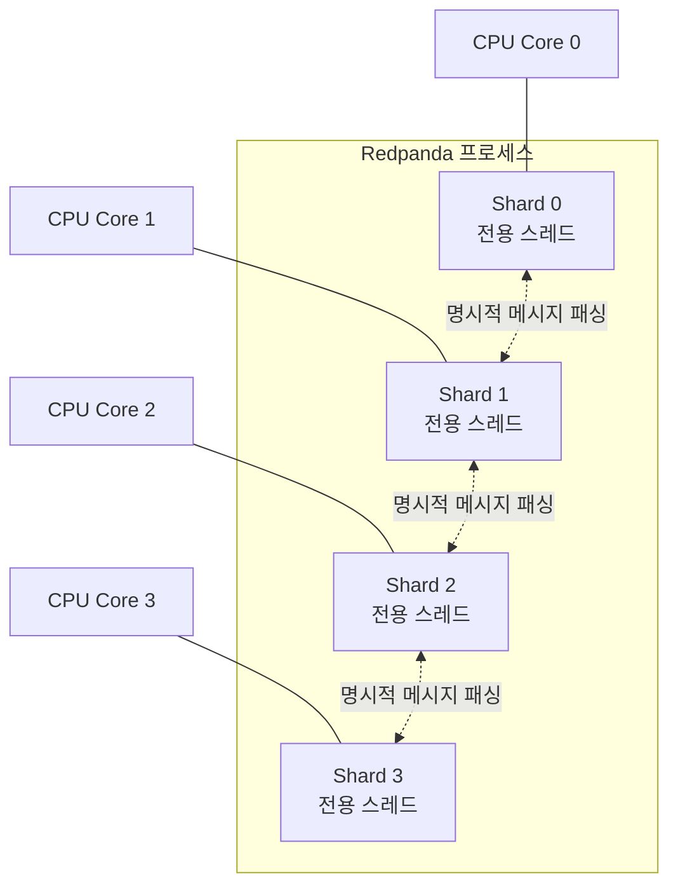
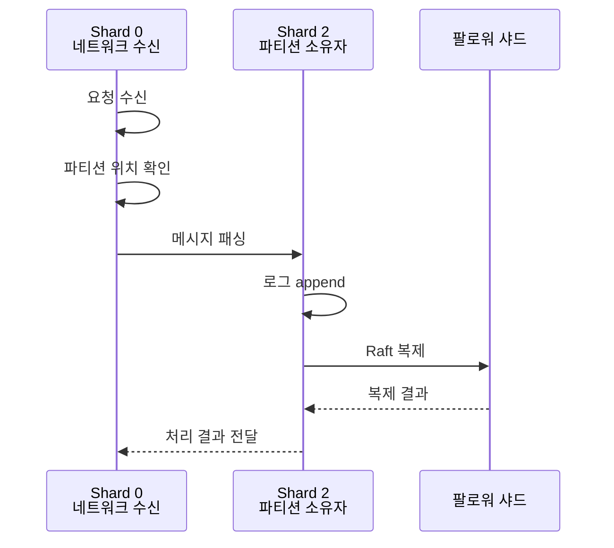
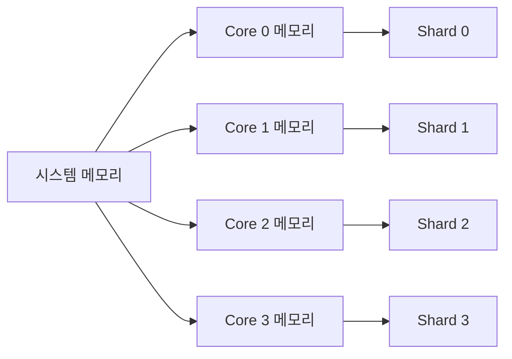
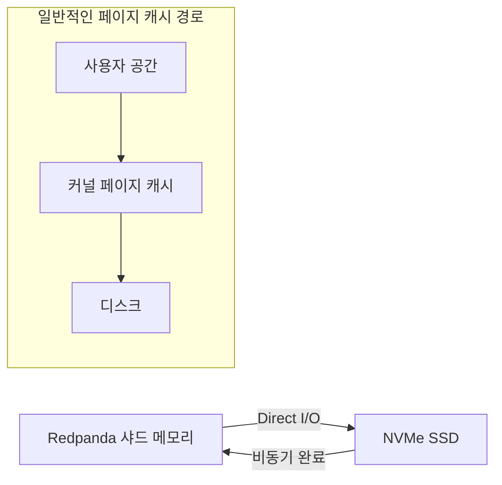
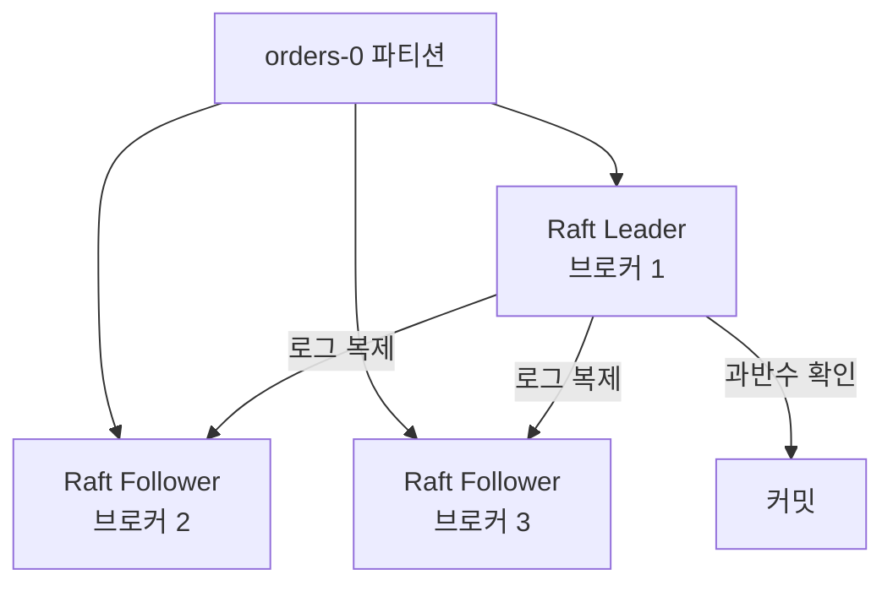
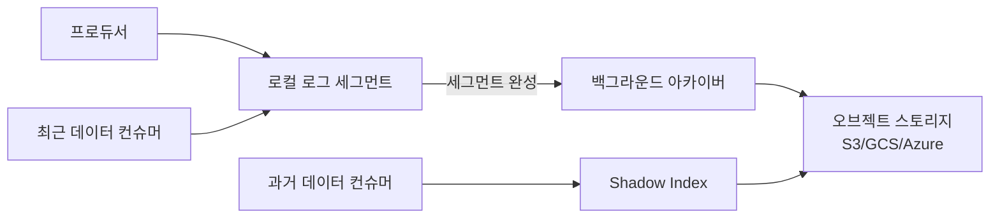
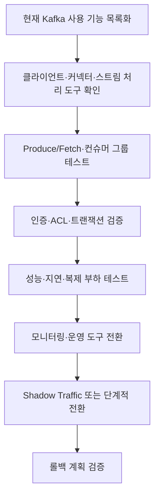

# Chapter 5. Redpanda 아키텍처 심화

Redpanda는 Kafka 프로토콜과 생태계를 활용하면서도 내부 구현을 다른 방향으로 설계한 이벤트 스트리밍 플랫폼이다. Kafka가 JVM과 운영체제 페이지 캐시를 적극 활용하는 구조라면, Redpanda는 C++와 Seastar 프레임워크를 기반으로 코어별 실행 단위와 애플리케이션 수준의 메모리·I/O 제어를 강조한다.

이 차이는 단순히 "Java로 작성했는가, C++로 작성했는가"의 문제가 아니다. Redpanda는 CPU 코어, 메모리, 네트워크, 스토리지의 동작 경로를 하나의 실행 모델로 묶어 예측 가능한 처리 지연과 하드웨어 효율을 얻으려 한다. 대신 이러한 설계는 기존 멀티스레드 애플리케이션과 다른 프로그래밍 모델을 요구하며, Kafka와의 호환성도 모든 기능에서 동일하게 보장되는 것은 아니다.

> **버전 기준**
> 이 장은 Redpanda v26.2.x를 기준으로 작성하며, v26.2.2를 최신 패치 버전으로 삼아 서술한다. Redpanda는 릴리스 주기가 빠르므로 기능, 호환성, 라이선스 조건은 실제 도입 시점에 공식 문서로 다시 확인해야 한다.

## 학습 목표

이 장을 읽고 나면 다음을 설명할 수 있어야 한다.

- Redpanda가 Seastar 기반 thread-per-core 모델을 사용하는 이유
- shared-nothing, 샤드, 메시지 패싱의 관계
- Redpanda의 Raft 기반 파티션 복제 구조
- Kafka API 호환성의 범위와 대표적인 예외
- Redpanda Tiered Storage와 Shadow Indexing의 동작 방식
- Redpanda의 성능·운영 이점과 도입 시 고려할 트레이드오프

---

## 5.1 Redpanda의 설계 방향

### Kafka 호환, 다른 내부 구조

Redpanda는 Kafka 프로토콜 0.11 이상을 지원하는 Kafka 호환 스트리밍 플랫폼이다. 기존 Kafka 클라이언트는 대부분 애플리케이션 코드 변경 없이 Redpanda에 연결할 수 있으며, 일반적으로 변경되는 부분은 `bootstrap.servers`와 인증·보안 설정이다.

그러나 Kafka 호환성은 내부 구현이 Kafka와 같다는 뜻이 아니다. Redpanda는 다음과 같은 내부 설계 방향을 선택했다.

| 영역 | Kafka 중심 모델 | Redpanda 중심 모델 |
|---|---|---|
| 구현 언어·실행 환경 | JVM 기반 | C++ 네이티브 바이너리 |
| 코어 활용 | JVM 스레드와 OS 자원 활용 | Seastar thread-per-core |
| 메모리 | Java 힙과 OS 페이지 캐시 조합 | 코어별 메모리와 자체 할당기 |
| 동시성 | 여러 스레드와 공유 상태 | shared-nothing과 명시적 메시지 패싱 |
| 파티션 복제 | 리더·팔로워와 ISR | 파티션별 Raft 그룹 |
| 메타데이터 | Kafka 4.x에서는 KRaft 쿼럼 | 클러스터 내부 컨트롤러 파티션·Raft |
| 운영 도구 | Kafka CLI, JMX 등 | `rpk`, Prometheus 중심 |
| 스토리지 확장 | 로컬 로그와 계층형 스토리지 | 로컬 로그와 Tiered Storage·Shadow Indexing |

이 표는 "어느 제품이 더 우수한가"를 말하기 위한 것이 아니다. 같은 Kafka API를 사용하더라도 내부 실행 모델과 운영 방식이 다를 수 있다는 점을 보여준다.

### JVM과 ZooKeeper 의존성

Redpanda는 JVM이나 ZooKeeper를 사용하지 않는 단일 네이티브 바이너리 방향을 취한다. 브로커, Raft, Schema Registry 호환 엔드포인트, HTTP Proxy와 같은 기능을 하나의 플랫폼 안에서 제공하는 것을 운영 단순성의 요소로 내세운다.

이 구조의 기대 효과는 다음과 같다.

- JVM GC 일시정지에 의한 지연 변동 감소
- ZooKeeper 또는 별도 메타데이터 클러스터 운영 부담 감소
- 하나의 바이너리와 도구를 중심으로 한 배포
- 최신 멀티코어·NVMe 하드웨어 활용

다만 JVM이 없다는 사실만으로 모든 지연 문제가 사라지는 것은 아니다. 네트워크, 디스크, 오브젝트 스토리지, 복제, 애플리케이션 처리 로직은 여전히 지연을 발생시킬 수 있다. Redpanda는 이를 다른 방식으로 관리할 뿐이다.

---

## 5.2 Seastar와 thread-per-core

### Reactor와 Shard

Redpanda의 핵심 실행 모델은 Seastar의 **thread-per-core** 또는 **reactor-per-core**다. 애플리케이션은 CPU 코어마다 하나의 실행 스레드를 두고, 각 스레드를 특정 코어에 고정한다. Seastar에서는 코어별 실행 단위를 **샤드**(shard)라고 부른다.



각 샤드는 자신의 실행 흐름과 상태를 주로 소유한다. 여러 스레드가 동일한 메모리 영역을 무작정 공유하는 대신, 필요한 작업을 해당 데이터를 소유한 샤드에 메시지로 전달한다.

### Shared-nothing

이 모델을 **shared-nothing**이라고 부른다. shared-nothing은 시스템에 메모리가 전혀 공유되지 않는다는 뜻이 아니라, 정상적인 처리 경로에서 코어 간 공유 상태와 잠금 경쟁을 최소화한다는 뜻이다.

전통적인 멀티스레드 프로그램은 다음과 같은 형태가 될 수 있다.

```text
스레드 A ─┐
          ├─ 공유 자료구조 ── mutex
스레드 B ─┘
```

두 스레드가 같은 자료구조를 변경하려면 잠금을 사용해야 한다. 잠금이 많아지면 대기 시간이 늘어나고, CPU 캐시의 내용이 코어 사이에서 이동하는 캐시 바운스가 발생할 수 있다.

Seastar의 모델은 다음과 같은 방향을 취한다.

```text
샤드 A ── 자체 메모리·상태
    │
    └── 메시지 전달 ──> 샤드 B ── 자체 메모리·상태
```

각 코어는 자신의 메모리와 데이터 구조를 소유하고, 코어 간 통신은 명시적인 메시지 전달로 처리한다. 이 방식의 목적은 락과 원자적 연산의 필요성을 줄이는 데 있다.

### "코어당 하나의 스레드"의 의미

thread-per-core는 모든 작업이 실제로 하나의 코어에서 끝난다는 의미가 아니다. 네트워크 요청을 받은 코어가 특정 파티션을 담당하는 다른 코어로 작업을 전달할 수 있다.

예를 들어 다음과 같은 흐름을 생각해 보자.

1. 샤드 0이 클라이언트 연결을 수락한다.
2. 메타데이터를 확인해 목적지 파티션을 찾는다.
3. 파티션을 담당하는 샤드 2로 작업을 전달한다.
4. 샤드 2가 로그 기록과 복제를 수행한다.
5. 결과가 필요한 경우 샤드 0으로 응답을 전달한다.



따라서 thread-per-core는 "조정이 전혀 없다"는 뜻이 아니다. 공유 메모리 기반의 조정을 명시적인 메시지 패싱과 데이터 소유권으로 바꾼다는 뜻에 가깝다. 다만 파티션이 코어에 정확히 어떻게 배치되는지에 대한 세부 구현은 버전에 따라 달라질 수 있다.

### 협력형 스케줄링

Seastar는 사용자 공간에서 협력형 멀티태스킹을 수행한다. 실행 중인 작업은 적절한 지점에서 제어권을 양보해야 한다. 긴 동기식 작업이나 블로킹 호출이 reactor를 붙잡으면 해당 코어의 다른 작업이 지연될 수 있다.

일반적으로 수백 마이크로초 이상 블로킹하는 작업은 문제로 감지될 수 있다. 다만 이 값은 설계 원칙과 진단 기준을 이해하기 위한 참고치이며, 실제 Redpanda 버전과 설정에서의 정확한 임계값은 별도로 확인해야 한다.

```text
좋은 작업:
작업 A → await/yield → 작업 B → await/yield → 작업 C

문제가 될 수 있는 작업:
작업 A → 긴 동기식 I/O 또는 계산 → 작업 B
```

이 모델의 장점은 명확하다. 코드가 이벤트 루프를 장시간 차단하지 않도록 설계되면 지연시간을 더 예측하기 쉽다. 반대로 기존의 블로킹 라이브러리나 임의의 멀티스레드 라이브러리를 그대로 가져오기 어렵다는 단점이 있다.

---

## 5.3 메모리와 버퍼 관리

### 코어 로컬 메모리

Seastar는 시스템 메모리를 코어별로 나누어 관리하는 방향을 취한다. 각 코어는 자체 메모리 영역을 사용하고, 실행 경로는 가능한 한 해당 코어의 메모리와 캐시를 활용한다.



이 방식은 공유 메모리 경합을 줄이는 대신 데이터가 어느 샤드에 있는지와 작업을 어느 샤드에서 실행할지를 중요하게 만든다. 특정 샤드에 데이터가 몰리면 코어별 부하가 균형을 잃을 수 있다.

### iobuf와 버퍼 재사용

Redpanda는 `iobuf`라는 버퍼 관리 구조를 사용한다. iobuf는 참조 카운팅과 조각난 버퍼 체인을 활용해, 데이터를 하나의 연속된 메모리 블록으로 불필요하게 복사하지 않도록 돕는다.

```text
네트워크 조각 1 ─┐
네트워크 조각 2 ─┼─> iobuf 체인 ─> 파싱·저장·복제
네트워크 조각 3 ─┘
```

이 구조는 다음 작업에서 복사를 줄이는 데 도움이 된다.

- 네트워크에서 받은 데이터 전달
- 파티션 샤드로 요청 전달
- 로그 기록 전 버퍼 조합
- 복제 데이터 전달

다만 Zero-Copy라는 표현이 모든 처리 단계에서 복사가 전혀 없다는 의미는 아니다. 메시지 파싱, 직렬화, 압축, 암호화, 애플리케이션 변환이 필요한 경우에는 해당 작업에 메모리와 CPU가 사용된다.

### 메모리 프로파일링의 트레이드오프

Redpanda와 Seastar는 자체 메모리 할당기를 사용한다. 이 할당기는 thread-per-core 모델에 맞춰 메모리를 효율적으로 관리하지만, 일반적인 C/C++ 메모리 분석 도구가 그대로 작동하지 않을 수 있다.

이를 보완하기 위해 할당 백트레이스를 수집하는 힙 프로파일러를 제공하지만, 모든 할당을 추적하면 상당한 성능 비용이 발생하므로 프로덕션에서 상시 활성화하기는 어렵다.

이 점은 운영에서 중요한 교훈을 준다.

> 성능을 높이기 위해 메모리 관리를 애플리케이션 쪽으로 가져오면, 기본 운영체제 도구로 문제를 분석하기 어려워질 수 있다.

따라서 다음을 함께 준비해야 한다.

- Redpanda가 제공하는 메모리 지표
- 코어별 메모리 사용량
- reactor stall 로그
- 프로파일링 도구의 제한적 사용 절차
- 재현 가능한 부하 테스트 환경

---

## 5.4 스토리지와 Raft 복제

### Direct I/O와 디스크 제어

Kafka는 운영체제 페이지 캐시를 적극적으로 활용하는 반면, Redpanda는 애플리케이션이 메모리와 I/O를 더 직접적으로 제어하는 방향을 취한다. Redpanda는 Direct I/O와 비동기 I/O를 활용해 커널 페이지 캐시의 예측하기 어려운 동작을 줄인다.



Direct I/O는 성능을 자동으로 보장하는 기능이 아니다. 운영체제의 캐시를 우회하는 만큼 애플리케이션이 버퍼 수명, 정렬, 읽기 패턴, 디스크 큐를 책임져야 한다. 스토리지 장치와 커널 환경이 적합하지 않으면 오히려 성능이 나빠질 수 있다.

### 파티션별 Raft 그룹

Redpanda는 각 토픽 파티션을 독립적인 Raft 그룹으로 다룬다. 하나의 파티션은 리더와 팔로워 복제본으로 구성되며, 리더는 쓰기 요청을 처리하고 팔로워는 로그를 복제한다.



프로듀서가 이벤트를 보내면 리더는 로그 엔트리를 만들고 팔로워에 복제한다. 과반수 복제본에 기록된 후 이벤트가 커밋되는 구조다. `acks=all`을 사용하는 경우에도 정확한 성공 조건은 Redpanda 버전과 설정 문서를 확인해야 한다.

### Kafka ISR과의 차이를 이해하는 방법

Kafka와 Redpanda 모두 리더·팔로워 복제와 과반수 기반의 안정성을 제공한다. 그러나 내부 구현과 용어가 동일하지는 않다.

| 관점 | Kafka | Redpanda |
|---|---|---|
| 복제 단위 | 파티션 | 파티션 |
| 복제 모델 | 리더·팔로워, ISR | 파티션별 Raft 그룹 |
| 합의 관점 | Kafka 복제 프로토콜 | Raft 합의 |
| 리더 장애 | 컨트롤러와 복제 상태에 따라 새 리더 선출 | Raft 그룹에서 새 리더 선출 |
| 데이터 커밋 | 복제 상태와 High Watermark | Raft 커밋 인덱스 기반 |
| 운영 명령 | Kafka 도구 | `rpk`와 Redpanda 도구 |

이 표는 사용자가 Kafka의 ISR을 Redpanda에 그대로 대입하면 안 된다는 점을 보여준다. 클라이언트 API는 비슷할 수 있지만, 장애 분석과 복구 절차는 제품별 문서를 따라야 한다.

---

## 5.5 Kafka API 호환성

### 호환성이 의미하는 것

Redpanda 공식 문서는 Kafka 0.11 이상 클라이언트와의 호환성을 명시한다. Apache Kafka Java Client, librdkafka, franz-go, KafkaJS, kafka-python 계열 등 여러 클라이언트가 검증 대상에 포함된다.

간단한 Kafka 프로듀서 코드는 브로커 주소만 바꾸어 Redpanda에 연결할 수 있다.

```java
Properties props = new Properties();
props.put(
    ProducerConfig.BOOTSTRAP_SERVERS_CONFIG,
    "redpanda-1:9092"
);
props.put(
    ProducerConfig.KEY_SERIALIZER_CLASS_CONFIG,
    StringSerializer.class.getName()
);
props.put(
    ProducerConfig.VALUE_SERIALIZER_CLASS_CONFIG,
    StringSerializer.class.getName()
);

try (KafkaProducer<String, String> producer =
         new KafkaProducer<>(props)) {
    producer.send(
        new ProducerRecord<>(
            "orders",
            "order-100",
            "ORDER_CREATED"
        )
    );
}
```

이 예제는 API 호환성의 기본적인 의미만 보여준다. 실제 마이그레이션에서는 인증, ACL, 트랜잭션, 모니터링, 토픽 설정, 운영 도구를 별도로 검증해야 한다.

### 호환되지 않는 기능도 있다

"Kafka 호환"을 "모든 Kafka 기능이 완전히 동일함"으로 해석하면 안 된다. 대표적인 차이는 다음과 같다.

| 영역 | Redpanda에서 확인된 제한 |
|---|---|
| SCRAM | 한 사용자에게 여러 SCRAM 메커니즘을 동시에 설정할 수 없음 |
| HTTP Proxy | 데이터 생산·소비 중심이며 토픽·ACL CRUD를 지원하지 않음 |
| 쿼터 | Kafka의 `request_percentage` 쿼터는 지원하지 않음 |
| 트랜잭션 | KIP-890 서버 측 방어 기능이 구현되지 않으며 Kafka 4.x 클라이언트는 기존 프로토콜로 폴백 |
| Kafka 내부 도구 | ZooKeeper 전용 도구나 Kafka 내부 메타데이터 조작 도구를 그대로 사용할 수 없음 |
| JVM·JMX | JVM 기반이 아니므로 JVM GC 설정과 JMX 기반 운영 방식이 그대로 적용되지 않음 |
| Kafka Streams·ksqlDB | JVM과 Kafka 내부 동작에 깊이 결합된 기능은 별도 호환성 검증 필요 |

특히 Kafka Streams나 ksqlDB처럼 Kafka 생태계의 내부 동작을 깊게 가정하는 도구는 단순한 Produce·Fetch API보다 더 높은 수준의 호환성 검증이 필요하다.

### 마이그레이션 검증 항목

Kafka에서 Redpanda로 전환할 때는 다음 순서로 검증하는 것이 좋다.

1. 사용 중인 클라이언트와 버전을 확인한다.
2. Produce·Fetch·Consumer Group 동작을 테스트한다.
3. 키 기반 파티셔닝과 파티션별 순서를 확인한다.
4. 인증·ACL·TLS·SASL 구성을 검증한다.
5. 멱등성 프로듀서와 트랜잭션을 확인한다.
6. Kafka Connect, Flink, Spark, Debezium 등 연계 도구를 테스트한다.
7. 모니터링과 알림을 Prometheus 기반으로 재구성한다.
8. Kafka CLI 대신 `rpk`를 사용하는 운영 절차를 정리한다.
9. 장애 복구와 롤백 시나리오를 실행한다.

---

## 5.6 Redpanda Tiered Storage와 Shadow Indexing

### 로컬 저장소와 오브젝트 스토리지

Redpanda의 Tiered Storage는 안정된 로그 세그먼트를 오브젝트 스토리지로 오프로드한다. Amazon S3, Google Cloud Storage, Azure Blob Storage, Azure Data Lake Storage 등이 지원 대상이다.



최근 데이터는 로컬 디스크에서 읽고, 오래된 데이터는 오브젝트 스토리지에서 읽는다. 클라이언트는 같은 Kafka API를 사용하므로 저장 계층의 차이를 직접 처리할 필요가 없다.

### Shadow Indexing

원격 세그먼트를 조회하려면 해당 데이터가 어느 객체에 있는지 알아야 한다. Redpanda는 원격 세그먼트의 오프셋 범위, 크기, 위치 같은 메타데이터를 인덱스로 관리한다. 이를 **Shadow Indexing**이라고 부른다.

```text
토픽 orders-0

offset 0–999      → 로컬 세그먼트 A
offset 1000–1999  → 로컬 세그먼트 B
offset 2000–2999  → S3 object C
offset 3000–3999  → S3 object D
```

컨슈머가 오프셋 2500을 요청하면 다음 흐름을 기대할 수 있다.

1. 브로커가 오프셋 2500의 저장 위치를 확인한다.
2. Shadow Index에서 원격 객체를 찾는다.
3. 오브젝트 스토리지에서 필요한 세그먼트를 가져온다.
4. Kafka Fetch 응답 형식으로 컨슈머에 전달한다.

### Tiered Storage 설정 예제

클러스터에서 오브젝트 스토리지를 활성화하고, 토픽을 tiered 모드로 설정하는 흐름은 개념적으로 다음과 같다.

```yaml
# 개념적 설정 예
cloud_storage_enabled: true
```

토픽 설정은 버전에 따라 다음과 같은 형태로 지정된다.

```bash
rpk topic alter-config orders \
  --set redpanda.storage.mode=tiered
```

정확한 명령 옵션과 설정명, 필요한 자격 증명 구성은 반드시 사용 중인 Redpanda 버전의 공식 문서에서 확인해야 한다.

### 운영상의 의미

Tiered Storage는 다음과 같은 요구에 적합하다.

- 대량 이벤트의 장기 보존
- 로컬 SSD 비용 절감
- 과거 이벤트 재처리
- 클러스터 복구와 재해 복구 보조
- 최근 데이터와 과거 데이터의 저장 비용 분리

그러나 원격 데이터 읽기는 로컬 디스크 읽기와 같지 않다. 오브젝트 스토리지의 네트워크 지연, 요청 제한, 데이터 전송 비용, 원격 서비스 장애를 고려해야 한다.

| 데이터 접근 | 주요 저장 위치 | 일반적 고려사항 |
|---|---|---|
| 최신 이벤트 | 로컬 NVMe | 낮은 지연, 높은 IOPS |
| 오래된 이벤트 | 오브젝트 스토리지 | 비용 절감, 네트워크 지연 |
| 대규모 재처리 | 원격 계층 중심 | 처리량·요청 비용·시간 |
| 장애 복구 | 원격 계층 활용 가능 | 복구 시나리오와 권한 검증 |

"사실상 무제한 보존"은 로컬 디스크 제약이 줄어든다는 의미로 이해해야 한다. 원격 스토리지도 저장 비용과 요청 비용을 가지므로, 보존 기간과 재처리 빈도를 함께 계산해야 한다.

---

## 5.7 성능과 운영

### Scale-up 우선

Redpanda는 사용 가능한 하드웨어를 최대한 활용한 뒤 scale-out하는 방향을 강조한다. 이는 여러 개의 작은 노드보다 코어와 NVMe를 갖춘 노드 하나를 효율적으로 사용하는 것이 유리할 수 있다는 관점이다.

다만 scale-up이 항상 정답은 아니다. 장애 도메인, 가용 영역, 네트워크, 복제, 유지보수, 노드 교체 시간까지 함께 고려해야 한다.

### 기본 사이징 가이드

Redpanda가 제시하는 사이징 방향은 다음과 같다.

| 항목 | 권장 방향 |
|---|---|
| CPU | 브로커당 최소 4코어 |
| 메모리 | 코어당 최소 2GB |
| 파티션 메모리 | 파티션 복제본당 최소 2MB 수준으로 알려져 있으나 버전·워크로드별 재확인 필요 |
| 스토리지 | NVMe SSD 우선 |
| 네트워크 | 복제 인자와 동시 읽기·쓰기 대역폭을 포함해 계산 |
| Kubernetes | 정적 CPU 관리자 정책과 전용 리소스 고려 |
| 자동 튜닝 | `rpk redpanda tune all`, `rpk iotune` 활용 |

위 값은 출발점이지 용량 계획의 결과가 아니다. 메시지 크기, 압축률, 파티션 수, 복제 인자, 컨슈머 지연, 원격 스토리지 사용 여부에 따라 실제 요구사항이 달라진다.

### 자동 튜너

Redpanda는 `rpk`를 통해 운영체제와 디스크 설정을 자동으로 조정하는 기능을 제공한다.

```bash
rpk redpanda mode production
rpk redpanda tune all
rpk iotune
```

자동 튜너는 CPU, 디스크, 네트워크, 커널 설정을 점검하고 환경에 맞는 값을 생성하는 데 도움을 준다. 하지만 컨테이너 환경에서는 호스트 커널과 Pod 권한에 의해 적용 가능한 범위가 달라질 수 있다.

### Reactor stall

thread-per-core 모델에서는 하나의 reactor가 특정 코어의 작업을 전담한다. 따라서 하나의 작업이 너무 오래 실행되면 해당 코어에서 처리할 다른 작업이 대기한다. 이를 reactor stall로 관찰할 수 있다.

운영자는 다음을 모니터링해야 한다.

- reactor stall 발생 횟수
- 코어별 CPU 사용률
- 코어별 요청 지연시간
- 파티션별 처리량
- 복제 지연
- 디스크 I/O 지연
- 메모리 할당과 회수
- 원격 스토리지 읽기 지연

---

## 5.8 Redpanda의 장점과 트레이드오프

### 주요 장점

Redpanda의 설계에서 기대할 수 있는 이점은 다음과 같다.

- JVM GC에 의한 일시정지 없이 네이티브 프로세스로 동작
- thread-per-core를 통한 코어 고정과 캐시 활용
- shared-nothing 모델을 통한 락 경합 감소
- 파티션별 Raft 복제
- ZooKeeper나 별도 메타데이터 시스템 없이 동작
- `rpk` 중심의 운영 경험
- 내장 Schema Registry와 HTTP Proxy
- 로컬·원격 저장소를 결합한 Tiered Storage

Redpanda는 낮은 테일 레이턴시와 높은 하드웨어 효율을 주요 목표로 제시한다. 다만 벤더가 제시하는 성능 수치는 하드웨어, 메시지 크기, 복제 인자, 압축, 클라이언트, 네트워크와 같은 조건에 크게 좌우된다. Kafka와 Redpanda를 동일 조건에서 비교한 중립적인 벤치마크는 흔치 않으므로, 도입 전 자체 워크로드로 직접 검증하는 것이 안전하다.

### 주요 트레이드오프

| 영역 | 기대 이점 | 주의할 점 |
|---|---|---|
| thread-per-core | 락·컨텍스트 스위칭 감소 | 코어 소유권과 메시지 패싱 설계가 필요 |
| 네이티브 C++ | JVM GC 부담 감소 | 네이티브 메모리 분석이 어려울 수 있음 |
| Direct I/O | 페이지 캐시 변동성 감소 | 애플리케이션과 하드웨어 의존성 증가 |
| Kafka 호환성 | 기존 클라이언트 재사용 | 일부 기능·도구·프로토콜 예외 존재 |
| 단일 바이너리 | 배포 단순화 | 제품별 운영 도구와 절차 학습 필요 |
| Tiered Storage | 장기 보존과 비용 절감 | 원격 읽기 지연과 요청 비용 발생 |
| scale-up | 작은 노드 수로 높은 자원 활용 | 대형 노드 장애 시 영향 범위가 커질 수 있음 |
| 자체 메모리 할당기 | 코어별 효율적 메모리 관리 | 범용 프로파일링 도구 사용에 제약 |

---

## 5.9 라이선스와 도입 검토

Redpanda Community Edition은 Business Source License(BSL) 기반으로 소스가 공개된다. Enterprise Edition에는 별도 라이선스 키와 추가 기능이 적용된다. BSL은 Apache 2.0과 동일한 조건이 아니므로, Redpanda를 도입할 때는 기술적 적합성뿐 아니라 조직의 오픈소스 정책과 서비스 제공 방식까지 검토해야 한다.

검토 항목은 다음과 같다.

- 내부 사용인지 외부 서비스 제공인지
- Community Edition과 Enterprise Edition의 기능 차이
- 소스 공개 라이선스의 사용 조건
- 상용 서비스에 포함할 때의 제한
- 지원 계약과 기술 지원 범위
- 라이선스 변경·전환 조건
- 장기 운영 시 비용 구조

라이선스는 릴리스마다 조건이 변경될 수 있으므로, 이 책의 설명을 법률 자문으로 사용해서는 안 된다. 정확한 조건은 반드시 사용 중인 버전의 공식 라이선스 전문으로 확인해야 한다.

---

## 5.10 실습: Kafka 클라이언트로 Redpanda 연결하기

### 목표

이 실습에서는 Kafka Java 클라이언트를 Redpanda에 연결한다.

### 프로듀서 설정

```java
Properties props = new Properties();

props.put(
    ProducerConfig.BOOTSTRAP_SERVERS_CONFIG,
    "localhost:9092"
);
props.put(
    ProducerConfig.KEY_SERIALIZER_CLASS_CONFIG,
    StringSerializer.class.getName()
);
props.put(
    ProducerConfig.VALUE_SERIALIZER_CLASS_CONFIG,
    StringSerializer.class.getName()
);
props.put(
    ProducerConfig.ACKS_CONFIG,
    "all"
);
props.put(
    ProducerConfig.ENABLE_IDEMPOTENCE_CONFIG,
    "true"
);
```

### 이벤트 발행

```java
try (KafkaProducer<String, String> producer =
         new KafkaProducer<>(props)) {

    ProducerRecord<String, String> record =
        new ProducerRecord<>(
            "orders",
            "order-100",
            "{\"type\":\"ORDER_CREATED\"}"
        );

    producer.send(record).get();
}
```

### 컨슈머 설정

```java
Properties props = new Properties();

props.put(
    ConsumerConfig.BOOTSTRAP_SERVERS_CONFIG,
    "localhost:9092"
);
props.put(
    ConsumerConfig.GROUP_ID_CONFIG,
    "order-reader"
);
props.put(
    ConsumerConfig.KEY_DESERIALIZER_CLASS_CONFIG,
    StringDeserializer.class.getName()
);
props.put(
    ConsumerConfig.VALUE_DESERIALIZER_CLASS_CONFIG,
    StringDeserializer.class.getName()
);
props.put(
    ConsumerConfig.AUTO_OFFSET_RESET_CONFIG,
    "earliest"
);
props.put(
    ConsumerConfig.ENABLE_AUTO_COMMIT_CONFIG,
    "false"
);
```

### 이벤트 소비

```java
try (KafkaConsumer<String, String> consumer =
         new KafkaConsumer<>(props)) {

    consumer.subscribe(List.of("orders"));

    while (true) {
        ConsumerRecords<String, String> records =
            consumer.poll(Duration.ofMillis(100));

        for (ConsumerRecord<String, String> record : records) {
            System.out.printf(
                "topic=%s partition=%d offset=%d key=%s value=%s%n",
                record.topic(),
                record.partition(),
                record.offset(),
                record.key(),
                record.value()
            );
        }

        consumer.commitSync();
    }
}
```

이 실습은 다음을 확인하는 데 목적이 있다.

- Kafka 클라이언트가 Redpanda에 연결되는지
- 토픽과 파티션이 정상적으로 동작하는지
- 키가 파티션 선택에 영향을 주는지
- 컨슈머 그룹과 오프셋이 동작하는지
- `acks=all`과 멱등성 설정이 적용되는지

트랜잭션, ACL, TLS, Schema Registry, Tiered Storage는 별도의 테스트 항목으로 분리해야 한다.

---

## 5.11 Kafka에서 Redpanda로 전환할 때

Redpanda로의 전환은 브로커 주소만 바꾸는 작업으로 끝나지 않는다. API 호환성이 충분하더라도 운영과 내부 동작이 달라진다.



전환 전에 반드시 확인할 항목은 다음과 같다.

- Kafka의 어떤 API와 기능을 실제로 사용하는가?
- Kafka Streams와 ksqlDB를 사용하는가?
- 트랜잭션 프로토콜과 exactly-once를 사용하는가?
- JMX 기반 대시보드가 있는가?
- Kafka 내부 토픽이나 ZooKeeper에 직접 접근하는 도구가 있는가?
- SCRAM·ACL·쿼터 설정이 호환되는가?
- Tiered Storage의 보존·복구 정책이 요구사항에 맞는가?
- BSL 라이선스가 조직 정책에 맞는가?

---

## 5.12 핵심 정리

Redpanda 아키텍처의 핵심은 다음과 같다.

1. **Seastar thread-per-core**: 코어마다 전용 실행 단위를 두고 작업을 코어에 고정한다.
2. **Shared-nothing**: 공유 메모리와 락 경합을 줄이고, 코어 간 통신을 명시적 메시지 패싱으로 처리한다.
3. **파티션별 Raft**: 각 파티션이 독립적인 Raft 그룹으로 복제되고 과반수 기반으로 커밋된다.
4. **Kafka API 호환성**: 기존 클라이언트와 생태계를 재사용할 수 있지만, 모든 Kafka 기능이 동일한 것은 아니다.
5. **Tiered Storage**: 최근 데이터는 로컬 저장소에, 과거 데이터는 오브젝트 스토리지에 배치하고 Shadow Index로 조회한다.
6. **운영 방식의 변화**: JVM·JMX·ZooKeeper 중심 운영에서 네이티브 메모리, reactor, `rpk`, Prometheus 중심 운영으로 이동한다.

Redpanda를 이해하는 가장 좋은 질문은 "Kafka보다 빠른가?"가 아니다.

> 어떤 하드웨어와 워크로드에서, 어떤 실행 모델과 운영 역량을 전제로, Redpanda의 구조가 우리 시스템에 더 적합한가?

이 질문에 답하려면 API 호환성만 확인해서는 부족하다. 파티션 분포, 코어별 부하, 복제 지연, 메모리 할당, 디스크 I/O, 원격 저장소, 모니터링 체계, 라이선스를 함께 검토해야 한다.
