# Chapter 6. Apache Pulsar 아키텍처

Apache Pulsar는 이벤트 스트리밍과 메시징을 하나의 플랫폼 안에서 함께 다루도록 설계된 시스템이다. 이 장의 핵심은 Pulsar가 **브로커와 스토리지를 분리**한다는 점이다. 브로커는 연결·라우팅·디스패치를 담당하고, Apache BookKeeper는 메시지의 영속 저장과 복제를 담당한다.

Kafka와 Redpanda에서는 브로커가 파티션을 서비스하면서 로컬 디스크에 데이터를 저장한다. 반면 Pulsar에서는 브로커를 비교적 상태 비저장인 서빙 계층으로, BookKeeper를 상태 저장 계층으로 분리한다. 이 차이는 확장, 장애 복구, 멀티테넌시, 구독 모델, 운영 난이도에 모두 영향을 준다.

> **버전 기준**
> 이 장은 Apache Pulsar의 안정 버전(4.2.x 계열)과 LTS(4.0.x 계열)를 기준으로 작성한다. Pulsar 5.0.0-M1은 프리뷰(마일스톤) 릴리스이므로 프로덕션 기준으로 사용하지 않는다. 이 장에서는 안정 계열을 중심으로 설명하고, 5.0의 변화는 6.14절에서 방향성만 제한적으로 다룬다.

## 학습 목표

이 장을 읽고 나면 다음을 설명할 수 있어야 한다.

- Pulsar 브로커, BookKeeper, 메타데이터 저장소의 역할
- Managed Ledger, Ledger, Segment의 관계
- 컴퓨트와 스토리지를 분리했을 때의 확장·복구 방식
- Tenant, Namespace, Topic 계층의 의미
- Exclusive, Failover, Shared, Key_Shared 구독 모드의 차이
- 지오 레플리케이션과 Tiered Storage의 기본 동작
- Kafka·Redpanda와 비교했을 때 Pulsar의 구조적 장점과 비용

---

## 6.1 Pulsar 전체 아키텍처

### 세 개의 계층

Pulsar 클러스터는 크게 다음 세 계층으로 나뉜다.

1. **Pulsar Broker**: 프로듀서와 컨슈머 연결, 토픽 조회, 인증·인가, 라우팅, 메시지 디스패치
2. **Apache BookKeeper**: 메시지 영속 저장, 레저 관리, 복제, 장애 복구
3. **Metadata Store**: 토픽 소유권, 레저 메타데이터, 클러스터 설정과 조정 정보 관리

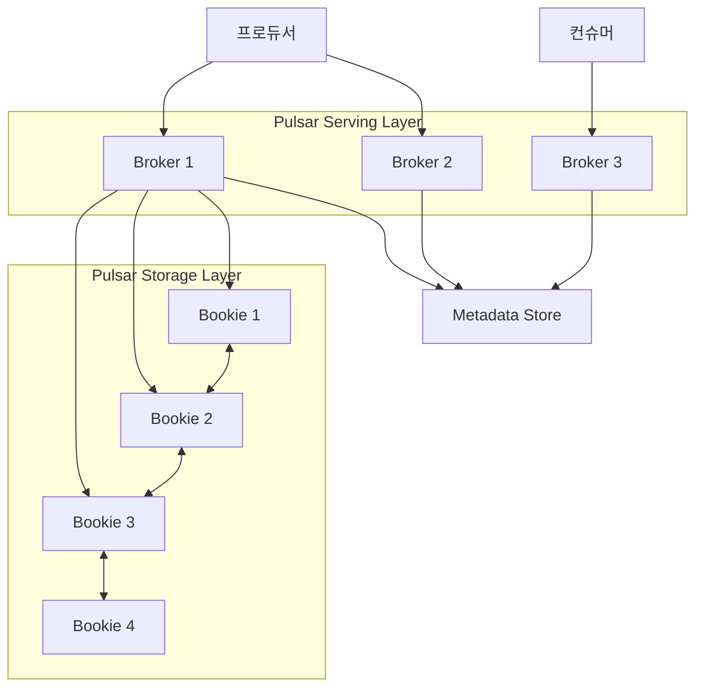

브로커는 프로듀서로부터 메시지를 받고, 컨슈머에게 메시지를 전달하며, BookKeeper에 메시지를 저장한다. 브로커는 토픽 lookup과 관리용 HTTP API도 제공한다.

### 브로커는 무엇을 하는가

브로커는 다음과 같은 작업을 담당한다.

- 프로듀서·컨슈머 연결 관리
- 토픽 위치 조회
- 메시지 발행 요청 처리
- BookKeeper로 메시지 기록
- 컨슈머에게 메시지 디스패치
- 구독 커서와 백로그 관리
- 인증·인가
- 네임스페이스 정책 적용
- 리전 간 복제 수행

Pulsar의 브로커는 장기 메시지 데이터를 자신의 로컬 디스크에 보관하는 저장 서버라기보다, 메시지 서비스를 제공하는 서빙 계층이다. 메시지는 일반적으로 Managed Ledger 캐시에서 디스패치되고, 캐시에 없는 오래된 백로그는 BookKeeper에서 읽는다.

### BookKeeper는 무엇을 하는가

BookKeeper의 저장 노드를 **bookie**라고 부른다. Bookie는 메시지를 레저에 기록하고 여러 bookie에 복제한다.

BookKeeper는 Pulsar에 다음 기능을 제공한다.

- 분산 Write-Ahead Log
- 레저 단위의 append-only 저장
- 여러 bookie에 대한 복제
- 장애가 난 레저의 복구
- 스토리지 용량과 처리량의 수평 확장
- 저널과 데이터 저장 영역의 분리

Pulsar 클라이언트는 BookKeeper와 직접 통신하지 않는다. 애플리케이션은 브로커에 연결하고, 브로커가 BookKeeper 저장 계층과 통신한다.

### 메타데이터 저장소

Pulsar는 브로커와 BookKeeper가 어느 토픽과 레저를 담당하는지 알기 위해 메타데이터 저장소를 사용한다. 전통적인 Pulsar 구성에서는 ZooKeeper가 이 역할을 담당했다.

최근에는 신규 클러스터에서 Oxia라는 대안 메타데이터 저장소를 권장하는 공식 문서도 등장하고 있다. 다만 Pulsar 버전별로 지원 백엔드와 권장 구성이 달라질 수 있으므로, ZooKeeper와 Oxia 중 무엇을 선택할지는 도입 시점의 공식 문서로 다시 확인해야 한다.

---

## 6.2 컴퓨트와 스토리지의 분리

### 분리의 의미

Pulsar의 가장 중요한 설계 선택은 브로커와 스토리지를 독립 계층으로 분리한 것이다.

```text
클라이언트 트래픽 증가
        ↓
브로커 증설

데이터 저장량·쓰기 처리량 증가
        ↓
Bookie 증설
```

Kafka나 Redpanda에서는 브로커가 서빙과 저장을 함께 수행한다. 따라서 브로커를 추가할 때 기존 파티션 데이터를 재배치해야 하는 상황이 생길 수 있다.

Pulsar에서는 브로커가 상태 비저장 계층이므로 브로커가 장애를 일으켜도 데이터 자체를 다른 브로커로 대량 복사할 필요가 없다. 새로운 브로커가 메타데이터를 확인하고 해당 토픽의 서빙 소유권을 넘겨받으면 된다.

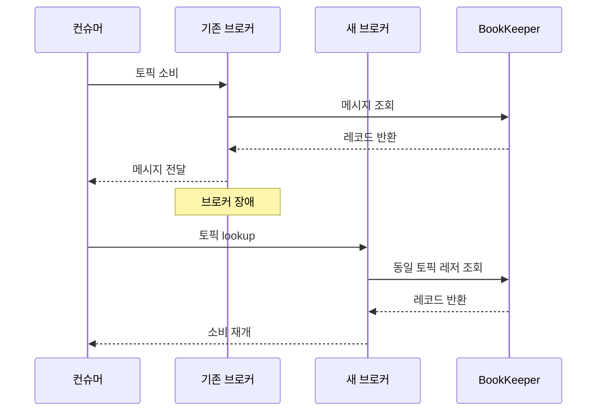

### 독립 확장

컴퓨트-스토리지 분리는 다음과 같은 확장 시나리오를 가능하게 한다.

| 상황 | 확장 대상 | 이유 |
|---|---|---|
| 프로듀서·컨슈머 연결 증가 | 브로커 | 서빙·네트워크 부하 증가 |
| 메시지 저장량 증가 | Bookie | 저장 용량 부족 |
| 디스크 쓰기 처리량 증가 | Bookie | 저널·EntryLog I/O 증가 |
| 메시지 디스패치 증가 | 브로커 | 네트워크·캐시 부하 증가 |
| 장기 보존 필요 | 오브젝트 스토리지 | BookKeeper 비용 절감 |
| 특정 네임스페이스 과부하 | 정책·격리 계층 | 테넌트별 자원 보호 |

이 구조는 자원별로 확장할 수 있다는 장점이 있지만, 운영자가 관리해야 할 계층도 늘어난다. 브로커, BookKeeper, 메타데이터 저장소, 오브젝트 스토리지의 상태를 각각 관찰해야 하기 때문이다.

### 분리의 트레이드오프

컴퓨트와 스토리지 분리는 다음의 이점을 제공한다.

- 브로커와 bookie의 독립 스케일링
- 브로커 장애 시 데이터 이동 감소
- 저장소의 독립적인 확장
- 테넌트·네임스페이스 단위 정책 적용
- 장기 보존과 컴퓨트 자원의 분리

반면 다음과 같은 비용이 생긴다.

- 네트워크 홉 증가
- BookKeeper와 메타데이터 저장소 운영
- 장애 원인 분석 범위 확대
- 브로커·bookie·메타데이터 간 버전·설정 관리
- 작은 규모에서는 과도한 인프라 복잡도

따라서 Pulsar의 컴퓨트-스토리지 분리는 대규모 멀티테넌트 환경이나 저장과 서빙 부하가 서로 다르게 증가하는 환경에서 특히 의미가 있다.

---

## 6.3 Managed Ledger와 BookKeeper Ledger

### 세그먼트와 레저

Pulsar의 토픽 파티션은 하나의 거대한 파일이 아니라, 시간에 따라 이어지는 여러 세그먼트로 구성된다. 각 세그먼트는 BookKeeper의 레저와 연결된다.

```text
Pulsar Topic Partition
    ├── Managed Ledger
    │     ├── Ledger 1 (sealed)
    │     ├── Ledger 2 (sealed)
    │     ├── Ledger 3 (sealed)
    │     └── Ledger 4 (active)
```

**Ledger**는 BookKeeper의 기본 append-only 저장 단위다. 하나의 레저는 기록이 끝나 봉인되면 더 이상 변경되지 않는 읽기 전용 구조가 된다.

**Managed Ledger**는 여러 BookKeeper 레저를 하나의 논리적 토픽 로그처럼 묶는 Pulsar의 저장 추상화다. 프로듀서는 현재 활성 레저에 기록하고, 레저가 봉인되면 새로운 레저가 만들어진다.

### 레저 롤오버

다음과 같은 조건에서 새로운 레저가 생성될 수 있다.

- 현재 레저가 설정된 크기에 도달한 경우
- 일정 시간이 지난 경우
- 토픽 파티션의 소유권이 변경된 경우
- 기존 레저가 장애 복구 후 더 이상 쓰기 가능한 상태가 아닌 경우

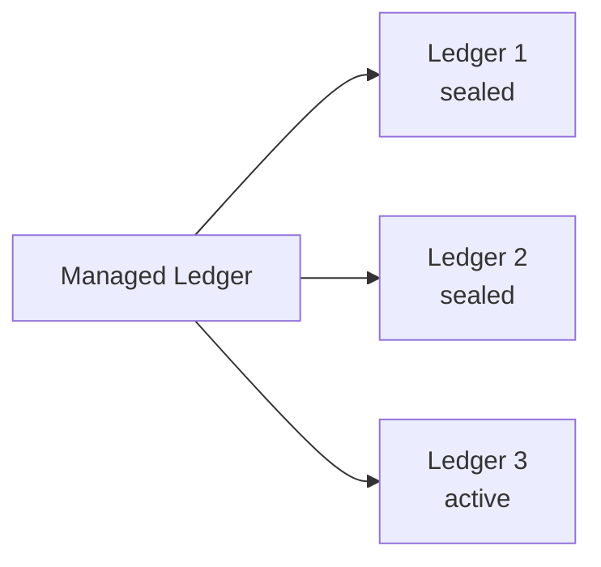

레저가 봉인되면 불변 데이터가 되므로 장기 보존이나 오브젝트 스토리지 오프로드에 적합하다.

### 커서

Pulsar에서 각 구독은 자신의 소비 위치를 가진다. 이 위치를 **커서**(cursor)라고 한다.

```text
토픽: persistent://commerce/orders/order-events

Ledger 1: [0] [1] [2] [3] [4] [5]
Ledger 2: [6] [7]
Ledger 3: [8] [9] [10] [11]

구독 A 커서: 9
구독 B 커서: 5
```

같은 토픽에 여러 구독이 있으면 각 구독은 독립적인 커서를 가진다. 구독 A가 과거 이벤트를 이미 처리했더라도 구독 B는 자신의 위치에서 같은 이벤트를 읽을 수 있다.

이 모델은 Kafka의 컨슈머 그룹 오프셋과 비슷한 목적을 수행하지만, Pulsar에서는 구독이 소비 모델의 핵심 단위라는 점이 다르다.

---

## 6.4 BookKeeper의 저장과 복제

### Journal과 EntryLog

BookKeeper는 쓰기와 읽기 I/O를 분리하기 위해 저널과 데이터 저장 영역을 나누는 구조를 사용한다.

- **Journal**: 이벤트를 먼저 기록하는 Write-Ahead Log
- **EntryLog**: 여러 엔트리를 모아 저장하는 데이터 파일
- **Index**: 엔트리 ID와 실제 데이터 위치를 연결하는 인덱스

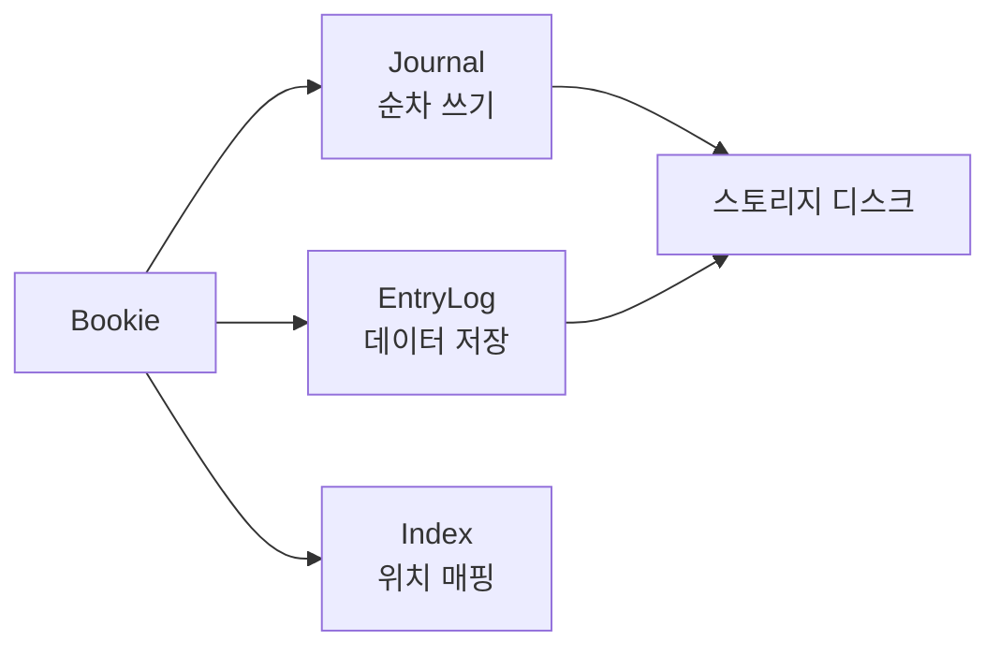

Journal은 내구성을 빠르게 확보하기 위한 경로이고, EntryLog는 데이터 저장과 이후 읽기를 위한 경로다. 두 경로를 전용 디스크나 디렉터리로 분리하면 쓰기와 읽기 사이의 I/O 경합을 줄일 수 있다. 세부 구현은 BookKeeper 버전에 따라 달라질 수 있으므로, 정확한 동작은 사용 중인 버전의 공식 문서로 확인해야 한다.

### Ensemble, Write Quorum, Ack Quorum

BookKeeper는 레저를 여러 bookie에 저장할 때 세 가지 개념을 사용한다.

| 개념 | 의미 |
|---|---|
| **Ensemble size** | 하나의 레저에 참여하는 bookie 수 |
| **Write quorum** | 하나의 엔트리를 기록할 bookie 수 |
| **Ack quorum** | 기록 성공으로 인정하기 위해 필요한 응답 수 |

예를 들어 다음과 같은 설정을 생각해 보자.

```text
Ensemble size = 5
Write quorum  = 3
Ack quorum    = 2
```

레저는 다섯 개의 bookie 중 일부를 사용하고, 하나의 엔트리는 세 개의 bookie에 기록된다. 그중 두 개의 성공 응답을 받으면 기록을 성공으로 판단할 수 있다. 실제 허용 장애 수와 일관성은 이 값들의 조합, 복제 배치 정책, BookKeeper 버전에 따라 달라진다.

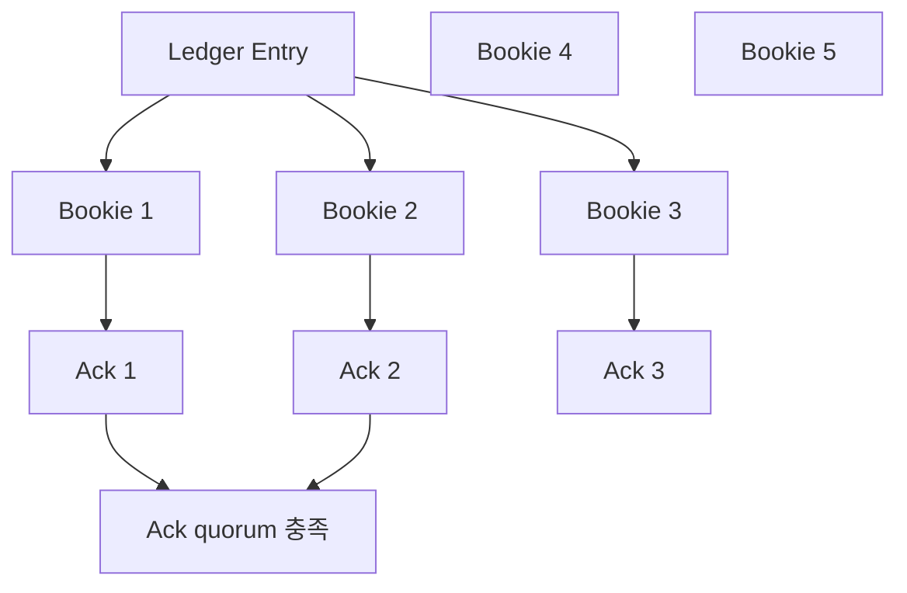

BookKeeper의 장점은 특정 하나의 저장 노드가 전체 파티션의 처리량을 독점하지 않도록 레저와 엔트리를 여러 bookie에 분산할 수 있다는 점이다. 그러나 네트워크 복제와 quorum 응답을 기다려야 하므로, bookie의 디스크와 네트워크 상태가 쓰기 지연에 직접 영향을 준다. 설정 조합별 정확한 장애 허용 수치는 BookKeeper 공식 문서의 최신 표로 확인하는 것이 안전하다.

---

## 6.5 멀티테넌시: Tenant, Namespace, Topic

### 계층 구조

Pulsar는 처음부터 멀티테넌트 시스템으로 설계되었다. 기본 계층은 다음과 같다.

```text
Tenant
  └── Namespace
        └── Topic
```

토픽의 전체 이름은 다음과 같은 형식이다.

```text
persistent://tenant/namespace/topic
```

비영속 토픽은 `non-persistent` 스킴을 사용한다.

### Tenant

Tenant는 조직, 사업부, 팀 또는 독립된 사용자를 나타내는 관리 단위다. Tenant에는 다음과 같은 정책을 적용할 수 있다.

- 인증·인가
- 허용 클러스터
- 관리자 역할
- 용량과 사용 범위
- 테넌트별 접근 정책

하나의 Tenant는 여러 클러스터에 걸쳐 사용될 수 있다. 따라서 전역 서비스 조직이나 여러 리전에 배치된 애플리케이션을 Tenant 단위로 모델링할 수 있다.

### Namespace

Namespace는 Tenant 안에서 토픽을 논리적으로 묶는 단위다. 일반적으로 서비스, 환경, 팀 또는 워크로드별로 Namespace를 나눈다.

예를 들어 다음과 같이 구성할 수 있다.

```text
commerce
  ├── production
  │     ├── orders
  │     └── payments
  └── staging
        ├── orders
        └── payments
```

Namespace에는 다음과 같은 정책을 적용할 수 있다.

- 메시지 보존
- 메시지 TTL
- 백로그 쿼터
- 생산·소비 속도 제한
- 복제 클러스터
- 오프로드 정책
- 브로커·bookie 격리

### Topic

Topic은 실제 이벤트 스트림이다.

```text
persistent://commerce/production/orders
```

Topic은 Namespace의 정책을 상속받을 수 있으며, 개별 Topic에 추가 설정을 적용할 수도 있다. 많은 정책이 Namespace 단위로 제공되며, Topic 수준의 더 세밀한 정책이 필요한 경우에는 네임스페이스 변경 이벤트와 시스템 토픽을 활용하는 접근도 있다.

### 정책 격리

Pulsar는 브로커와 bookie를 별도 그룹으로 나누어 특정 Namespace를 특정 자원에 배치할 수 있다.

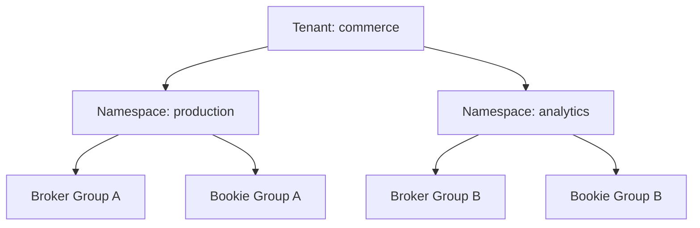

대표적인 격리 방식은 다음과 같다.

- **Broker-level isolation**: Namespace를 특정 브로커 그룹에 배치
- **Bookie-level isolation**: 랙·리전·존을 고려해 bookie 배치
- **Bookie affinity group**: Namespace의 데이터를 지정한 bookie 그룹에 저장

이러한 정책은 한 팀의 대량 백로그나 보존 정책이 다른 팀의 서비스에 영향을 미치는 것을 줄이는 데 도움이 된다.

---

## 6.6 구독 모델

Pulsar에서는 소비자의 논리적 그룹을 **구독**(Subscription)으로 표현한다. 하나의 토픽에 여러 구독이 존재할 수 있으며, 각 구독은 독립적인 소비 위치를 관리한다.

Pulsar의 대표적인 구독 모드는 네 가지다.

| 구독 모드 | 소비자 수 | 순서 보장 | 적합한 사용 사례 |
|---|---:|---|---|
| **Exclusive** | 1개 | 전체 순서 | 단일 소비자 스트림 |
| **Failover** | 여러 개 연결 가능, 하나만 활성 | 활성 소비자 기준 | 장애 조치를 갖춘 단일 리더 |
| **Shared** | 여러 개 | 전체 순서 없음 | 작업 큐·병렬 처리 |
| **Key_Shared** | 여러 개 | 키 단위 순서 | 키별 순서와 병렬 처리 |

### Exclusive

Exclusive 모드에서는 하나의 구독에 하나의 활성 소비자만 연결할 수 있다.


이 모드는 전체 이벤트 순서가 중요하고 소비자를 병렬화할 필요가 없는 경우에 적합하다.

예:

- 단일 순서로 처리해야 하는 이벤트
- 하나의 리더 애플리케이션
- 순차적인 상태 변경 처리

### Failover

Failover 모드에서는 여러 소비자가 구독에 연결될 수 있지만, 한 번에 하나의 소비자만 활성 상태가 된다. 활성 소비자에 장애가 발생하면 대기 소비자가 역할을 이어받는다.

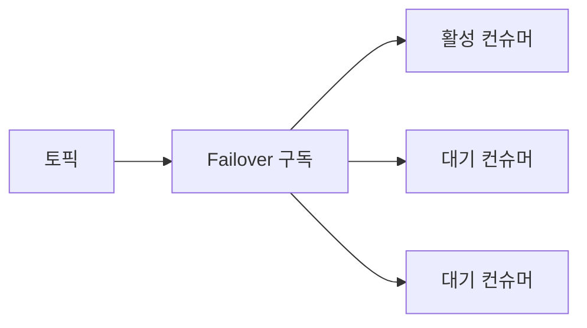

이 모드는 순차 처리와 장애 조치를 함께 원할 때 사용할 수 있다.

### Shared

Shared 모드에서는 여러 소비자가 하나의 구독을 공유한다. 메시지는 소비자들에게 분배되며, 작업 큐와 비슷한 방식으로 병렬 처리할 수 있다.

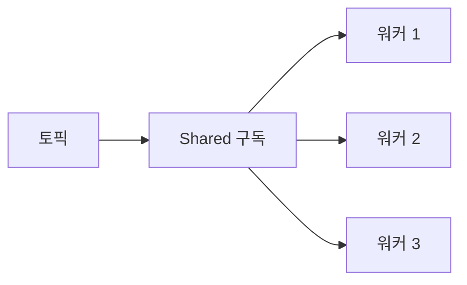

Shared 모드의 장점은 파티션 수와 별개로 소비자 워커를 확장할 수 있다는 점이다. 하지만 여러 소비자가 동시에 처리하므로 토픽 전체 또는 키 전체의 순서는 보장되지 않는다.

적합한 예:

- 이메일 발송
- 이미지 변환
- 백그라운드 작업
- 독립적인 주문 후속 처리

### Key_Shared

Key_Shared는 Shared의 병렬 처리와 키 단위 순서를 결합한다. 같은 키의 메시지는 같은 소비자에게 전달되고, 서로 다른 키는 여러 소비자에게 분산될 수 있다.

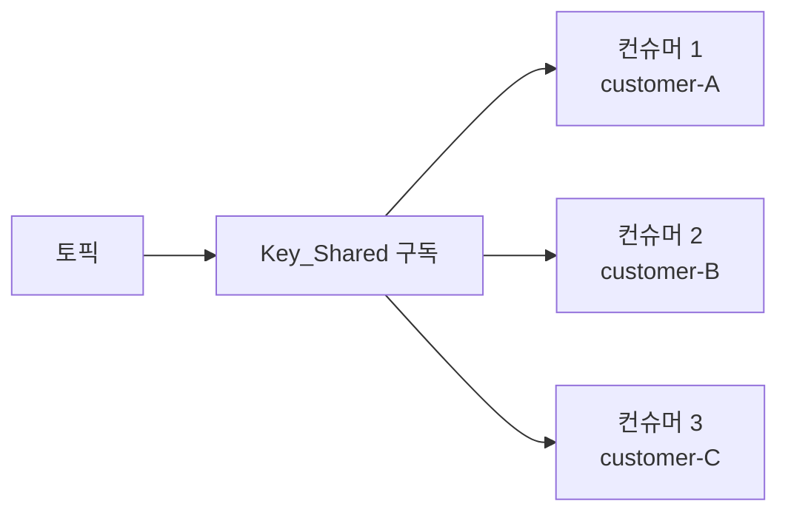

예를 들어 고객 ID를 키로 사용하면 다음과 같은 처리가 가능하다.

```text
customer-A → 컨슈머 1
customer-A → 컨슈머 1
customer-B → 컨슈머 2
customer-C → 컨슈머 3
```

고객 A의 이벤트 순서는 유지하면서 고객 B·C의 이벤트는 병렬로 처리할 수 있다.

### Key_Shared의 실무적 가치

다음과 같은 요구사항을 생각해 보자.

- 하나의 토픽에는 파티션이 8개 있다.
- 처리량을 높이기 위해 소비자 워커를 30개로 늘리고 싶다.
- 같은 고객의 이벤트 순서는 유지해야 한다.

Kafka의 일반적인 컨슈머 그룹 모델에서는 파티션 수가 병렬 처리의 상한으로 작동한다. Pulsar의 Key_Shared는 키 단위 순서를 유지하면서 소비자 분산을 수행하는 선택지를 제공한다.

다만 Key_Shared를 사용할 때는 프로듀서가 메시지 키를 일관되게 설정해야 하고, 소비자 재배치가 발생할 때 키의 소유권과 처리 중 메시지의 관계를 검증해야 한다. 재전송·누적 확인·키 해시와 관련한 세부 동작은 버전에 따라 달라질 수 있으므로 도입 전 공식 문서를 확인해야 한다.

---

## 6.7 브로커 부하 분산과 Bundle

Pulsar의 부하 분산은 토픽 하나하나를 직접 이동시키는 방식이 아니라 **번들**(Bundle) 단위로 수행된다.

번들은 Namespace의 해시 범위를 나눈 단위다. 하나의 번들에는 여러 토픽이 포함될 수 있고, 브로커는 개별 토픽이 아니라 번들을 소유한다.

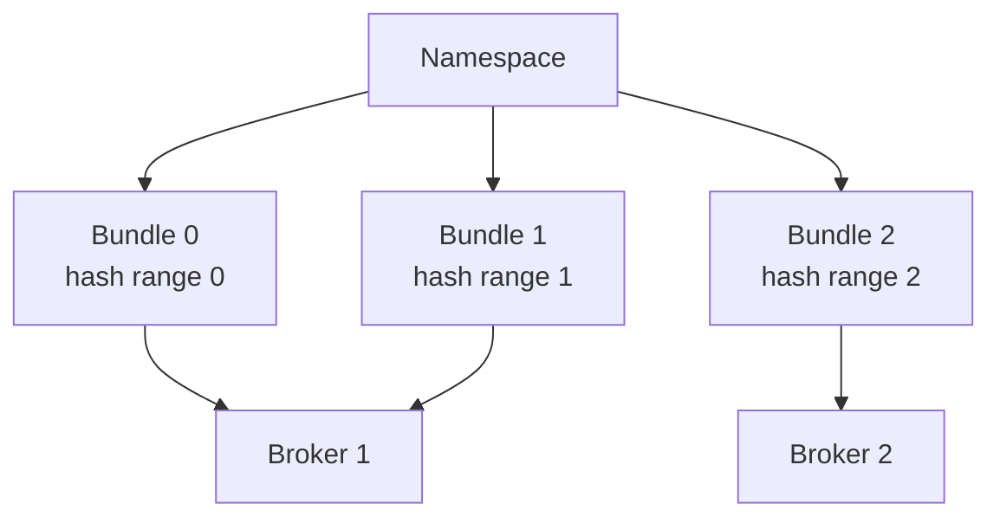

브로커 부하가 높아지면 번들을 다른 브로커로 이동할 수 있다. 이 방식은 토픽 수가 매우 많은 환경에서 개별 토픽마다 소유권을 조정하는 부담을 줄이는 데 도움이 된다.

반면 특정 토픽 하나가 매우 큰 부하를 발생시키는 경우에는 번들 안의 다른 토픽과 함께 부하가 묶일 수 있다. 따라서 번들 크기와 분할 정책을 워크로드에 맞게 점검해야 하며, 자동 분할이 일어나는 정확한 조건은 사용 중인 버전의 공식 문서로 확인해야 한다.

---

## 6.8 지오 레플리케이션

### 클러스터 간 복제

Pulsar는 여러 클러스터 사이에서 토픽을 비동기적으로 복제할 수 있다. 일반적으로 복제 대상은 Namespace 정책으로 지정한다.

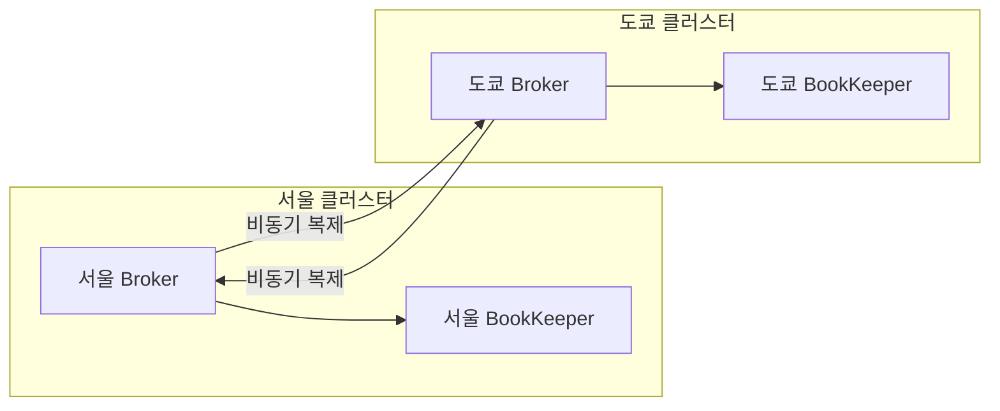

Pulsar 브로커는 로컬 클러스터에 기록된 메시지를 추적하고, 다른 리전의 클러스터로 재발행하는 리플리케이터를 관리한다.

### 레플리케이션 커서와 마커

지오 레플리케이션은 다음 메커니즘을 사용한다.

- 원격 클러스터별 레플리케이션 커서
- 복제 위치를 표시하는 스냅샷 마커
- Namespace 단위 복제 대상 설정
- Pulsar 4.0부터는 Namespace 기본값을 덮어쓰는 Topic 단위 복제 클러스터 설정도 가능

레플리케이션 커서는 어느 이벤트까지 원격 클러스터로 전달했는지를 추적한다. 장애 후 복제가 재개될 때 누락된 범위를 확인하는 데 사용된다.

### 지오 레플리케이션의 사용 사례

- 리전 장애 시 다른 리전에서 서비스 지속
- active-active 또는 active-passive 구성
- 사용자와 가까운 리전에서 로컬 소비
- 데이터 거주성 정책
- 리전별 분석 파이프라인
- 재해 복구

예를 들어 유럽 사용자의 개인정보 이벤트는 유럽 클러스터에만 복제하도록 Namespace 정책을 설계할 수 있다. 다만 실제 데이터 거주성 보장은 애플리케이션, 네트워크, 인증, 저장소 정책을 함께 검증해야 한다. active-active 환경에서의 충돌 처리와 복제 지연 지표는 버전마다 세부 동작이 다를 수 있으므로 공식 문서로 확인해야 한다.

---

## 6.9 Tiered Storage

### 레저 오프로딩

Pulsar의 Tiered Storage는 봉인된 BookKeeper 레저를 오브젝트 스토리지로 오프로드한다.

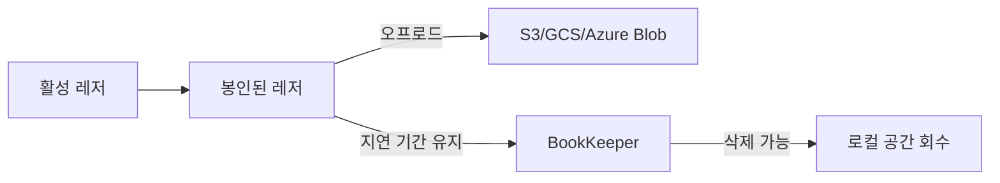

오프로드는 일반적으로 Namespace 정책에 지정한 시간 또는 크기 임계값을 기준으로 실행된다. 오프로드가 완료되면 설정된 삭제 지연 시간이 지난 후 BookKeeper의 로컬 원본을 삭제할 수 있다.

### 읽기 경로

컨슈머는 오프로드된 데이터를 별도의 API로 읽지 않는다. 같은 토픽 API를 사용한다.

1. 컨슈머가 과거 메시지를 요청한다.
2. 브로커가 해당 메시지의 레저 위치를 확인한다.
3. 데이터가 로컬 BookKeeper에 있으면 로컬에서 읽는다.
4. 레저가 오브젝트 스토리지에 있으면 오프로드 저장소에서 읽는다.
5. 브로커가 같은 Pulsar 프로토콜로 컨슈머에 전달한다.

```text
최근 이벤트
  → Broker → BookKeeper

오래된 이벤트
  → Broker → Object Storage → Broker → Consumer
```

### 오프로드 설정 예제

S3를 사용하는 개념적 설정 예제는 다음과 같다.

```conf
managedLedgerOffloadDriver=aws-s3
s3ManagedLedgerOffloadBucket=pulsar-tiered-storage-prod
s3ManagedLedgerOffloadRegion=us-east-1
s3ManagedLedgerOffloadMaxBlockSizeInBytes=67108864
s3ManagedLedgerOffloadReadBufferSizeInBytes=1048576
```

Namespace 수준의 오프로드 임계값은 다음과 같은 형태로 구성된다.

```bash
pulsar-admin namespaces set-offload-threshold \
  --size 100G public/orders

pulsar-admin namespaces set-offload-deletion-lag \
  --lag 24h public/orders
```

실제 명령과 설정 이름은 Pulsar 버전에 따라 다를 수 있으므로 운영 전에 공식 문서를 확인해야 한다.

### 비용과 지연

Tiered Storage의 장점은 로컬 BookKeeper 공간을 줄이면서 장기 보존을 유지하는 것이다. 그러나 과거 이벤트를 읽을 때는 다음 비용이 생길 수 있다.

- 오브젝트 스토리지 네트워크 지연
- 오브젝트 조회 요청 비용
- 대규모 재처리 시 데이터 전송 비용
- 원격 스토리지 장애
- 브로커의 읽기 버퍼와 동시 요청 제한

따라서 "장기 보존"과 "저지연 재처리"를 같은 요구사항으로 취급하면 안 된다. 최신 데이터의 실시간 처리는 로컬 계층을, 오래된 대규모 재처리는 원격 계층을 기준으로 성능을 따로 측정해야 한다.

---

## 6.10 Kafka·Redpanda와 비교

Pulsar를 Kafka나 Redpanda와 비교할 때는 처리량 숫자보다 아키텍처의 차이를 먼저 봐야 한다.

| 비교 관점 | Kafka 4.x·Redpanda | Apache Pulsar |
|---|---|---|
| **서빙과 저장** | 브로커가 서빙과 저장을 함께 수행 | 브로커와 BookKeeper 분리 |
| **메타데이터** | Kafka는 KRaft, Redpanda는 내장 방식 | 메타데이터 저장소 사용 |
| **스토리지 단위** | 브로커 로컬 파티션 로그 | Managed Ledger와 BookKeeper Ledger |
| **브로커 장애 복구** | 파티션 리더·복제 상태에 따라 조정 | 브로커 소유권 재할당, 데이터는 BookKeeper에 유지 |
| **스토리지 확장** | 브로커 증설과 파티션 재배치 고려 | Bookie 독립 증설 |
| **소비 모델** | 컨슈머 그룹 중심 | 구독과 네 가지 구독 모드 |
| **작업 큐 모델** | 별도 설계 또는 Share Groups 등 활용 | Shared 구독 |
| **키 단위 순서** | 파티션 키 기반 | Key_Shared 구독 |
| **멀티테넌시** | ACL·쿼터 중심으로 구성 | Tenant·Namespace가 기본 계층 |
| **지오 레플리케이션** | 별도 구성 요소나 기능 조합 필요 | 브로커 기반 복제 기능 제공 |
| **운영 복잡도** | 비교적 단순한 배포 구조 | 브로커·BookKeeper·메타데이터 운영 필요 |

Pulsar의 강점은 저장과 서빙을 독립적으로 확장하고, 큐잉과 스트리밍 소비 모델을 하나의 구독 추상화 안에서 제공하며, 멀티테넌시를 기본 설계에 포함한다는 점이다.

반대로 Kafka·Redpanda는 운영 구성요소가 상대적으로 단순하고, Kafka 생태계와 도구의 폭이 넓다는 장점이 있다. 어느 쪽이 적합한지는 워크로드와 조직의 운영 역량에 달려 있다.

---

## 6.11 성능을 해석하는 방법

Pulsar의 성능을 측정한 논문과 벤더 자료는 특정 하드웨어와 JVM, ZGC, 전용 NVMe 저널, 네트워크 구성에서 높은 메시지 처리량과 낮은 중앙값 지연을 보고하기도 한다.

예를 들어 한 연구에서는 다음과 같은 수치가 보고된 바 있다.

- 3노드 환경에서 약 1,499,947 msg/s
- 중앙값 발행 지연 3.88ms
- 특정 비동기 배치 모드에서 1M writes/s 이상

그러나 이 숫자를 일반적인 Pulsar 성능으로 해석해서는 안 된다. 성능은 다음 조건에 크게 좌우된다.

- 메시지 크기
- 배치 여부
- 압축 방식
- Journal 디스크 종류
- EntryLog 디스크 종류
- 복제·quorum 설정
- JVM과 GC
- 네트워크 대역폭
- BookKeeper 캐시
- 컨슈머 수와 백로그
- 로컬 데이터와 오프로드 데이터 비율

벤치마크는 제품 이름보다 조건을 함께 기록해야 한다.

```text
처리량 = 메시지 크기 × 초당 메시지 수
지연 = 프로듀서 기록 요청부터 ack까지의 측정 범위
```

서로 다른 벤치마크에서 "처리량"과 "지연"의 측정 위치가 다르면 숫자를 직접 비교할 수 없다. Pulsar와 Kafka·Redpanda를 동일한 하드웨어·메시지 크기·복제 조건으로 비교한 중립적인 벤치마크는 흔치 않으므로, 도입 전 자체 워크로드로 검증하는 것이 안전하다.

---

## 6.12 운영 설계 체크리스트

### 아키텍처

- 브로커와 BookKeeper를 별도 장애 도메인으로 설계했는가?
- 메타데이터 저장소의 종류와 고가용성을 확인했는가?
- 브로커와 bookie를 독립적으로 확장해야 하는 이유가 있는가?
- Namespace와 Topic의 소유 팀을 정의했는가?

### BookKeeper

- Journal과 EntryLog의 디스크를 분리했는가?
- Ensemble·Write Quorum·Ack Quorum을 요구사항에 맞게 계산했는가?
- bookie 장애와 디스크 장애를 별도로 모니터링하는가?
- 레저 복구와 봉인 상태를 확인할 수 있는가?

### 구독

- 토픽 전체 순서가 필요한가, 키 단위 순서면 충분한가?
- 작업 큐라면 Shared가 적합한가?
- 장애 조치가 필요하면 Failover를 검토했는가?
- Key_Shared 사용 시 메시지 키가 항상 존재하는가?

### 멀티테넌시

- Tenant와 Namespace의 경계를 정의했는가?
- 보존·TTL·쿼터를 Namespace에 적용했는가?
- 특정 팀의 백로그가 다른 팀에 영향을 주지 않는가?
- broker·bookie affinity가 필요한가?

### 지오 레플리케이션과 오프로드

- 복제 대상 클러스터를 Namespace 단위로 관리하는가?
- 복제 지연과 누락 이벤트를 추적하는가?
- 최근 데이터와 과거 데이터의 읽기 지연을 구분했는가?
- 오브젝트 스토리지 권한과 비용을 계산했는가?

---

## 6.13 실습: Tenant·Namespace·Topic 구성

다음은 Pulsar의 계층 구조를 익히기 위한 개념적인 CLI 예제다.

### Tenant 생성

```bash
pulsar-admin tenants create commerce \
  --admin-roles commerce-admin \
  --allowed-clusters pulsar-cluster-a
```

### Namespace 생성

```bash
pulsar-admin namespaces create commerce/production
```

### Namespace 정책 설정

```bash
pulsar-admin namespaces set-retention commerce/production \
  --size 100G \
  --time 7d

pulsar-admin namespaces set-message-ttl commerce/production \
  --messageTTL 86400
```

### Topic 생성

```bash
pulsar-admin topics create \
  persistent://commerce/production/orders
```

### 구독 생성

```bash
pulsar-client consume \
  persistent://commerce/production/orders \
  --subscription-name payment-service \
  --subscription-type Key_Shared
```

위 예제는 Tenant → Namespace → Topic → Subscription의 관계를 보여주기 위한 것이다. 실제 Pulsar 버전과 배포 방식에 따라 인증, 클러스터 이름, 권한, 토픽 생성 정책을 추가해야 할 수 있다.

---

## 6.14 Pulsar 5.0 방향성

Apache Pulsar 5.0.0-M1은 5.0으로 가는 첫 마일스톤 프리뷰 릴리스로 공개되었다. 이 릴리스가 제시하는 방향에는 다음이 포함된다.

- Scalable Topics
- Oxia의 메타데이터 저장소 역할 강화
- 새로운 Java Client API
- Stream·Queue·Checkpoint 소비 모델
- 구조화 로깅
- Jakarta EE 전환

특히 Scalable Topics는 고정된 파티션 수에 의존하지 않고 키 범위 세그먼트를 분할·병합하는 방향으로 설명된다. 그러나 M1은 최종 릴리스가 아니므로 API와 내부 동작이 변경될 수 있다.

따라서 이 책의 안정 버전 본문에서는 5.0 기능을 현재 운영 표준처럼 설명하지 않는다.

> **버전 원칙**
> 마일스톤이나 프리뷰 기능은 "향후 방향"으로만 소개하고, 프로덕션 설계 예제는 안정 버전의 공식 문서를 기준으로 작성한다.

---

## 6.15 핵심 정리

Pulsar의 아키텍처를 다음과 같이 요약할 수 있다.

1. **브로커는 서빙 계층이고 BookKeeper는 저장 계층이다.**
2. **Managed Ledger는 여러 BookKeeper Ledger를 하나의 논리적 토픽 로그로 묶는다.**
3. **Ledger는 봉인되면 불변이 되므로 Tiered Storage 오프로드에 적합하다.**
4. **Tenant → Namespace → Topic 계층은 멀티테넌시와 정책 격리를 기본 모델로 제공한다.**
5. **Exclusive·Failover·Shared·Key_Shared 구독은 스트리밍과 작업 큐 소비 모델을 함께 지원한다.**
6. **지오 레플리케이션은 Namespace와 클러스터 정책을 기반으로 여러 리전에 이벤트를 복제한다.**
7. **Tiered Storage는 오래된 레저를 오브젝트 스토리지로 옮겨 장기 보존 비용을 줄인다.**
8. **컴퓨트-스토리지 분리는 확장과 장애 복구를 유연하게 만들지만 운영할 구성요소를 늘린다.**

Pulsar를 선택하는 이유는 단순히 "Kafka보다 빠르기 때문"이 아니다. 저장 용량과 클라이언트 트래픽을 독립적으로 확장해야 하거나, 여러 조직이 하나의 플랫폼을 공유하면서 강한 정책 격리가 필요하거나, 작업 큐와 스트리밍 소비 모델을 함께 지원해야 할 때 Pulsar의 구조가 의미를 갖는다.

반대로 시스템 규모가 작고 Kafka 생태계의 도구를 폭넓게 활용하며 운영 단순성을 우선한다면, BookKeeper와 메타데이터 저장소까지 포함하는 Pulsar의 계층 구조가 오히려 부담이 될 수 있다.
