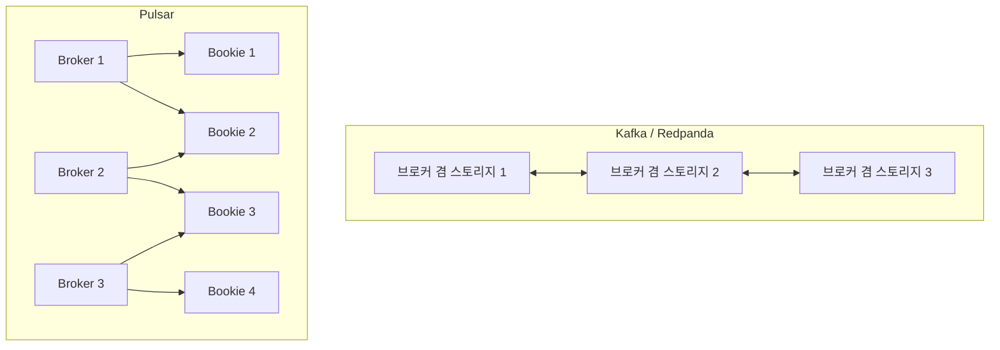
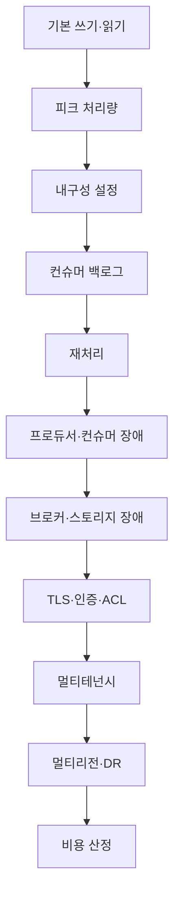
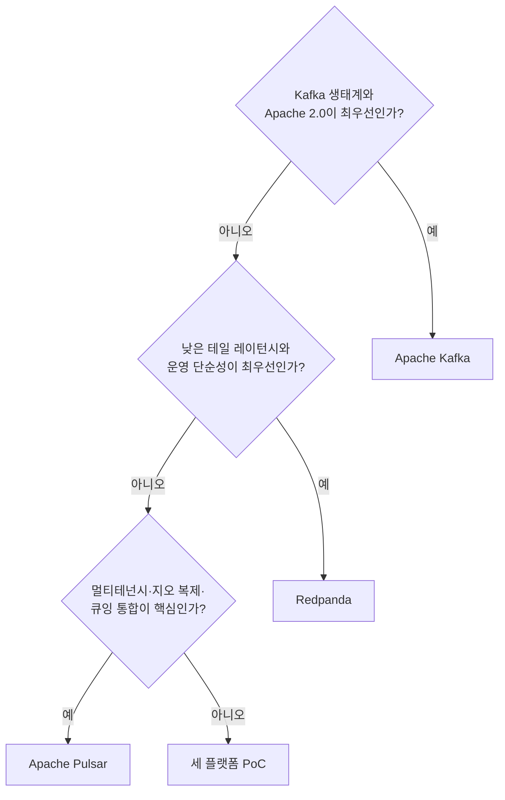

# Chapter 7. 세 플랫폼 비교와 선택 기준

Apache Kafka, Redpanda, Apache Pulsar는 모두 이벤트 스트리밍 문제를 해결하지만, 같은 방법을 사용하는 제품은 아니다. Kafka는 성숙한 분산 로그와 가장 넓은 생태계를 중심으로 발전했고, Redpanda는 Kafka 호환 API 위에 네이티브·thread-per-core 실행 모델을 구축했다. Pulsar는 브로커와 스토리지를 분리하고 멀티테넌시와 큐잉 모델을 기본 기능으로 끌어올렸다.

따라서 “어느 플랫폼이 가장 빠른가?”라는 질문만으로는 올바른 선택을 할 수 없다. 실제 선택에는 메시지 크기, 처리량, 지연시간, 내구성, 순서, 재처리, 멀티테넌시, 운영 인력, 생태계, 라이선스, 클라우드 비용이 모두 포함되어야 한다.

> **이 장의 원칙**  
> 벤치마크 숫자를 그대로 믿지 말고, 플랫폼이 어떤 설계 결정을 했으며 그 결정이 자신의 워크로드에 어떤 결과를 만드는지 분석한다.

## 학습 목표

이 장을 읽고 나면 다음을 설명할 수 있어야 한다.

- Kafka, Redpanda, Pulsar의 아키텍처적 차이
- 이벤트 스트리밍 벤치마크가 쉽게 왜곡되는 이유
- 처리량·지연·내구성·비용을 함께 평가하는 방법
- 세 플랫폼의 생태계·운영·라이선스 차이
- 워크로드와 조직 제약에 맞는 플랫폼 선택 절차
- PoC와 TCO 분석을 설계하는 방법

***

## 7.1 세 플랫폼은 무엇이 다른가

세 플랫폼은 모두 프로듀서가 이벤트를 기록하고 컨슈머가 이를 읽는 구조를 제공한다. 그러나 이벤트를 저장하고, 처리하고, 확장하는 방법은 다르다.

| 비교 영역 | Apache Kafka | Redpanda | Apache Pulsar |
|---|---|---|---|
| 구현·실행 환경 | Java·Scala, JVM | C++·Seastar, 네이티브 | Java 기반 브로커·BookKeeper |
| 핵심 저장 모델 | 브로커 로컬 파티션 로그 | 브로커 로컬 로그와 파티션별 Raft | Managed Ledger와 BookKeeper Ledger |
| 컴퓨트·스토리지 | 브로커에 결합 | 브로커에 결합 | 브로커와 BookKeeper 분리 |
| 메타데이터 | Kafka 4.x KRaft | 내장 Raft 계층 | 메타데이터 저장소 계층 |
| 소비 모델 | 컨슈머 그룹·오프셋 | Kafka API와 유사 | Exclusive·Failover·Shared·Key_Shared |
| 멀티테넌시 | ACL·쿼터 등으로 구성 | Kafka 호환·제품 기능으로 구성 | Tenant·Namespace·Topic 기본 계층 |
| 지오 레플리케이션 | 별도 도구·기능 조합 | Shadowing 계열 기능 | 클러스터 간 복제 기능 |
| Tiered Storage | 지원 범위와 버전 확인 필요 | 지원 | BookKeeper 레저 오프로드 |
| 가장 두드러진 강점 | 생태계와 표준화 | 낮은 테일 레이턴시와 운영 단순화 | 분리 확장과 멀티테넌시 |
| 주요 부담 | JVM·파티션·운영 관리 | 호환성 예외·라이선스 | 구성요소와 운영 복잡도 |

### Kafka

Kafka는 분산 커밋 로그를 중심으로 하는 플랫폼이다. 토픽은 파티션으로 나뉘고, 파티션은 브로커의 로그 세그먼트로 저장된다. Kafka 4.x에서는 KRaft가 메타데이터를 관리하며 ZooKeeper는 제거되었다.

Kafka의 가장 큰 강점은 생태계다.

- Kafka Connect와 다양한 커넥터
- Kafka Streams
- ksqlDB
- Flink·Spark·Debezium 연계
- 폭넓은 클라이언트와 운영 도구
- 풍부한 인력과 사례

이미 조직에 Kafka 경험이 있거나 Kafka 중심 데이터 플랫폼을 구축하고 있다면, 기능 자체보다 생태계 재사용성이 큰 선택 이유가 된다.

### Redpanda

Redpanda는 Kafka 프로토콜을 지원하면서 내부적으로는 다른 실행 모델을 사용한다. C++와 Seastar의 thread-per-core 모델을 기반으로 하며, 코어별 샤드와 메시지 패싱을 통해 락 경합과 JVM GC의 영향을 줄이는 방향을 취한다.

Redpanda의 핵심 가치는 다음과 같다.

- Kafka 클라이언트 재사용
- JVM과 ZooKeeper 없는 배포
- 단일 바이너리 중심 운영
- 낮은 테일 레이턴시 목표
- 코어와 NVMe를 활용한 scale-up
- `rpk`와 Prometheus 중심의 운영

그러나 Kafka API가 호환된다고 해서 Kafka의 모든 도구와 기능이 동일하게 동작하는 것은 아니다. SCRAM, 일부 쿼터, HTTP Proxy 관리 기능, 특정 트랜잭션 기능 등은 버전별 제한을 확인해야 한다.

### Pulsar

Pulsar는 브로커와 BookKeeper를 분리한다. 브로커는 클라이언트 연결과 메시지 전달을 담당하고, BookKeeper는 레저 단위로 데이터를 저장한다.

Pulsar의 구조는 다음 요구사항에 특히 적합하다.

- 브로커와 스토리지를 독립적으로 확장
- 여러 팀이나 고객이 하나의 플랫폼 공유
- Namespace 단위 정책 격리
- 큐잉과 스트리밍 소비 모델 통합
- 내장 지오 레플리케이션
- 레저 기반 장기 보존과 오프로드

대신 브로커, BookKeeper, 메타데이터 저장소를 별도로 운영해야 한다. 따라서 기능적 유연성이 늘어나는 만큼 운영 플랫폼의 범위도 넓어진다.

***

## 7.2 아키텍처 선택이 만드는 차이

### 저장과 확장

Kafka와 Redpanda는 브로커가 파티션 데이터를 보유한다. 브로커를 추가하면 데이터를 재배치하거나 파티션 리더를 다시 분산해야 하는 상황이 생길 수 있다.

Pulsar는 BookKeeper가 저장을 담당한다. 브로커를 추가할 때에는 서빙 소유권을 분산하고, 저장 용량이 부족할 때에는 bookie를 추가할 수 있다.



이 차이는 다음 질문으로 이어진다.

- 트래픽만 증가하는가?
- 저장량만 증가하는가?
- 두 부하가 같은 비율로 증가하는가?
- 브로커 장애 때 데이터 이동이 허용되는가?
- 스토리지와 네트워크를 독립적으로 확장해야 하는가?

컴퓨트·스토리지 분리가 반드시 더 좋은 것은 아니다. 작은 시스템에서는 별도 BookKeeper 클러스터를 운영하는 비용이 브로커 로컬 저장의 단순성보다 클 수 있다.

### 소비와 동시성

Kafka와 Redpanda의 일반적인 컨슈머 그룹은 파티션을 소비자에게 할당한다. 따라서 파티션 수가 컨슈머 병렬성의 중요한 상한이다.

Pulsar는 구독 모드에 따라 소비 모델을 바꿀 수 있다.

- 전체 순서가 필요하면 Exclusive
- 활성 소비자 장애 조치가 필요하면 Failover
- 작업 큐처럼 병렬 처리하려면 Shared
- 키 단위 순서와 병렬 처리를 함께 원하면 Key_Shared

이 차이는 “파티션 수보다 소비자를 더 많이 늘리고 싶은가?”라는 질문에서 특히 중요하다.

### 멀티테넌시

Kafka에서도 ACL, 쿼터, 토픽 명명 규칙으로 팀과 고객을 격리할 수 있다. 하지만 Pulsar는 Tenant와 Namespace를 기본 개념으로 제공하고, 보존·TTL·쿼터·복제·격리 정책을 이 계층에 연결한다.

| 요구사항 | Kafka | Redpanda | Pulsar |
|---|---|---|---|
| 팀별 인증·인가 | ACL로 구성 | Kafka 호환 ACL과 제품 기능 | Tenant·Namespace 정책 |
| 팀별 보존 정책 | 토픽별 설정 | 토픽·제품 정책 | Namespace 정책 |
| 팀별 속도 제한 | 쿼터 구성 | 제품 쿼터와 호환 기능 | Namespace 쿼터 |
| 브로커 격리 | 별도 설계 | 별도 설계 | Broker isolation |
| 저장 노드 격리 | 별도 설계 | 별도 설계 | Bookie affinity·placement |
| 여러 고객의 공유 플랫폼 | 가능하지만 플랫폼 설계 필요 | 가능하지만 제품 조건 확인 | 기본 설계에 가까움 |

***

## 7.3 벤치마크를 믿기 어려운 이유

### 벤더 주장의 구조

Redpanda의 공식 벤치마크는 Kafka보다 낮은 테일 레이턴시와 적은 노드 수를 주장한다. 반면 Confluent 소속 엔지니어의 재현 실험은 프로듀서·컨슈머 수와 TLS 조건을 바꾸면 Redpanda의 결과가 달라질 수 있다고 분석했다.

제3자 ComputingForGeeks 실험에서도 결과는 설정에 따라 달라졌다. 단일 파티션과 `acks=1`에서는 Redpanda가 유리했지만, `acks=all`에서는 Kafka의 평균 및 p99 레이턴시가 더 낮게 측정되었다.

이 사례의 핵심은 특정 제품의 승패가 아니다.

> **내구성 설정 하나만 바뀌어도 플랫폼의 상대적 순위가 바뀔 수 있다.**

### 공개 수치를 일반화하면 안 되는 이유

벤치마크 결과는 다음 조건에 의존한다.

- 메시지 크기
- 프로듀서·컨슈머 수
- 파티션 수
- 복제 인자
- `acks` 설정
- fsync와 flush 정책
- 압축 방식
- 배치 크기와 `linger`
- TLS 활성화 여부
- 디스크 종류
- 네트워크 대역폭
- JVM·GC 설정
- 테스트 지속 시간
- 최신 데이터와 과거 데이터의 읽기 비율

예를 들어 다음 두 테스트는 이름이 모두 “쓰기 성능 테스트”여도 의미가 다르다.

```text
테스트 A:
acks=1, 복제 지연 허용, NVMe, 4개 프로듀서, 10분 실행

테스트 B:
acks=all, quorum 확인, TLS, 50개 프로듀서, 24시간 실행
```

테스트 A는 원시 처리량과 낮은 지연을 보기 좋다. 테스트 B는 내구성과 장시간 안정성을 평가하는 데 더 가깝다.

### 평균 지연의 함정

평균값은 꼬리 지연을 숨길 수 있다. 이벤트 처리 시스템에서는 대부분의 요청이 빠른 것보다, 장애·GC·디스크 플러시·네트워크 혼잡이 발생했을 때 최악의 요청이 얼마나 느려지는지가 중요할 수 있다.

다음 지표를 함께 기록해야 한다.

| 지표 | 의미 |
|---|---|
| P50 | 일반적인 중간 지연 |
| P95 | 상위 5% 요청의 지연 경계 |
| P99 | 상위 1% 요청의 지연 경계 |
| P99.9 | 극단적인 꼬리 지연 |
| 처리량 | 초당 메시지 또는 바이트 |
| 백로그 | 생산과 소비의 차이 |
| 복제 지연 | 복제본이 리더를 따라가는 시간 |
| 오류율 | 실패·재시도·타임아웃 비율 |
| 자원 사용률 | CPU·메모리·디스크·네트워크 |
| 비용 | 노드·스토리지·전송·운영 비용 |

### Coordinated Omission

부하 생성기가 응답을 기다리는 동안 새 요청을 보내지 않으면, 시스템이 느려진 구간의 지연이 측정에서 빠질 수 있다. 이런 측정 왜곡을 Coordinated Omission이라고 한다.

따라서 부하 생성기 자체가 시스템의 지연에 맞춰 요청을 늦추지 않는지 확인해야 한다. OpenMessaging Benchmark와 그 변형 도구를 사용할 때도 어떤 드라이버와 타임스탬프 방식이 사용되었는지 확인해야 한다.

### 공정한 벤치마크의 조건

다음 조건을 문서에 남겨야 한다.

1. 테스트한 플랫폼과 정확한 버전
2. 하드웨어 사양과 디스크 종류
3. CPU 코어와 메모리
4. 네트워크 대역폭과 배치 환경
5. 메시지 크기와 데이터 분포
6. 토픽·파티션 수
7. 복제 인자
8. `acks`, flush, fsync 설정
9. 압축 방식
10. 프로듀서·컨슈머 수
11. TLS와 인증 활성화 여부
12. 테스트 시간
13. 정상 상태와 장애 상태의 결과
14. P50·P95·P99·P99.9 지연
15. 실패한 테스트 결과

***

## 7.4 플랫폼별 성능 해석

자료에는 여러 벤치마크 결과가 정리되어 있지만, 서로 다른 조건에서 측정되었으므로 절대값을 하나의 표로 결합해서 “공식 성능 순위”처럼 사용해서는 안 된다.

### Kafka의 성능 특성

Kafka는 높은 처리량과 안정적인 로그 처리에 강점을 가진다. 특히 생태계가 성숙하고 다양한 클라이언트와 처리 엔진이 연결되어 있어 전체 파이프라인을 구성하기 쉽다.

다만 성능은 다음 요소의 영향을 받는다.

- JVM 힙과 GC
- OS 페이지 캐시
- 파티션 수
- 복제와 ISR
- 디스크와 네트워크
- KRaft 메타데이터 처리
- `acks`와 배치 설정

Kafka를 평가할 때는 “JVM이라 느리다”처럼 단순화하면 안 된다. JVM은 오버헤드를 가지지만, 오랜 운영 경험과 튜닝 자료, 도구 생태계라는 이점도 함께 제공한다.

### Redpanda의 성능 특성

Redpanda는 thread-per-core, shared-nothing, 네이티브 I/O를 통해 낮은 테일 레이턴시와 하드웨어 효율을 목표로 한다.

그러나 다음 조건이 결과에 영향을 줄 수 있다.

- 프로듀서·컨슈머 수
- TLS 활성화
- 파티션 분포
- 코어별 샤드 부하
- 복제 quorum
- NVMe와 네트워크
- 코어별 메모리 할당
- reactor stall

Redpanda는 작은 노드 수와 높은 코어 활용률이 중요한 환경에서 PoC 가치가 크다. 반면 Kafka 생태계의 모든 기능을 그대로 사용하려는 경우에는 호환성 예외를 먼저 검증해야 한다.

### Pulsar의 성능 특성

Pulsar는 브로커와 BookKeeper 사이의 분리된 경로를 가진다. 이 구조는 저장과 서빙의 독립 확장에 유리하지만, 브로커와 bookie 간 네트워크와 quorum 응답이 쓰기 지연에 영향을 줄 수 있다.

Pulsar 성능에 중요한 요소는 다음과 같다.

- Journal 디스크
- EntryLog 디스크
- ensemble·write quorum·ack quorum
- JVM과 GC
- BookKeeper 캐시
- 네트워크 대역폭
- 브로커·bookie 배치
- 로컬 레저와 오프로드 레저의 비율

따라서 Pulsar를 Kafka나 Redpanda와 비교할 때는 단순한 publish throughput보다 분리 확장에 따른 전체 비용과 운영 요구를 함께 측정해야 한다.

***

## 7.5 라이선스와 상용화

라이선스는 기술 기능과 별개의 문제가 아니다. 플랫폼을 내부에서 사용하는지, 고객에게 서비스로 제공하는지, 제품에 내장하는지에 따라 선택이 달라질 수 있다.

| 플랫폼 | 라이선스 | 검토 포인트 |
|---|---|---|
| Apache Kafka | Apache License 2.0 | 내부 사용·수정·배포·상용 서비스 제공 검토가 상대적으로 단순 |
| Apache Pulsar | Apache License 2.0 | Apache 2.0 조건에 따른 사용 |
| Redpanda Community | BSL 1.1 계열 | source-available이며 경쟁 스트리밍·큐잉 서비스 제공 조건 확인 |
| Redpanda Enterprise | 상용 라이선스 | Enterprise 기능과 라이선스 키, 계약 조건 확인 |

Redpanda의 BSL은 Apache 2.0과 같은 의미의 완전한 오픈소스 라이선스가 아니다. 조사 자료에서는 BSL 대상 저작물을 제3자에게 스트리밍 또는 큐잉 서비스로 제공하는 사용이 제한되고, 코드 병합 시점으로부터 4년 후 Apache 2.0으로 전환되는 구조가 설명되어 있다.

다만 “내부 사용은 무료”와 “모든 상업적 사용에 제한이 없다”는 같은 말이 아니다. 다음 질문을 법무·조달·보안 조직과 확인해야 한다.

- 고객이 직접 토픽을 만들거나 데이터를 읽는가?
- 플랫폼을 SaaS의 내부 구성요소로만 사용하는가?
- Redpanda를 관리형 서비스로 재판매하는가?
- Enterprise 기능이 필요한가?
- 사용 중인 버전의 BSL 원문은 무엇인가?
- 변경 라이선스 날짜와 전환 조건은 무엇인가?

라이선스의 최종 판단은 해당 버전의 공식 라이선스 원문과 법률 검토를 기준으로 해야 한다.

***

## 7.6 매니지드 서비스

Self-managed 플랫폼 비교와 매니지드 서비스 비교는 분리해야 한다. 직접 클러스터를 운영하면 제품의 기본 복잡도를 부담하지만, 매니지드 서비스를 사용하면 비용과 기능·지역·SLA 제약을 함께 부담한다.

조사 자료에서 언급된 대표적인 선택지는 다음과 같다.

| 계열 | 매니지드 옵션 | 특징 |
|---|---|---|
| Kafka | Confluent Cloud | Kafka 원작자 계열의 관리형 서비스, 생태계·거버넌스 연계 |
| Kafka | Amazon MSK | AWS 서비스와의 통합, Provisioned·Serverless 옵션 |
| Redpanda | Redpanda Cloud | Dedicated·Serverless·BYOC 모델 |
| Pulsar | StreamNative Cloud | Pulsar 기반 관리형 서비스와 멀티클라우드·BYOC 방향 |

매니지드 서비스를 비교할 때는 시간당 클러스터 가격만 보면 안 된다.

```text
총비용
= 컴퓨트 비용
+ 저장 비용
+ 네트워크·AZ 간 전송 비용
+ 오브젝트 스토리지 비용
+ 요청·처리량 비용
+ 백업·DR 비용
+ 운영 인력 비용
+ 장애 대응 비용
+ 라이선스 비용
```

특히 스트리밍 플랫폼은 데이터 전송량이 크므로 Cross-AZ 전송, PrivateLink, 원격 저장소 조회, 리전 간 복제가 총비용에 큰 영향을 줄 수 있다. 벤더 계산기의 가정과 실제 서비스 토폴로지가 같은지 확인해야 한다.

***

## 7.7 워크로드별 선택 가이드

### Kafka를 우선 검토할 경우

다음 조건이라면 Kafka를 먼저 검토한다.

- Kafka Connect 생태계가 핵심인 경우
- Kafka Streams나 ksqlDB를 적극 활용하는 경우
- Flink·Spark·Debezium 등 Kafka 중심 도구가 이미 구축된 경우
- 조직에 Kafka 운영 인력과 장애 대응 경험이 있는 경우
- Apache 2.0 라이선스와 폭넓은 배포 자유가 중요한 경우
- 표준화와 인력 확보를 성능의 일부로 보는 경우
- Confluent Cloud나 MSK 같은 매니지드 옵션을 활용할 수 있는 경우

### Redpanda를 우선 검토할 경우

다음 조건이라면 Redpanda의 PoC 가치가 높다.

- Kafka 클라이언트와 연결 방식을 유지하고 싶은 경우
- 낮은 p99·p99.9 테일 레이턴시가 중요한 경우
- JVM·ZooKeeper·복잡한 외부 운영 요소를 줄이고 싶은 경우
- 단일 바이너리와 `rpk` 중심 운영을 선호하는 경우
- NVMe와 멀티코어 하드웨어를 적극 활용할 수 있는 경우
- 작은 플랫폼 팀으로 스트리밍 인프라를 운영하는 경우

단, 다음을 반드시 확인한다.

- Kafka API 예외
- Kafka Streams·ksqlDB·Connect 호환성
- 트랜잭션 동작
- JMX 기반 모니터링 대체
- BSL과 Enterprise 라이선스

### Pulsar를 우선 검토할 경우

다음 조건이라면 Pulsar가 적합할 수 있다.

- 여러 사업부·고객·팀이 하나의 플랫폼을 공유하는 경우
- Tenant·Namespace 단위 격리가 중요한 경우
- 브로커와 스토리지를 독립적으로 확장해야 하는 경우
- Shared·Key_Shared 작업 큐 모델이 필요한 경우
- 내장 지오 레플리케이션이 중요한 경우
- BookKeeper와 오브젝트 스토리지를 활용한 장기 보존이 필요한 경우
- 대규모 토픽과 다양한 구독 모델을 관리해야 하는 경우

반대로 팀이 작고 단일 서비스의 이벤트 파이프라인만 필요하다면 Pulsar의 구성요소 수가 부담이 될 수 있다.

***

## 7.8 의사결정 프레임워크

플랫폼 선택은 제품 목록을 읽는 것으로 끝나지 않는다. 다음 세 단계로 진행한다.

### 1단계: 워크로드 분류

먼저 이벤트를 어떤 방식으로 사용할지 분류한다.

| 질문 | 답변 예 |
|---|---|
| 이벤트를 작업으로 처리하는가? | 이메일·이미지 변환·백그라운드 작업 |
| 이벤트를 장기간 보존하는가? | 감사 로그·CDC·이벤트 소싱 |
| 과거 이벤트를 재생하는가? | 재집계·버그 수정·신규 소비자 |
| 전체 순서가 필요한가? | 단일 엔티티 또는 키 단위 순서 |
| 여러 소비자가 독립적으로 읽는가? | 결제·배송·분석·추천 |
| 여러 테넌트가 공유하는가? | SaaS·사업부 공용 플랫폼 |
| 여러 리전에서 처리하는가? | 글로벌 서비스·DR |

이 단계에서 이미 일부 플랫폼은 후보에서 제외될 수 있다.

### 2단계: 제약 조건 매핑

다음으로 기술·조직 제약을 점검한다.

- 최대 허용 P99 지연
- 피크 처리량과 평균 처리량
- 메시지 크기와 압축률
- RPO·RTO
- 리전 장애 시 동작
- 보존 기간
- 재처리 빈도
- 인증·인가 요구
- 운영팀 규모
- 기존 클라이언트와 커넥터
- 라이선스 정책
- 클라우드와 데이터 거주성
- 예상 성장률

### 3단계: 가중치 평가

자료에는 Core Functionality, Integration, Security, Scalability, UX, AI & Innovation에 가중치를 주는 평가 방식이 제시되어 있다.

조직에 맞게 가중치를 바꿔야 한다. 예를 들어 금융 거래 플랫폼은 지연·내구성·감사성을 높게 평가하고, 사내 데이터 플랫폼은 커넥터·인력·운영성을 높게 평가할 수 있다.

```text
플랫폼 점수
= 기능 점수 × 기능 가중치
+ 통합 점수 × 통합 가중치
+ 보안 점수 × 보안 가중치
+ 확장성 점수 × 확장성 가중치
+ 운영성 점수 × 운영성 가중치
+ 비용 점수 × 비용 가중치
```

점수표가 최종 결정을 대신하지는 않는다. 점수표는 팀이 무엇을 중요하게 생각하는지 드러내는 도구다.

***

## 7.9 PoC 설계

### 벤치마크 계약서

PoC를 시작하기 전에 한 페이지 분량의 벤치마크 계약서를 작성한다.

| 항목 | 기록할 내용 |
|---|---|
| 비즈니스 질문 | 어떤 의사결정을 위한 데이터인가 |
| 메시지 | 크기, 형식, 키 분포, 압축 |
| 부하 | 평균·피크 처리량, 버스트 패턴 |
| 토폴로지 | 토픽·파티션·테넌트·구독 수 |
| 내구성 | `acks`, quorum, 복제 인자 |
| 순서 | 전역·파티션·키 단위 중 무엇인가 |
| 소비 | 최신 데이터·백로그·재처리 비율 |
| 지연 | P50·P95·P99·P99.9 기준 |
| 장애 | 브로커·디스크·네트워크·리전 장애 |
| 성공 기준 | 성능·오류·비용의 합격선 |
| 제외 항목 | 이번 PoC에서 측정하지 않는 것 |
| 비교 대상 | 버전·설정·하드웨어 |

### 최소 테스트 세트



최소한 다음 시나리오를 포함해야 한다.

1. 정상 상태의 쓰기·읽기
2. 피크 트래픽
3. `acks=1`과 내구성 설정 비교
4. 소비자 백로그와 catch-up
5. 과거 데이터 재처리
6. 프로듀서·컨슈머 재시작
7. 브로커 장애
8. 디스크 또는 bookie 장애
9. TLS·인증·ACL 활성화
10. 여러 테넌트의 경쟁 부하
11. 멀티리전 복제와 장애 조치
12. 운영자 작업과 롤백

### 메트릭 수집

플랫폼 메트릭과 클라이언트 메트릭을 동시에 수집한다.

```text
클라이언트:
- 요청 지연
- 재시도
- 타임아웃
- 처리량
- 소비 지연

플랫폼:
- CPU
- 메모리
- 디스크 I/O
- 네트워크
- 복제 지연
- 백로그
- 브로커·bookie 상태
- GC 또는 reactor stall
```

PoC 결과에는 성공한 테스트뿐 아니라 실패한 테스트와 조건도 포함해야 한다. 실패 조건이 실제 도입 위험을 보여주기 때문이다.

***

## 7.10 예시: 주문 이벤트 플랫폼 선택

다음과 같은 조직을 생각해 보자.

- 하루 수십억 건의 주문·클릭 이벤트
- 결제, 배송, 추천, 분석 소비자가 존재
- 이벤트는 30일 동안 재처리 가능해야 함
- 글로벌 리전에서 서비스
- 일부 고객사는 논리적으로 격리되어야 함
- 운영팀은 5명
- 기존 애플리케이션은 Kafka Java 클라이언트를 사용
- Apache 2.0 또는 이에 준하는 라이선스가 필요

### 1차 후보

- Kafka: 기존 클라이언트와 생태계, Apache 2.0
- Redpanda: Kafka 호환성과 운영 단순성
- Pulsar: 멀티테넌시, 지오 레플리케이션, 분리 확장

### 핵심 충돌

요구사항 중 다음 항목이 서로 긴장 관계에 있다.

- Kafka 클라이언트 재사용
- 멀티테넌시 정책 격리
- 운영팀 규모
- Apache 2.0 라이선스
- 글로벌 복제
- 장기 재처리

이 경우 단순히 처리량을 측정해서 결정하면 안 된다. 다음과 같이 PoC를 구성한다.

| 테스트 | Kafka | Redpanda | Pulsar |
|---|---:|---:|---:|
| Kafka 클라이언트 연결 | 필수 | 필수 | KoP 또는 별도 방식 검증 |
| 30일 이벤트 보존 | 검증 | 검증 | 검증 |
| 고객사별 격리 | ACL·쿼터 | 기능·라이선스 검증 | Tenant·Namespace |
| 멀티리전 복제 | 구성·운영 검증 | 기능 검증 | Namespace 복제 검증 |
| 운영자 5명 기준 | runbook 작성 | runbook 작성 | Bookie·메타데이터 포함 runbook |
| Apache 2.0 조건 | 충족 | 법무 검토 | 충족 |
| 백로그 재처리 | 검증 | 검증 | 검증 |

결과에 따라 결론은 다음처럼 달라질 수 있다.

- Kafka 생태계와 Apache 2.0이 최우선이면 Kafka
- 지연과 운영 단순성이 최우선이고 BSL이 허용되면 Redpanda
- 고객사 격리와 멀티리전·큐잉 통합이 최우선이면 Pulsar

이 예제에서 중요한 것은 특정 제품을 미리 정하는 것이 아니라, 요구사항 사이의 충돌을 드러내고 측정하는 것이다.

***

## 7.11 TCO 분석

소프트웨어 라이선스 비용만으로 플랫폼을 비교하면 실제 비용을 놓치기 쉽다.

### 비용 항목

| 비용 범주 | 예시 |
|---|---|
| 컴퓨트 | 브로커·bookie·컨트롤러 노드 |
| 메모리 | JVM 힙, 페이지 캐시, 네이티브 메모리 |
| 스토리지 | 로컬 SSD, NVMe, 오브젝트 스토리지 |
| 네트워크 | 복제, Cross-AZ, 리전 간 전송 |
| 소프트웨어 | 엔터프라이즈 기능, 지원 계약 |
| 인력 | 운영·보안·장애 대응 |
| 마이그레이션 | 데이터 복제, 검증, 롤백 |
| 교육 | 개발자·운영자 학습 |
| 장애 비용 | 지연·데이터 유실·복구 시간 |
| 기회비용 | 플랫폼 팀이 다른 작업을 못 하는 비용 |

### 플랫폼별 비용 방향

**Kafka**

- 생태계 재사용으로 개발 비용을 줄일 수 있다.
- Self-managed 운영은 파티션·JVM·스토리지 관리가 필요하다.
- 매니지드 서비스를 사용하면 운영 부담을 줄이지만 데이터·전송 비용이 증가할 수 있다.

**Redpanda**

- 단일 바이너리와 자동 튜닝으로 운영 비용을 줄일 가능성이 있다.
- 낮은 노드 수가 하드웨어 비용에 유리할 수 있다.
- BSL·Enterprise 라이선스와 Kafka 호환성 검증 비용을 포함해야 한다.

**Pulsar**

- 브로커와 스토리지의 독립 확장으로 over-provisioning을 줄일 수 있다.
- BookKeeper와 메타데이터 저장소 운영 인력이 필요하다.
- 멀티테넌시와 지오 레플리케이션을 별도 시스템 없이 제공하면 관련 개발·운영 비용을 절감할 수 있다.

결국 TCO는 다음과 같은 조건부 계산이다.

```text
최저 TCO 플랫폼
= 라이선스가 가장 싼 플랫폼
```

이 식은 성립하지 않는다.

```text
최저 TCO 플랫폼
= 인프라 비용
+ 운영 인력
+ 개발·통합 비용
+ 장애 비용
+ 라이선스 비용
+ 확장·마이그레이션 비용
```

***

## 7.12 최종 선택 규칙

다음은 의사결정의 출발점으로 사용할 수 있는 간단한 규칙이다.



이 규칙은 최종 답이 아니라 후보를 줄이는 방법이다. 다음 조건에 해당하면 반드시 세 플랫폼 PoC로 넘어가야 한다.

- 처리량과 지연 요구가 모두 매우 높은 경우
- 데이터 유실이 허용되지 않는 경우
- 멀티리전 active-active가 필요한 경우
- 여러 팀·고객이 플랫폼을 공유하는 경우
- Kafka 호환성이 중요한 동시에 Pulsar 기능도 필요한 경우
- 라이선스 해석에 불확실성이 있는 경우
- 벤더 벤치마크와 내부 요구가 충돌하는 경우

***

## 7.13 핵심 정리

세 플랫폼을 다음과 같이 기억하면 된다.

- **Kafka**는 생태계·표준화·인력·커넥터가 가장 강한 선택지다.
- **Redpanda**는 Kafka API를 유지하면서 네이티브 실행 모델과 운영 단순성을 추구한다.
- **Pulsar**는 컴퓨트·스토리지 분리, 멀티테넌시, 다양한 구독 모델, 지오 레플리케이션을 기본 설계에 포함한다.
- 공개 벤치마크의 승자는 설정과 워크로드에 따라 바뀐다.
- 처리량만이 아니라 P99·P99.9 지연, 내구성, 백로그, 장애 복구, 비용을 함께 측정해야 한다.
- Apache 2.0과 BSL은 기술적으로 대체 가능한 라이선스가 아니다.
- Self-managed 운영 비용과 매니지드 서비스 비용은 동일한 방식으로 비교할 수 없다.
- 최종 선택은 제품명이 아니라 워크로드·조직·제약 조건의 함수다.

가장 실용적인 선택 기준은 다음 한 문장으로 요약된다.

> **Kafka는 생태계와 표준화, Redpanda는 지연과 단순성, Pulsar는 분리 확장과 멀티테넌시를 우선할 때 먼저 검토한다.**

단, 이 문장은 결론이 아니라 PoC의 출발점이다. 실제 운영 환경의 메시지 크기, 키 분포, 복제 정책, TLS, 피크 패턴, 장애 시나리오를 넣어 검증한 뒤 선택해야 한다.